# Part 1: Bybit Hack 2025 by Lazarus Group

Type: Blockchain Forensics / DPRK Attribution
 
Date of hack: February 21 2025
 
Amount Stolen: ~$1.5 billion USD (in ETH)
 
Attributed To: Lazarus Group (North Korea, state-sponsored hackers)
 
Sources: Chainalysis, TRM Labs, Etherscan, on-chain data.
 
---
 
## What happened?
In February 2025 is that hackers from North Korea stole 1.5 billion dollars from the crypto exchange Bybit.
This is the biggest crypto theft in history.
 
The Bybit hack was carried out by the Lazarus Group, a group of hackers from North Korea.
They did not hack Bybit directly. Instead they hacked a third-party software called Safe{Wallet} that Bybit was using to manage their cold wallet.
The hackers changed the transaction data in the interface.
When Bybit employees signed the transaction they thought it was a normal transfer but actually they signed a transaction that gave full control of the wallet to the hackers.
After the theft the money was quickly converted, chain hopped and split through thousands of wallets to confuse the trace.
The Bybit hack is an example of how the Lazarus Group operates.
 
---
 
## How the attack worked? 

Step by step:

**1) The hackers compromised Safe{Wallet}.**
They got access to a developers computer at Safe{Wallet}. Injected malicious code into the interface.
 
**2) The transaction data was replaced.**
When Bybit employees opened the wallet to sign a transaction the malicious code showed them fake data. Everything looked legitimate.
 
**3) The Bybit employees signed.**
All required signatures were collected. From the blockchains perspective it was an authorized transaction.
No AML alert would fire at this moment. The theft looked like a normal transfer.
 
**4) $1.5 Billion moved to hacker wallets.**
The primary receiving address was `0x1db92e2eebc8e0c075a02bea49a2935bcd2dfcf4`.
The Lazarus Group used this address to receive the stolen funds.
 
---
 
## How they laundered the money?

(proofs you will see in part 2 on-chain analysis)
 
**Phase 1) Split through thousands of wallets.**
Automated scripts split the funds across thousands of wallets.
Each wallet held an amount creating a huge transaction graph that is very hard to analyze manually.
The hackers split the funds into smaller amounts making it difficult to track.
One stolen wallet split into hundreds of wallets then each split into thousands wallets into smaller and smaller amounts and after it cash out points.

**Phase 2) Conversion.**
After the theft the hackers started converting ETH to other assets through DEX exchanges to prevent freezing.
They stole 1.5 billion dollars in ETH. Swapped it via DEX, such as Uniswap and Paraswap and converted it to BTC, USDT, DAI and much of no-name tokens.
The reason they did this fast is that Bybit could ask exchanges to freeze specific ETH addresses.
Once converted through DEX the trail splits across assets and chains.
 
**Phase 3) Chain hopping.**
The hackers used the THORChain bridge to move ETH to BTC.
Then used TornadoCash, BTC mixers and P2P exchanges to further launder the funds.
They also used XMR, a privacy coin to break traceability and then moved the funds back to BTC via OTC brokers.
 
**Phase 4) Cash out.**
The hackers used OTC brokers in China and Southeast Asia where there is no KYC to cash out the funds.
They also used Huione Guarantee, a marketplace in Southeast Asia and Russian instant exchangers, which do not have KYC or AML controls.
Additionally Korean IT workers who work at Western companies and receive crypto salaries were also used to cash out the funds.
 
---

## How the industry responded?
 
How the industry responded is an example of why public-private cooperation in AML matters.
Several exchanges received real-time alerts from Chainalysis and TRM Labs when the Lazarus funds arrived.
Around $400 millions was frozen in the weeks after the hack.
This would not have been possible without blockchain intelligence tools.
 
---
 
## Red Flags
 
If you were an AML analyst at an exchange and these funds arrived, you would see:
 
| Red Flag | Risk Level | Action |
|---|---|---|
| Funds from OFAC sanctioned address | 🔴 CRITICAL | Immediate freeze + SAR |
| Large inflow right after known hack | 🔴 HIGH | Immediate escalation |
| Cross-chain bridge origin | 🟡 MEDIUM | Enhanced review |
| New wallet with no prior history | 🟡 MEDIUM | Source of funds request |
| Many rapid small splits | 🔴 HIGH | SAR + escalation |
| Destination, high-risk OTC broker | 🔴 HIGH | Freeze + SAR |
| Fake token airdrop, Secondary scam | ⚪️ LOW | Don't sign any scam contracts |
 
---

## Key takeaways from the Bybit hack
 
Supply chain attacks are hard to detect as the theft looked like a normal authorized transaction.
Standard KYC/AML controls do not help in these cases.
 
Speed matters, as the Lazarus Group moved funds within minutes and real-time blockchain monitoring is essential.
 
Blockchain intelligence tools work as $400 million was frozen because Chainalysis and TRM pushed real-time alerts to exchanges.
 
DEX is a regulatory gap. DEX swaps don't trigger Travel Rule. This is a big problem for AML compliance right now.
 
DPRK crypto funds a nuclear program, this is not just a compliance issue, it is a national security issue.
Any DPRK-attributed transaction requires immediate escalation.
 
---

# Part 2: Real on-chain investigation
On-Chain Analysis: Bybit Hack Transaction Tracing
 
Type: Hands-on Blockchain Analysis
 
Tool Used: Etherscan.io (free, public data)
 
Blockchain: Ethereum (ETH)
 
Address Analyzed: `0x1db92e2eebc8e0c075a02bea49a2935bcd2dfcf4` (Bybit Cold Wallet 1)
 
Date of Analysis: May 2026
 
---
 
## 1) What I Did?
 
I opened the real Bybit hack address on Etherscan and manually traced the transactions to
understand how the theft happened and how the money was moved after.
All data below is from public on-chain records. No paid tools were used only Etherscan.io
 

 
---
 
## 2) What I Found on Etherscan?
 
### Timelines:
 
**~470-500 days ago, Normal Operations**
 
Bybit Cold Wallet 1 received several large transfers:
- Multiple transactions of ~30,000 ETH from other Bybit wallets
- One transfer of ~60,000 ETH to Bybit Hot Wallet
This looks like normal exchange treasury management and moving funds between cold and hot wallets.
 

 
---
 
**~455 days ago, Staked Assets Moved In**
 
Bybit Hot Wallet sent staked assets to Cold Wallet 1:
- 10,000 stETH
- 15,000 cmETH
 
These are liquid staking tokens (ETH that is staked and earning yield). At this point the
wallet held a large amount of different ETH-based assets, normal treasury.
 

 
---
 
**~450-460 days ago, Preparation**
 
4 transactions from Hot Wallet to Cold Wallet 1:
- 20,000–25,000 ETH per transaction
Normal treasury consolidation, nothing suspicious at this stage.
 

 
---

**21.02.2025 14:16:11 UTC ~451 days ago, THE HACK**
 
This is the moment everything changed.
 
Cold Wallet 1 sent to Bybit Exploiter 1:
- 401,346 ETH in one transaction, staked assets and usdt also transferred later
- 15,000 cmETH
- 90,375 stETH
- 8,000 mETH
- 90 USDT

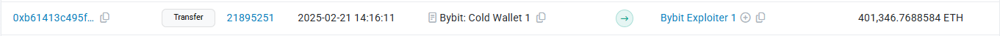
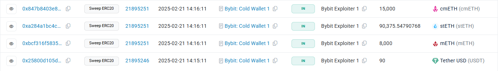
 
At the same time immediate DEX swaps via Uniswap Paraswap and others to convert staked
tokens to regular ETH and other assets.
 
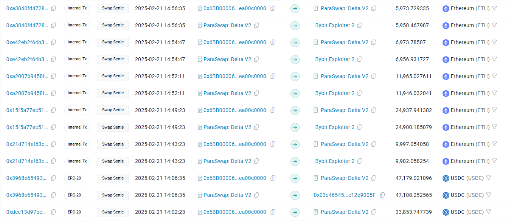
 
---

## 3) Transaction Flow. Visual scheme
 
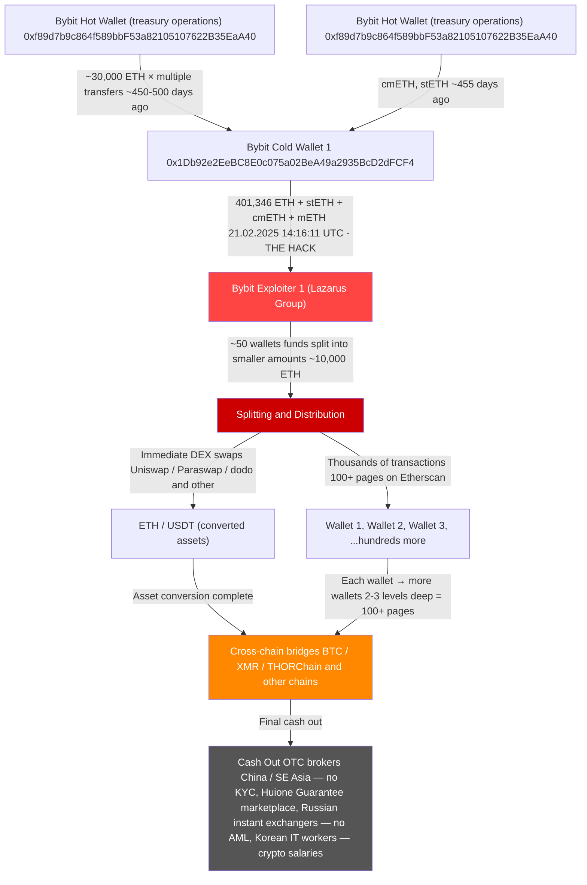
---

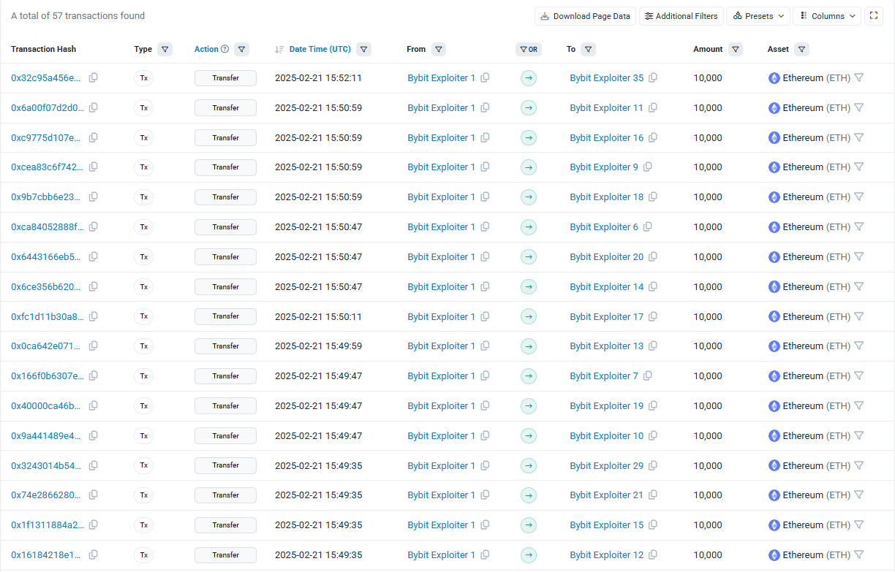

Only 2 wallets from thousands have more than 14000 transactions(manual tracing is near impossible):

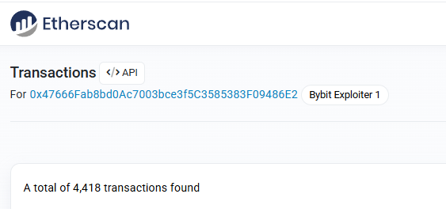
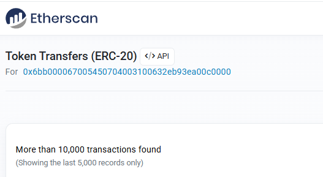

---

## 4) What Happened After? Layering Phase:
 
After the theft, Bybit Exploiter 1 address showed 6 pages of transactions going to hundreds of different wallets.
When I tried to follow the money deeper and opening wallets at level 2 and level 3.
Some of those wallets had 100+ pages of transactions and more than 10000 transactions.
This is exactly what layering looks like in practice:
 
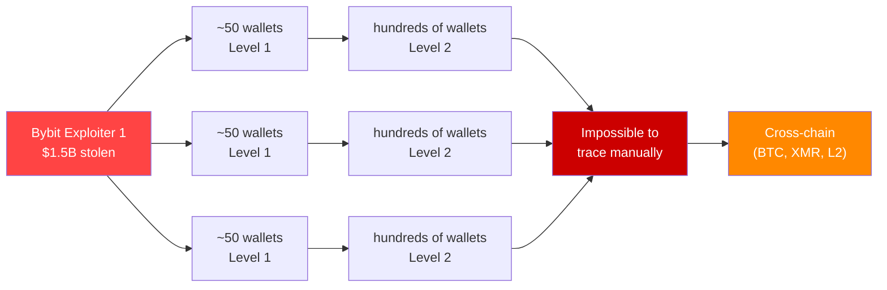
 
Why this matters for Anti Money Laundering: Manual analysis is completely impossible at this scale.
This is why blockchain intelligence tools like Chainalysis Reactor and TRM Forensics exist.
They can cluster thousands of addresses automatically and follow the money across chains.
 
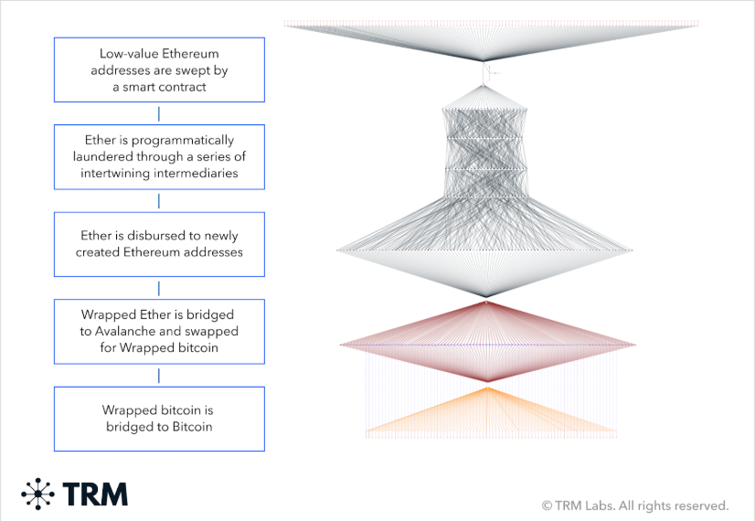
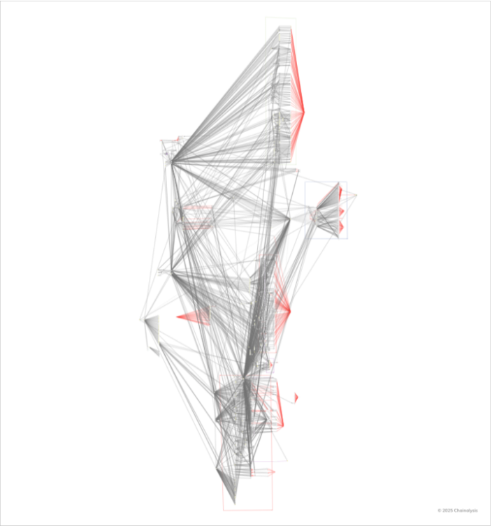

Here was TRM and Chainalysis graphs, I took them only in educational purposes, noted the sources in the end.
 
---

## 5) Swaps and Why They Used Different Assets
 
I noticed things about the tokens used: stETH, cmETH, mETH. These are liquid staking tokens.
They are not Ethereum. Not every exchange or tool tracks them the same way.
By holding these assets the Lazarus group made the initial theft harder to value and freeze quickly.
 
Immediate swaps via Uniswap and Paraswap. Right after the theft they converted everything to regular Ethereum, DAI, USDC, USDT and other cryptocurrencies.
Why did they do this?
 
- It is easier to move across chains. It is liquid. Easier to cash out.
- DEX swaps do not trigger the Travel Rule. No Know Your Customer, no Anti Money Laundering reporting required.
I saw unknown and flagged tokens have been used for laundering (several tokens on Etherscan marked as unverified or suspicious).
The Lazarus group used these to move value across token standards.
 
- Exit to Layer 2 networks. It is cheaper faster and less monitored.
- Create additional noise in the transaction graph.

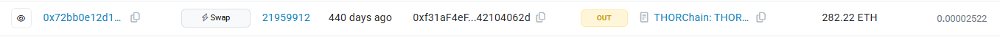

---

## 6) Fake Token. "Justice for Bybit"
 
I also noticed a token called "Justice for Bybit" after the hack was sent to the Cold Wallet address with 500,000,000 tokens.
 
This is a classic airdrop scam. It is not related to the hack. Scammers see that a hacked address gets attention create a token with an emotional name 
and airdrop it hoping someone will click a phishing link to "claim" something. 

From an Anti Money Laundering perspective this is noise. It shows how public high-profile hacks attract secondary scams.

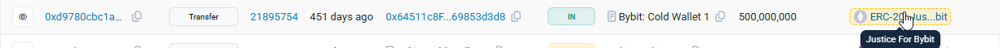

---
 
## 7) Red Flags I Identified
 
| Red Flag | Pattern | Risk Level |
|---|---|---|
| 401,346 ETH sent in single transaction to new address | Massive unusual outflow | 🔴 CRITICAL |
| Destination address (Exploiter 1) had zero prior history | New wallet receives huge amount | 🔴 HIGH |
| Immediate DEX swaps after receipt | Rapid asset conversion | 🔴 HIGH |
| Many pages of outgoing transactions within hours | Fan-out layering pattern | 🔴 HIGH |
| Staked tokens converted immediately | Avoiding asset-specific freezes | 🟡  MEDIUM |
| Transactions to L2 bridges | Cross-chain obfuscation attempt | 🟡 MEDIUM |
| Fake token airdrop | Secondary scam — noise | ⚪️ LOW |
 
---

## 8) What this analysis shows?
 
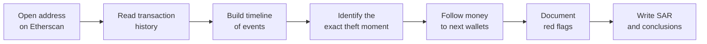
 
Key conclusions from this real analysis:
 
1. The theft moment is clearly visible one massive transaction to a new address with zero history is an obvious red flag.
2. Layering makes manual tracing impossible (6 pages → 100 pages per wallet). You need tools.
3. DEX is the biggest AML gap, all swaps happened on DEX with no KYC and no Travel Rule. This is where regulation needs to catch up.
4. Speed is the defence and the only way to stop this is real-time alerts, not manual review. By the time a human analyst sees it, the money is already 10 layers deep
   
---
 
## 9) Conclusions
 
Working through this case on Etherscan surprised me in two ways. The first surprise was how fast it all happened. I thought I'd see a setup before the theft.
Instead 401,346 ETH disappeared in one transaction at 14:16:11 UTC. Within the block range the hackers were already swapping staked assets on Uniswap and other DEX.
There was no delay. This was clearly a planned operation. The second surprise was how the hackers split the stolen assets.
When I opened Level 2 and Level 3 wallets on Etherscan I saw over 100 pages of transactions per address. That's when I realized. Not in theory but in practice. 
Why manually tracing the assets is impossible. It's not a matter of having resources. It's a data volume problem that only automated tools can solve.

**Could AML have prevented this?**

The theft itself. No. This was a supply chain attack on Safe{Wallet}. No KYC process, no CDD checklist no transaction monitoring rule would have flagged
a transaction that looked fully authorized from the blockchains perspective. Standard AML was blind here. The response is a different story.
Alerts from Chainalysis and TRM Labs resulted in around $400M being frozen across exchanges in the weeks after the hack. That outcome was only possible because of 
automated blockchain monitoring, not review. By the time a human analyst finished tracing one wallet level the funds were already three chains deep.
This tells me that the value of AML in crypto is not about preventing attacks. It's about detecting and responding quickly after the fact.

**What I want to show with this case:**

- I can work with on-chain data using free public tools and extract meaningful conclusions.
- I understand how DPRK-attributed hackers think and operate. Not the compliance checklist version, but the operational pattern: why they used liquid staking tokens
- Why DEX was chosen over CEX, why THORChain and XMR appear at specific stages.
- I can see the gaps. DEX has no Travel Rule obligation, no KYC, no SAR requirement and understand why that matters for the future of crypto AML.

This is not just theory. Every transaction, every timestamp, every wallet in this case is publicly verifiable, on Etherscan now.

---
