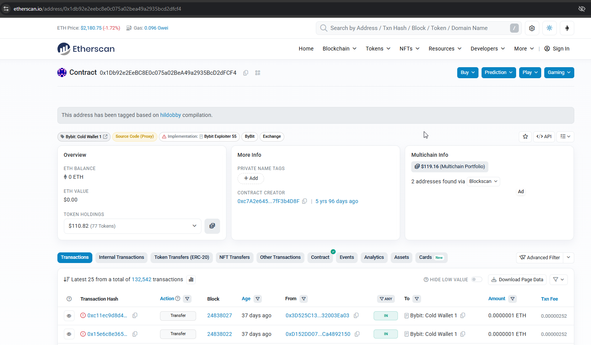
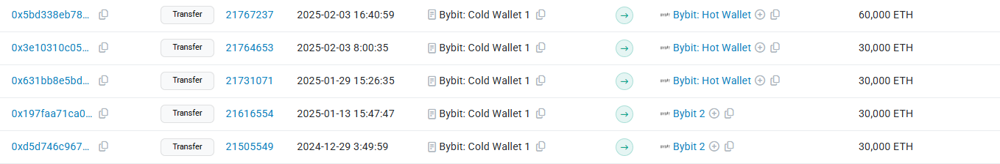
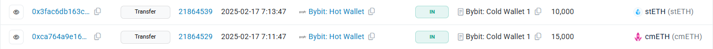
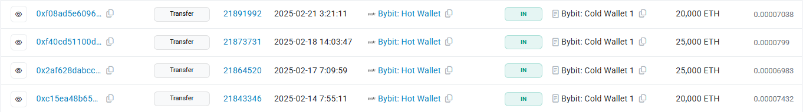

# Part 1: Bybit Hack 2025 by Lazarus Group

Type: Blockchain Forensics / DPRK Attribution
 
Date of hack: February 21 2025
 
Amount Stolen: ~$1.5 billion USD (in ETH)
 
Attributed To: Lazarus Group (North Korea, state-sponsored hackers)
 
Sources: Chainalysis, TRM Labs, Etherscan, on-chain data.
 
---
 
## What happened?
In February 2025 is that hackers from North Korea stole 1.5 billion dollars from the crypto exchange Bybit.
This is the biggest crypto theft in history.
 
The Bybit hack was carried out by the Lazarus Group, a group of hackers from North Korea.
They did not hack Bybit directly. Instead they hacked a third-party software called Safe{Wallet} that Bybit was using to manage their cold wallet.
The hackers changed the transaction data in the interface.
When Bybit employees signed the transaction they thought it was a normal transfer but actually they signed a transaction that gave full control of the wallet to the hackers.
After the theft the money was quickly converted, chain hopped and split through thousands of wallets to confuse the trace.
The Bybit hack is an example of how the Lazarus Group operates.
 
---
 
## How the attack worked? 

Step by step:

**1) The hackers compromised Safe{Wallet}.**
They got access to a developers computer at Safe{Wallet}. Injected malicious code into the interface.
 
**2) The transaction data was replaced.**
When Bybit employees opened the wallet to sign a transaction the malicious code showed them fake data. Everything looked legitimate.
 
**3) The Bybit employees signed.**
All required signatures were collected. From the blockchains perspective it was an authorized transaction.
No AML alert would fire at this moment. The theft looked like a normal transfer.
 
**4) $1.5 Billion moved to hacker wallets.**
The primary receiving address was `0x1db92e2eebc8e0c075a02bea49a2935bcd2dfcf4`.
The Lazarus Group used this address to receive the stolen funds.
 
---
 
## How they laundered the money?

(proofs you will see in part 2 on-chain analysis)
 
**Phase 1) Split through thousands of wallets.**
Automated scripts split the funds across thousands of wallets.
Each wallet held an amount creating a huge transaction graph that is very hard to analyze manually.
The hackers split the funds into smaller amounts making it difficult to track.
One stolen wallet split into hundreds of wallets then each split into thousands wallets into smaller and smaller amounts and after it cash out points.

**Phase 2) Conversion.**
After the theft the hackers started converting ETH to other assets through DEX exchanges to prevent freezing.
They stole 1.5 billion dollars in ETH. Swapped it via DEX, such as Uniswap and Paraswap and converted it to BTC, USDT, DAI and much of no-name tokens.
The reason they did this fast is that Bybit could ask exchanges to freeze specific ETH addresses.
Once converted through DEX the trail splits across assets and chains.
 
**Phase 3) Chain hopping.**
The hackers used the THORChain bridge to move ETH to BTC.
Then used TornadoCash, BTC mixers and P2P exchanges to further launder the funds.
They also used XMR, a privacy coin to break traceability and then moved the funds back to BTC via OTC brokers.
 
**Phase 4) Cash out.**
The hackers used OTC brokers in China and Southeast Asia where there is no KYC to cash out the funds.
They also used Huione Guarantee, a marketplace in Southeast Asia and Russian instant exchangers, which do not have KYC or AML controls.
Additionally Korean IT workers who work at Western companies and receive crypto salaries were also used to cash out the funds.
 
---

## How the industry responded?
 
How the industry responded is an example of why public-private cooperation in AML matters.
Several exchanges received real-time alerts from Chainalysis and TRM Labs when the Lazarus funds arrived.
Around $400 millions was frozen in the weeks after the hack.
This would not have been possible without blockchain intelligence tools.
 
---
 
## Red Flags
 
If you were an AML analyst at an exchange and these funds arrived, you would see:
 
| Red Flag | Risk Level | Action |
|---|---|---|
| Funds from OFAC sanctioned address | 🔴 CRITICAL | Immediate freeze + SAR |
| Large inflow right after known hack | 🔴 HIGH | Immediate escalation |
| Cross-chain bridge origin | 🟡 MEDIUM | Enhanced review |
| New wallet with no prior history | 🟡 MEDIUM | Source of funds request |
| Many rapid small splits | 🔴 HIGH | SAR + escalation |
| Destination, high-risk OTC broker | 🔴 HIGH | Freeze + SAR |
| Fake token airdrop, Secondary scam | ⚪️ LOW | Don't sign any scam contracts |
 
---

## Key takeaways from the Bybit hack
 
Supply chain attacks are hard to detect as the theft looked like a normal authorized transaction.
Standard KYC/AML controls do not help in these cases.
 
Speed matters, as the Lazarus Group moved funds within minutes and real-time blockchain monitoring is essential.
 
Blockchain intelligence tools work as $400 million was frozen because Chainalysis and TRM pushed real-time alerts to exchanges.
 
DEX is a regulatory gap. DEX swaps don't trigger Travel Rule. This is a big problem for AML compliance right now.
 
DPRK crypto funds a nuclear program, this is not just a compliance issue, it is a national security issue.
Any DPRK-attributed transaction requires immediate escalation.
 
---

# Part 2: Real on-chain investigation
On-Chain Analysis: Bybit Hack Transaction Tracing
 
Type: Hands-on Blockchain Analysis
 
Tool Used: Etherscan.io (free, public data)
 
Blockchain: Ethereum (ETH)
 
Address Analyzed: `0x1db92e2eebc8e0c075a02bea49a2935bcd2dfcf4` (Bybit Cold Wallet 1)
 
Date of Analysis: May 2026
 
---
 
## 1) What I Did?
 
I opened the real Bybit hack address on Etherscan and manually traced the transactions to
understand how the theft happened and how the money was moved after.
All data below is from public on-chain records. No paid tools were used only Etherscan.io
 

 
---
 
## 2) What I Found on Etherscan?
 
### Timelines:
 
**~470-500 days ago, Normal Operations**
 
Bybit Cold Wallet 1 received several large transfers:
- Multiple transactions of ~30,000 ETH from other Bybit wallets
- One transfer of ~60,000 ETH to Bybit Hot Wallet
This looks like normal exchange treasury management and moving funds between cold and hot wallets.
 

 
---
 
**~455 days ago, Staked Assets Moved In**
 
Bybit Hot Wallet sent staked assets to Cold Wallet 1:
- 10,000 stETH
- 15,000 cmETH
 
These are liquid staking tokens (ETH that is staked and earning yield). At this point the
wallet held a large amount of different ETH-based assets, normal treasury.
 

 
---
 
**~450-460 days ago, Preparation**
 
4 transactions from Hot Wallet to Cold Wallet 1:
- 20,000–25,000 ETH per transaction
Normal treasury consolidation, nothing suspicious at this stage.
 

 
---
