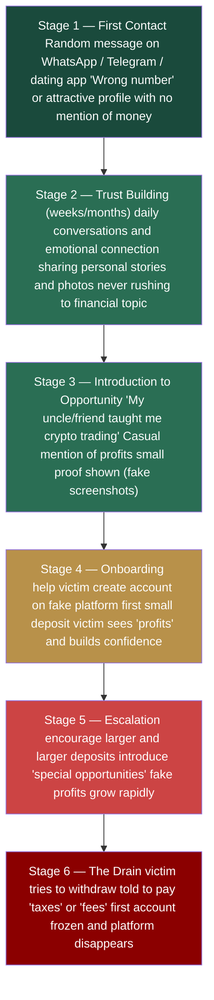
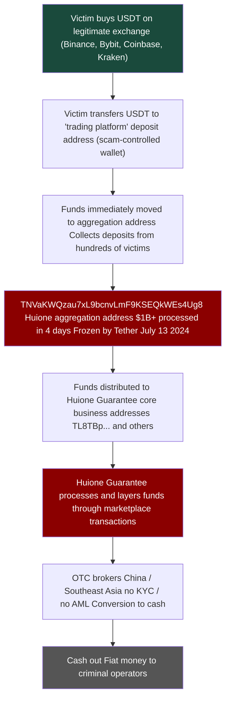

# Case 2 — Pig Butchering & Huione Guarantee: Full AML Analysis
 
**Type:** Financial Crime Typology, On-chain Analysis, AML Gap Assessment
 
**Date of Analysis:** May 2026
 
**Tools Used:** Tronscan.org (free, public)
 
**Addresses Analyzed:**
- `TNVaKWQzau7xL9bcnvLmF9KSEQkWEs4Ug8` — Huione Guarantee aggregation address (frozen by Tether July 2024, $29.62M frozen)
- `TL8TBpubVzBr1UWPXBXU8Pci5ZAip9SwEf` — HuionePay core business address ($1.66B+ deposits, created Oct 2022, still active May 2026, identified via SlowMist Dune dashboard + verified on Tronscan)
**Sources:** Chainalysis Crypto Crime Report 2025, Elliptic Huione Report 2024, FinCEN Proposed Rule 2024, Bitrace On-chain Analysis, TRM Labs Reports, UNODC Southeast Asia Reports
 
---
 
## Overview
 
This case study covers three connected topics:
 
1. **Pig Butchering** and how the scheme works from first contact to financial drain.
2. **Huione Guarantee** - the criminal marketplace that enables the entire pig butchering ecosystem.
3. **TRC-20 USDT and AML Gaps** and why Tron became the infrastructure of choice for organised financial crime.
All on-chain data in this case comes from publicly available blockchain records. No paid tools were used.
 
---
 
## Part 1:  Pig Butchering: How the Scheme Works
 
### What Is Pig Butchering
 
Pig butchering - is a long-term investment fraud that combines romance scam tactics with fake cryptocurrency trading platforms. The name comes from the idea of fattening a pig before slaughter, the scammer builds 
a relationship with the victim over weeks or months before draining their savings.
 
It is not a simple scam. It is an industrialised operation run by organised crime groups from Southeast Asia. Many of the "scammers" are themselves victims — trafficked people forced to work in scam compounds
in Cambodia, Myanmar, and Laos under threat of violence.
 
### Statistics
 
- **$75+ billion** in victim losses globally (Chainalysis 2025 estimate)
- **$64 billion** processed through Huione Group alone between 2021–2025 per FinCEN
- Tens of thousands of victims globally per year
- Operates from scam compounds with hundreds to thousands of forced workers

### The Psychological Cycle — 6 Stages
 

 
### How the Fake Platform Works
 
The victim never trades on a real exchange. They use a fake platform that looks exactly like Binance or another legitimate exchange — professional design, real-time charts, support chat. But:
 
- All "trades" are fake, the platform shows whatever the scammer programs
- "Profits" are fake (they exist only to encourage larger deposits)
- Withdrawals are always blocked, victims are told they owe taxes, fees, or need to "unlock" their account
- The platform disappears once the scammer has extracted maximum funds
  
### Who Are the Scammers
 
This is important for AML context. The people making the calls and building the relationships are often:
 
- Trafficked workers from China, Taiwan, Malaysia, Vietnam, Myanmar
- Recruited with fake job advertisements promising IT or customer service work
- Held in compounds against their will
- Forced to meet daily quotas of victim conversations
  
This is why arresting individual scammers does not stop the operation. The criminal infrastructure — the compound operators, the technology providers, the money launderers — is the real target.
 
---
 
## Part 2 — On-Chain Flow: From Victim to Cash Out
 
### The Full Money Flow
 

 
### Real On-Chain Analysis — Aggregation Address
 
**Address:** `TNVaKWQzau7xL9bcnvLmF9KSEQkWEs4Ug8`
 

 
**Key data from Tronscan:**
- Created: **July 9, 2024**
- Frozen by Tether: **July 13, 2024**, only 4 days after creation
- Total transactions: **48,700**
- Total transfers: **82,429** (34,692 outgoing + 47,737 incoming)
- Current balance: **$1.14**, funds already moved or frozen
  
**What this means:** This address was created specifically for a large collection operation. In just 4 days it processed over $1 billion USDT from hundreds of different senders before Tether intervened. The pattern is clear (rapid creation, massive inflow from many sources, then freeze).
 
### Transfers, Aggregation Pattern
 

 
Looking at the transfers tab you can see the typical aggregation pattern:
 
- **Many different senders** — each from a different wallet (different victims)
- **Varied amounts** $1,200 / $1,500 / $2,000 / $2927 / $5,000 / $9,057 / $10,000 / **$270,000** / 
- **All in the same time period** — coordinated collection from active scam operations
- **All USDT TRC-20**, no other tokens, just stablecoins for easy conversion
The smaller amounts ($1,200–$10,000) are likely individual victims at different stages of the scam. The large amounts ($270K, $2.9M) are either high-value individual victims or sub-aggregation wallets
consolidating funds from multiple victims.
 
### HuionePay Scale — Dune Analytics (SlowMist Dashboard)
 
> Note: Tronscan's built-in analysis tab shows TRX balance only, not USDT transfers. For real USDT volume analysis, SlowMist built a public Dune dashboard: https://dune.com/misttrack/huionepay-data
 
#### Monthly USDT Volume
 

 
This graph shows the full scale of HuionePay USDT flows on Tron (Jan 2024 – Jan 2026):
 
- **Jan 2024** — ~$590M USDT per month in deposits and withdrawals
- **Jun–Jul 2024** — first peak ~$1B+ USDT monthly — maximum activity
- **Jul 2024** — minor dip after Tether froze TNVaKWQzau7xL9bcnvLmF9KSEQkWEs4Ug8 and operations recovered within weeks
- **Feb 2025** — second peak ~$1.1B USDT — showed that the Tether freeze had almost no long-term impact
- **May–Jun 2025** — still $800M–$1.1B monthly
- **Jul–Aug 2025** — sharp collapse, FinCEN Section 311 designation + Telegram channel ban
- **Oct 2025 onward** — near zero activity
**Key AML observation:** The Tether freeze in July 2024 barely slowed operations. Huione recovered within weeks by switching addresses. Only the FinCEN systemic designation in May 2025 — which cut off US correspondent banking access caused real operational disruption. This shows that address-level freezes are insufficient without systemic regulatory action.
 
#### Monthly Active Users
 

 
- **Jan 2024** — ~29,000 depositors and recipients per month
- **Peak (Jun–Jul 2025)** — 80,000+ unique users per month
- **Aug 2025** — sharp decline following regulatory action
- **Dec 2025** — near zero
  
At peak, Huione was processing transactions for more active monthly users than many legitimate regional banks. This is not a small criminal operation, it is industrial-scale financial infrastructure.
 
#### Total Volume Counters and Top Addresses
 

 
**Total flows (January 2024 – June 2025):**
- Total withdrawals: **$61,540,947,381** (~$61.5B USDT)
- Total deposits: **$68,964,360,769** (~$68.9B USDT)
- Combined throughput: **~$130B USDT** in 18 months
This data from SlowMist/MistTrack covers only the 2024–2025 period. FinCEN's assessment covering 2021–2025 estimates total flows at $64B+ which aligns with the scale visible here.
 
**Core business address identified:**
 
The deposits rank table reveals the full address of HuionePay's primary business address:
 
`TL8TBpubVzBr1UWPXBXU8Pci5ZAip9SwEf` — **$1,665,718,013 in deposits** is top address by volume
 
This matches the `TL8TBp...` address referenced in Bitrace reports. Verified on Tronscan:
 

 
**Key data from Tronscan:**

- Created: **October 6, 2022** — operational for 3+ years
- Latest activity: **May 10, 2026** — still active at time of analysis
- Total transactions: **141,734**
- Total transfers: **871,288** (860,825 outgoing + 10,463 incoming)
- Current balance: **$144.12** — near zero, funds constantly moving out
  
**Comparison: aggregation address vs core business address**
 
| | TNVaKW (aggregation) | TL8TBp (core business) |
|---|---|---|
| Created | July 9, 2024 | October 6, 2022 |
| Lifespan | 4 days before freeze | 3+ years, still active |
| Transactions | 48,700 | 141,734 |
| Transfers | 82,429 | 871,288 |
| Outgoing ratio | High inflow from victims | 98.8% outgoing |
| Status | Frozen by Tether | Still active |
 
The 98.8% outgoing ratio (860,825 out vs 10,463 in) confirms this is a **distribution node**, funds collected by aggregation addresses like TNVaKW are routed here and then redistributed to vendors, operators
and OTC cash-out points. This is the layering stage of the laundering process in action.

### Top Addresses by Volume, Deposits and Withdrawals Rank
 

 
**Top deposit addresses (639,025 total unique depositors):**
 
| Address | Total Deposited (USDT) |
|---|---|
| TL8TBpubVzBr1UWPXBXU8Pci5ZAip9SwEf | 1,665,718,013 |
| TVy8p6erwinkkfmvG3iPGpUkswMZU36uMV | 605,687,723 |
| TPepdLYtHr8cN1Jbwf6CGNB9Ppho7L2otr | 449,218,402 |
| TM1zzNDZD2DPASbKcgdVoTYhfmYgtfwx9R | 436,485,292 |
| TFTWNgDBkQ5wQoP8RXpRznnHvAVV8x5jLu | 402,144,129 |
 
**Top withdrawal addresses (960,910 total unique recipients):**
 
| Address | Total Withdrawn (USDT) |
|---|---|
| TWS84SZ2GE2EgyZDCrfVuEJXpoXYuBxteS | 816,288,490 |
| T9yFi9yxwBUjMbHwBFKDdwFdBwvzUAqBfR | 580,787,004 |
| TTSSC4TEYtQMAMURND6i1FPYaaBJMGY4ed | 512,389,323 |
| TDRkHLDxnBu2XtkxwKZMm5qwSuguKHmWDB | 479,470,912 |
| TVy8p6erwinkkfmvG3iPGpUkswMZU36uMV | 379,550,762 |
 
**Key observation:** TVy8p6erwinkkfmvG3iPGpUkswMZU36uMV appears in **both** top deposits and top withdrawals — this is a typical pass-through address that receives and immediately re-sends funds. 
960,910 unique withdrawal addresses confirms the scale of the distribution network.
 
### Outgoing Transfers, Layering in Action
 

 
Filtering for outgoing transfers reveals a critical pattern, the core business address sends massive amounts repeatedly to a **single destination address**: `TQUvJ5HEfazJtEzdjF9GbN8rKdCgzKeqWX`
 
Sample of outgoing transactions visible on a single page — all amounts in USDT:
 
| Amount (USDT) | Destination |
|---|---|
| -67,813 | TQUvJ5HEfazJtEzdjF9GbN8rKdCgzKeqWX |
| -600,000 | TQUvJ5HEfazJtEzdjF9GbN8rKdCgzKeqWX |
| -1,000,000 | TQUvJ5HEfazJtEzdjF9GbN8rKdCgzKeqWX |
| -1,000,000 | TQUvJ5HEfazJtEzdjF9GbN8rKdCgzKeqWX |
| -2,000,000 | TQUvJ5HEfazJtEzdjF9GbN8rKdCgzKeqWX |
| -2,000,000 | TQUvJ5HEfazJtEzdjF9GbN8rKdCgzKeqWX |
| -2,000,000 | TQUvJ5HEfazJtEzdjF9GbN8rKdCgzKeqWX |
| -2,000,000 | TQUvJ5HEfazJtEzdjF9GbN8rKdCgzKeqWX |
| -1,080,000 | TQUvJ5HEfazJtEzdjF9GbN8rKdCgzKeqWX |
| -1,310,000 | TQUvJ5HEfazJtEzdjF9GbN8rKdCgzKeqWX |
| -1,050,000 | TQUvJ5HEfazJtEzdjF9GbN8rKdCgzKeqWX |
| -1,260,000 | TQUvJ5HEfazJtEzdjF9GbN8rKdCgzKeqWX |
| -1,130,000 | TQUvJ5HEfazJtEzdjF9GbN8rKdCgzKeqWX |
 
This single page of transfers represents over **$20,000,000 USDT** in outgoing transactions and all going to the same destination address. These are not retail transfers. 
This is wholesale movement of criminal proceeds between infrastructure layers.
 
Every single outgoing transaction goes to the same destination address (a pattern that would immediately trigger a transaction monitoring alert at any regulated exchange).
 
**What this shows:**
 
This is textbook layering. The core business address acts as a pass-through, it receives funds from hundreds of aggregation addresses and then concentrates them into large transfers to a single next-level address. The destination `TQUvJ5HEfazJtEzdjF9GbN8rKdCgzKeqWX` is likely either another Huione-controlled consolidation address or a direct OTC cash-out point.
 
**The full layering chain visible on-chain:**
 

 
This three-level structure is deliberately designed to make tracing difficult, by the time funds reach level 3, the connection to individual victims is buried under thousands of intermediate transactions.
 
**Top withdrawal addresses (960,910 total unique addresses):**
- `TWS84SZ2GE2EgyZDCrfVuEJXpoXYuBxteS` — $816M
- `T9yFi9yxwBUjMbHwBFKDdwFdBwvzUAqBfR` — $580M
- `TTSSC4TEYtQMAMURND6i1FPYaaBJMGY4ed` — $512M
**639,025 unique deposit addresses**, each representing a different user or sub-account within the HuionePay ecosystem.
 
#### Transaction Count
 

 
- Withdrawals peaked at **150,000 transactions per month** (Jun–Jul 2025)
- Deposits peaked at **100,000+ transactions per month**
- Both metrics collapsed after July 2025
  
150,000 monthly withdrawal transactions means approximately **5,000 transactions per day** at peak. This level of throughput requires automated infrastructure, not manual processing.
Huione was running a fully automated money laundering platform.
 
---
