# Case 2 — Pig Butchering & Huione Guarantee: Full AML Analysis
 
**Type:** Financial Crime Typology · On-chain Analysis · AML Gap Assessment
 
**Date of Analysis:** May 2026
 
**Tools Used:** Tronscan.org (free, public data)
 
**Addresses Analyzed:**
- `TNVaKWQzau7xL9bcnvLmF9KSEQkWEs4Ug8` - Huione aggregation address (frozen by Tether July 2024, $29.62M blocked)
- `TL8TBpubVzBr1UWPXBXU8Pci5ZAip9SwEf` - HuionePay core business address ($1.66B+ deposits, created Oct 2022, still active May 2026)
**Sources:** Chainalysis Crypto Crime Report 2025, Elliptic Huione Report 2024, FinCEN NPRM May 2025, Bitrace On-chain Analysis, TRM Labs Reports, UNODC Southeast Asia Reports, SlowMist Dune Dashboard
 
---
 
## Overview
 
This case covers three connected topics:
 
1. **Pig Butchering** - how the scheme works from first contact to financial drain
2. **Huione Guarantee** - the criminal marketplace that runs the infrastructure behind pig butchering
3. **TRC-20 USDT and AML Gaps** - why Tron became the preferred network for organised financial crime
All on-chain data comes from public blockchain records. No paid tools were used.
 
---
 
## Part 1 — Pig Butchering: How the Scheme Works
 
### What Is Pig Butchering
 
Pig butchering is a long-term investment fraud. The scammer builds a fake relationship with the victim over weeks or months, 
then drains their savings through a fake crypto trading platform.
 
The name comes from the idea of fattening a pig before slaughter. The victim is the pig.
 
It is not a straightforward fraud. An industrialised operation is being conducted by organised crime organisations from Southeast Asia. 
Numerous "scammers" are themselves victims, as they are trafficked individuals who are forced to work in scam compounds under threat of violence in Cambodia, Myanmar, and Laos).
 
### Scale
 
- **$75+ billion** in victim losses globally — Chainalysis 2025 estimate
- FinCEN identified at least **$4 billion** in verified illicit proceeds processed through Huione Group between 2021 and 2025
- Tens of thousands of victims globally per year
- Operates from scam compounds with hundreds to thousands of forced workers
### The Psychological Cycle — 6 Stages
 
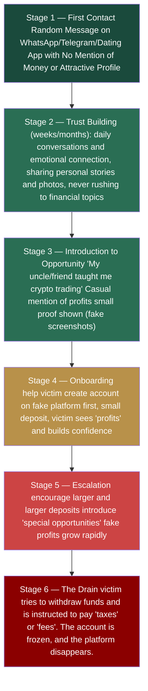
 
### How the Fake Platform Works
 
The victim never trades on a real exchange. They use a fake platform that looks exactly like Binance or another legitimate exchange — professional design, real-time charts, support chat. But:
- All "trades" are fake, the platform shows whatever the scammer programs
- "Profits" are fake, they exist only to encourage larger deposits
- Withdrawals are always blocked and victims are told they owe taxes, fees, or need to "unlock" their account
- The platform disappears once the scammer has extracted maximum funds
  
### Who Are the Scammers
 
This is important for AML context. The people making the calls and building relationships with victims are often:
- Trafficked workers from China, Taiwan, Malaysia, Vietnam, Myanmar
- Recruited with fake job advertisements promising IT or customer service work
- Held in compounds against their will
- Forced to meet daily quotas of victim conversations
  
This is why arresting individual scammers does not stop the operation. The compound operators, technology providers, and money launderers - they are the real targets.
 
---
 
## Part 2 — On-Chain Flow: From Victim to Cash Out
 
### The Full Money Flow
 
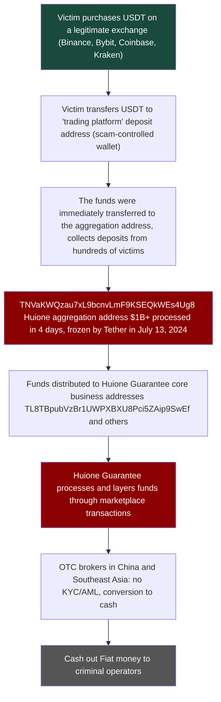
 
### Real On-Chain Analysis. Aggregation Address
 
**Address:** `TNVaKWQzau7xL9bcnvLmF9KSEQkWEs4Ug8`
 
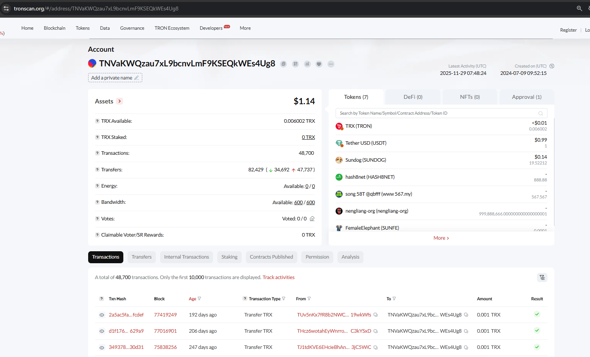
 
**Key data from Tronscan:**
- Created: **July 9, 2024**
- Frozen by Tether: **July 13, 2024**, only 4 days after creation
- Total transactions: **48,700**
- Total transfers: **82,429** (34,692 outgoing + 47,737 inbound)
- Current balance: **$1.14**
  
This address was created specifically for a large collection operation. Before Tether intervened, it processed more than $1 billion USDT from hundreds of distinct senders in just 4 days.
The current balance of $1.14 shows the money is already gone(moved or frozen).
 
### Transfers. Aggregation Pattern
 
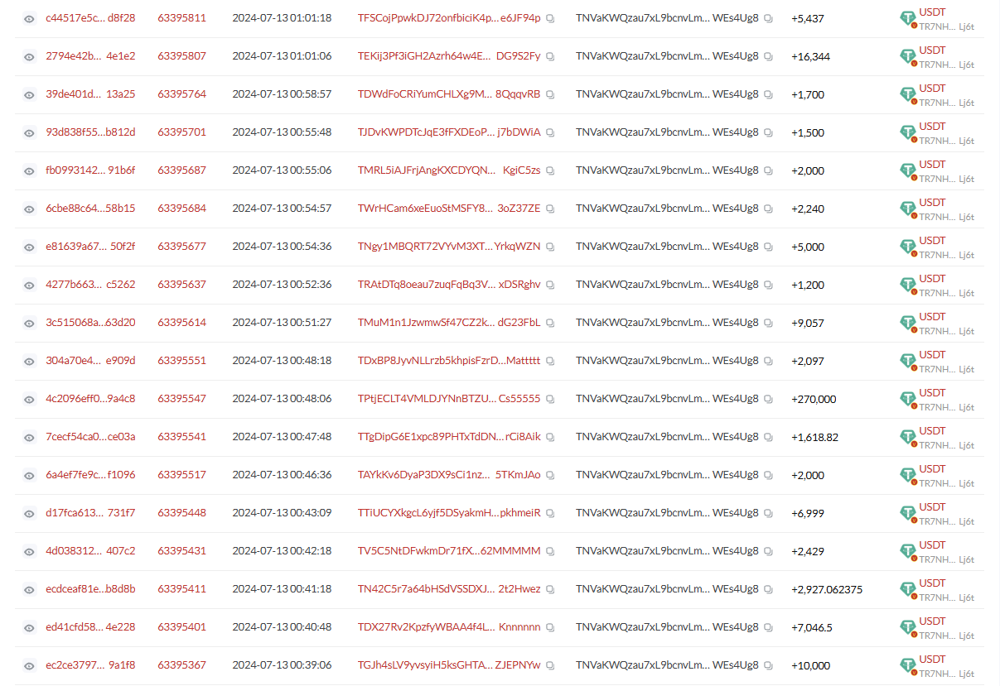
 
Looking at the transfers tab you can see the typical aggregation pattern:
 
- **Many different senders** each from a different wallet (different victims)
- **Varied amounts** $1,200 / $1,500 / $2,000 / $5,000 / $9,057 / $10,000 / **$270,000** / **$2,927,062**
- **All in the same time period** coordinated collection from active scam operations
- **All USDT TRC-20** no other tokens, just stablecoins for easy conversion
  
The smaller amounts ($1,200–$10,000) are likely individual victims at different stages of the scam.
The large amounts ($270K, $2.9M) are either high-value individual victims or sub-aggregation wallets consolidating funds from multiple victims.
 
### HuionePay Scale. Dune Analytics (SlowMist Dashboard)
 
> Note: Tronscan's built-in analysis tab shows TRX balance only, not USDT transfers. For real USDT volume analysis, SlowMist built a public Dune dashboard: https://dune.com/misttrack/huionepay-data
 
#### Monthly USDT Volume
 
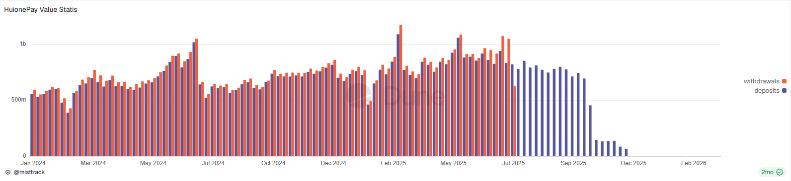
 
- **Jan 2024** approximately $500-600M USDT per month
- **Jun–Jul 2024** first peak, over $1B per month
- **Jul 2024** small dip after Tether froze TNVaKWQzau7xL9bcnvLmF9KSEQkWEs4Ug8 recovered within weeks
- **Feb 2025** second peak, $1.1B — the Tether freeze had no lasting effect
- **May–Jun 2025** still $800M–$1.1B monthly
- **Jul–Aug 2025** sharp collapse after FinCEN Section 311 designation
- **Oct 2025 onwards** near zero activity
  
The Tether freeze in July 2024 barely changed anything. Huione switched addresses in a few days and kept going.
The FinCEN designation in May 2025 was different - it cut off US correspondent banking access and that actually stopped the operation.
Address-level freezes are not enough. Systemic action is what works.
 
#### Monthly Active Users
 
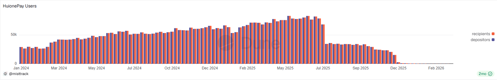
 
- **Jan 2024** approximately 29,000 active users per month
- **Jun–Jul 2025** peak at 80,000+ unique users per month
- **Aug 2025** sharp drop after regulatory action
- **Dec 2025** near zero activity
  
At peak Huione had more active monthly users than many regional banks.
This is not a small criminal operation. It is financial infrastructure at industrial scale.
 
#### Total Volume and Top Addresses
 
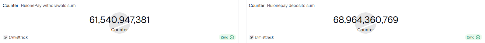
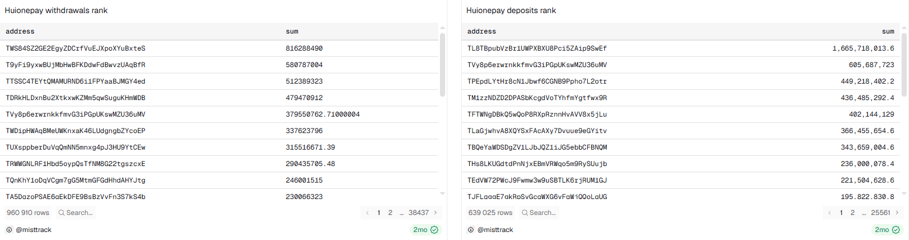
 
**Total flows Jan 2024 – Jun 2025:**
- Total withdrawals: **$61,540,947,381** (~$61.5B USDT)
- Total deposits: **$68,964,360,769** (~$68.9B USDT)
- Combined: **~$130B USDT** in 18 months
The top deposits address in the rank table is the full HuionePay core business address:
`TL8TBpubVzBr1UWPXBXU8Pci5ZAip9SwEf` - **$1,665,718,013 in deposits**
 
Verified on Tronscan:
 
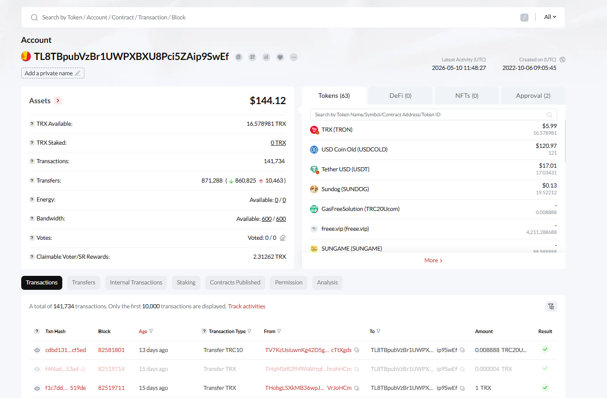
 
- Created: **October 6, 2022**, operational for 3+ years
- Latest activity: **May 10, 2026** still active at time of analysis
- Total transactions: **141,734**
- Total transfers: **871,288** (860,825 outgoing + 10,463 incoming)
- Current balance: **$144.12**
  
98.8% of transfers are outgoing. This is not where money arrives, this is where money is distributed.
Funds collected from victims through aggregation addresses like TNVaKWQzau7xL9bcnvLmF9KSEQkWEs4Ug8 come here and get sent further to OTC brokers and cash-out points.
 
**Comparison: aggregation address vs core business address**
 
| | TNVaKWQzau7xL9bcnvLmF9KSEQkWEs4Ug8 (aggregation) | TL8TBpubVzBr1UWPXBXU8Pci5ZAip9SwEf (core business) |
|---|---|---|
| Created | July 9, 2024 | October 6, 2022 |
| Lifespan | 4 days before freeze | 3+ years, still active |
| Transactions | 48,700 | 141,734 |
| Transfers | 82,429 | 871,288 |
| Outgoing ratio | High inflow from victims | 98.8% outgoing |
| Status | Frozen by Tether | Still active |
 
### Top Addresses by Volume
 
**Top deposit addresses (639,025 total unique depositors):**
 
| Address | Total Deposited (USDT) |
|---|---|
| TL8TBpubVzBr1UWPXBXU8Pci5ZAip9SwEf | 1,665,718,013 |
| TVy8p6erwinkkfmvG3iPGpUkswMZU36uMV | 605,687,723 |
| TPepdLYtHr8cN1Jbwf6CGNB9Ppho7L2otr | 449,218,402 |
| TM1zzNDZD2DPASbKcgdVoTYhfmYgtfwx9R | 436,485,292 |
| TFTWNgDBkQ5wQoP8RXpRznnHvAVV8x5jLu | 402,144,129 |
 
**Top withdrawal addresses (960,910 total unique recipients):**
 
| Address | Total Withdrawn (USDT) |
|---|---|
| TWS84SZ2GE2EgyZDCrfVuEJXpoXYuBxteS | 816,288,490 |
| T9yFi9yxwBUjMbHwBFKDdwFdBwvzUAqBfR | 580,787,004 |
| TTSSC4TEYtQMAMURND6i1FPYaaBJMGY4ed | 512,389,323 |
| TDRkHLDxnBu2XtkxwKZMm5qwSuguKHmWDB | 479,470,912 |
| TVy8p6erwinkkfmvG3iPGpUkswMZU36uMV | 379,550,762 |
 
`TVy8p6erwinkkfmvG3iPGpUkswMZU36uMV` appears in **both** lists — a typical pass-through address that receives and immediately re-sends funds.
 
#### Transaction Count
 
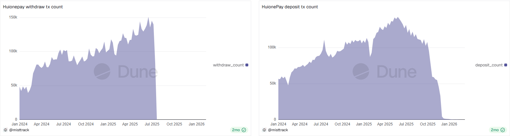
 
- Withdrawals peaked at **150,000 transactions per month** (Jun–Jul 2025)
- Deposits peaked at **100,000+ transactions per month**
- Both collapsed after July 2025
  
150,000 monthly withdrawals means approximately **5,000 transactions per day** at peak.
At any regulated exchange this pattern would trigger an immediate alert.
Huione was running a fully automated money laundering platform.
 
### Outgoing Transfers. Layering in Action
 
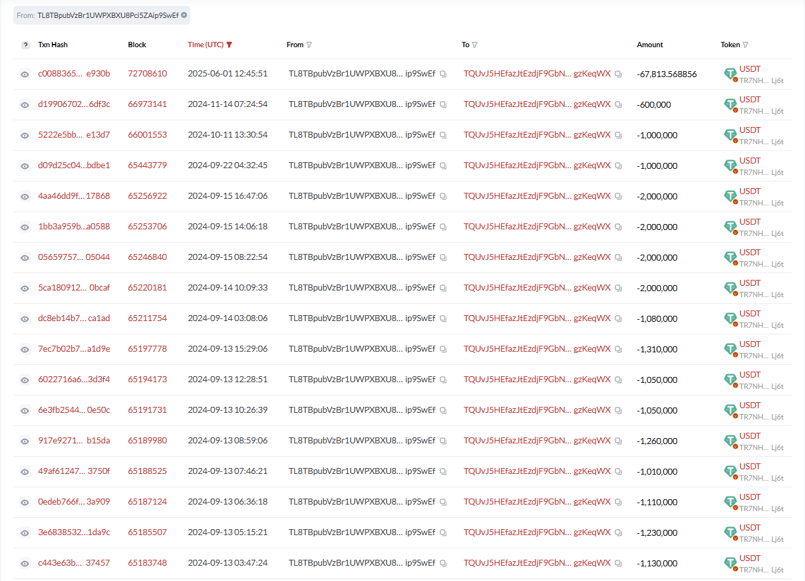
 
Filtering for outgoing transfers reveals one clear pattern — almost every large outgoing transaction goes to the same address: `TQUvJ5HEfazJtEzdjF9GbN8rKdCgzKeqWX `
 
Sample from a single page of transfers — all amounts in USDT:
 
| Amount (USDT) | Destination |
|---|---|
| -67,813 | TQUvJ5HEfazJtEzdjF9GbN8rKdCgzKeqWX |
| -600,000 | TQUvJ5HEfazJtEzdjF9GbN8rKdCgzKeqWX |
| -1,000,000 | TQUvJ5HEfazJtEzdjF9GbN8rKdCgzKeqWX |
| -1,000,000 | TQUvJ5HEfazJtEzdjF9GbN8rKdCgzKeqWX |
| -2,000,000 | TQUvJ5HEfazJtEzdjF9GbN8rKdCgzKeqWX |
| -2,000,000 | TQUvJ5HEfazJtEzdjF9GbN8rKdCgzKeqWX |
| -2,000,000 | TQUvJ5HEfazJtEzdjF9GbN8rKdCgzKeqWX |
| -2,000,000 | TQUvJ5HEfazJtEzdjF9GbN8rKdCgzKeqWX |
| -1,080,000 | TQUvJ5HEfazJtEzdjF9GbN8rKdCgzKeqWX |
| -1,310,000 | TQUvJ5HEfazJtEzdjF9GbN8rKdCgzKeqWX |
| -1,050,000 | TQUvJ5HEfazJtEzdjF9GbN8rKdCgzKeqWX |
| -1,260,000 | TQUvJ5HEfazJtEzdjF9GbN8rKdCgzKeqWX |
| -1,130,000 | TQUvJ5HEfazJtEzdjF9GbN8rKdCgzKeqWX |
 
This single page represents over **$20,000,000 USDT** and all going to one address.
These are not retail transfers. This is wholesale movement of criminal money between infrastructure layers.
 
**The full layering chain visible on-chain:**
 
```mermaid
flowchart TD
    A["Victims
(hundreds of wallets)
Each sends $1,000–$10,000 USDT"] --> B
    A2["Victims
(hundreds of wallets)"] --> B
    A3["Victims
(hundreds of wallets)"] --> B
 
    B["TNVaKWQzau7xL9bcnvLmF9KSEQkWEs4Ug8
Aggregation Address
Frozen by Tether — July 13, 2024
48,700 transactions · 82,429 transfers
Incoming: small amounts $1,000–$10,000 USDT"] --> C
 
    C["TL8TBpubVzBr1UWPXBXU8Pci5ZAip9SwEf
Core Business Address
Created Oct 2022 · Still active May 2026
141,734 transactions · 871,288 transfers
$1.66B+ in deposits
Incoming: medium amounts $10,000–$500,000 USDT"] --> D
 
    D["["TQUvJ5HEfazJtEzdjF9GbN8rKdCgzKeqWX
Next-Level Consolidation
Receives $600,000–$2,000,000 per transaction
OTC cash-out / further layering"]
 
    style A fill:#1A4A3C,color:#fff
    style A2 fill:#1A4A3C,color:#fff
    style A3 fill:#1A4A3C,color:#fff
    style B fill:#8b0000,color:#fff
    style C fill:#8b0000,color:#fff
    style D fill:#555555,color:#fff
```
 
This three-level structure is deliberately designed to make tracing difficult.
By the time funds reach level 3, the connection to individual victims is buried under thousands of intermediate transactions.
 
---
 
## Part 3 — Huione Guarantee: The Criminal Marketplace
 
### What Is Huione Group
 
Huione Group is a Cambodian financial conglomerate with links to the Hun family (Cambodia's ruling political dynasty). It operates multiple businesses including:
 - **HuionePay** — cryptocurrency payment platform
- **Huione Guarantee** — escrow and marketplace service (became criminal marketplace)
- Insurance, travel, and other businesses
  
Originally Huione Guarantee was a legitimate escrow service for high-value transactions in Southeast Asia.
Over time it evolved into the largest criminal marketplace for fraud infrastructure on the internet.
 
### Scale of Huione
 
| Metric | Data | Source |
|---|---|---|
| Verified illicit funds laundered (Aug 2021–Jan 2025) | **$4 billion** | FinCEN NPRM May 2025 (official) |
| Total HuionePay flows (2024–Jun 2025) | **$55+ billion** | SlowMist / MistTrack |
| Total crypto volume including legal (since 2021) | **$49 billion** | FinCEN NPRM |
| Dune dashboard combined flows (Jan 2024–Jun 2025) | **~$130 billion** | SlowMist Dune dashboard |
| Core address inflow (Jul 2023–Jun 2024) | **$2.158 billion** | Bitrace Analysis |
| Active deposit addresses | **80,000+** | SlowMist 2025 |
| Frozen by Tether (Jul 2024) | **$29.62 million** | Bitrace / Tronscan |
| DPRK-linked funds laundered | **$37.6 million** | FinCEN |
 
> Note: The difference between $4B (FinCEN illicit) and $55B+ (SlowMist total) is important. FinCEN explicitly acknowledged that Huione also runs legitimate businesses in Cambodia — bill payments,
> QR codes used in restaurants and hotels. The $4B figure represents only verified criminal proceeds. The $55B+ is total platform volume.
 
### What Is Sold on Huione Guarantee
 
Elliptic researchers documented thousands of active vendor listings:
 
| Category | What Is Sold | Price |
|---|---|---|
| AI Tools | Deepfake software, voice cloning, fake profile generators | $50–500 |
| Identity Documents | Fake passports, KYC bypass kits, synthetic identities | $100–2,000 |
| Scam Infrastructure | Fake trading platform templates, scam scripts | $500–10,000 |
| Money Laundering | Crypto-to-cash conversion, mixing, layering | 3–5% commission |
| Victim Data | Contact lists, victim databases | $10–100 per 1,000 |
| Physical Items | Electrified shackles for use on compound workers | Varied |
 
The last item is not a mistake. Electrified shackles for controlling trafficking victims in scam compounds were listed as a product.
This is the direct connection between Huione and human trafficking.
 
### Fund Flow Risk Breakdown
 
Based on Bitrace analysis of core address TL8TBpubVzBr1UWPXBXU8Pci5ZAip9SwEf (July 2023 – June 2024):
 
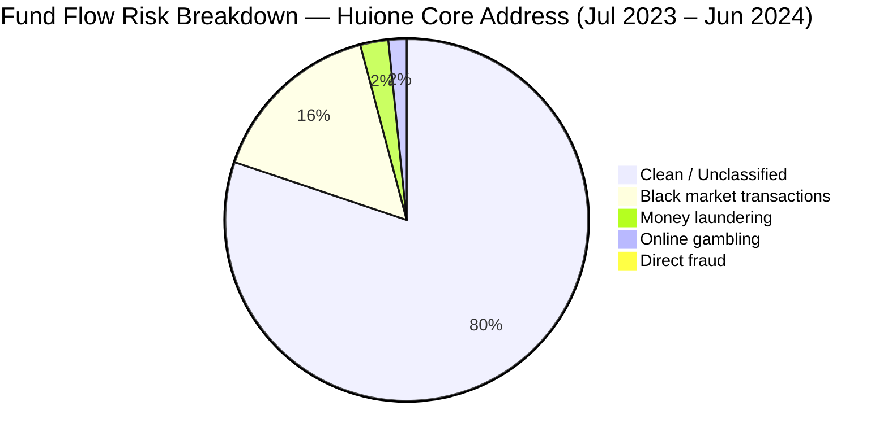
 
Note: The low "direct fraud" percentage does not mean fraud is rare. It means the funds are already layered by the time they reach the core address — direct pig butchering deposits 
go to aggregation addresses first (like TNVaKWQzau7xL9bcnvLmF9KSEQkWEs4Ug8), not directly to the core address.
 
> Note: Percentages is not equal exactly 100% due to rounding in the original Bitrace source data.
 
### Regulatory Response to Huione
 
**July 2024** Tether froze TNVaKWQzau7xL9bcnvLmF9KSEQkWEs4Ug8 — $29.62M blocked.
Huione switched to new addresses within days. Operations continued without interruption.
 
**Late 2024** Huione launched **USDH**, their own stablecoin that cannot be frozen by Tether.
Also acquired 30% stake in Tudou Guarantee to expand infrastructure.
 
**May 1, 2025** FinCEN issued NPRM under Section 311 of the USA PATRIOT Act - proposing to designate Huione Group as a primary money laundering concern.
This would cut off all US correspondent banking access. 30-day comment period opened.
 
**October 15, 2025** FinCEN issued the final rule. US financial institutions are now fully prohibited from doing business with Huione Group.
OFAC, FinCEN, and UK FCDO jointly sanctioned Chen Zhi of Prince Group (the largest coordinated action against a Southeast Asian cyber fraud network)
 
This is why the Dune charts show a collapse after July–August 2025.
The Tether freeze did almost nothing. The FinCEN designation destroyed the operation.
 
---
 
## Part 4 — Why USDT on Tron (TRC-20): Technical and AML Analysis
 
### Tron vs Ethereum: Why Criminals Chose Tron
 
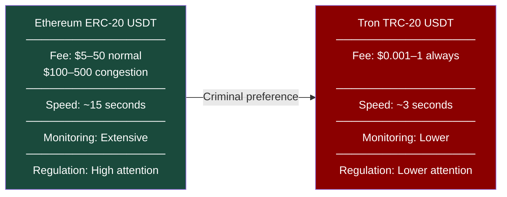
 
**The economics:**
- A single USDT transfer on Ethereum costs $5–50 at normal gas prices, and can spike to $100–500 during network overloads
- A single USDT transfer on Tron costs $0.001–1 regardless of conditions
- Pig butchering collects from hundreds of victims daily. At 1,000 transactions per day the fee difference is $5,000–50,000 per day on Ethereum vs under $1,000 on Tron
- Speed matters, faster transactions means faster layering before any freeze can be applied
  
### USDT — Why a Stablecoin
 
Scammers need stability. If they collected ETH or BTC:
- Price fluctuates and their holdings lose value while waiting to layer
- Conversion to fiat requires extra steps
- USDT is pegged 1:1 to USD (it is already dollars in crypto form)
This makes the cash-out step simpler and reduces value leakage during layering.
 
### USDH — Huione's Own Unfreezable Stablecoin
 
After Tether froze $29.62M in July 2024, Huione's biggest vulnerability became clear — dependence on a centralised stablecoin that a third party could freeze. 
Their response was to eliminate that dependency entirely.
 
In late 2024 Huione launched **USDH** — their own stablecoin pegged 1:1 to USD, deployed on Ethereum, BNB Chain, and Tron.
 
**Key difference from USDT:**
 
| | USDT (Tether) | USDH (Huione) |
|---|---|---|
| Issuer | Tether Ltd — regulated | Huione Group — unregulated |
| Can be frozen | Yes — Tether has freeze function | No — no central freeze authority |
| Regulatory oversight | Growing | None |
| Purpose | General payments | Criminal marketplace transactions |
| Backing | US Treasury bonds (claimed) | Unknown |
 
USDH is specifically designed to be immune to the main tool that stopped Huione temporarily — asset freezing. If exchanges and compliance systems do not screen for USDH 
specifically, transactions in this token will pass through undetected.
 
This is a direct example of **regulatory arbitrage in action** — criminals building infrastructure specifically to exploit gaps in existing AML controls.
Every time a control is applied, the criminal ecosystem adapts to work around it.
 
**Current status:** USDH remains active. It represents an emerging AML gap that most compliance systems have not yet addressed.
 
### The Tether Paradox
 
USDT is issued by Tether — a centralised company that can freeze any wallet.
This is actually useful for law enforcement. Tether has frozen hundreds of millions in criminal wallets.
 
But Huione showed exactly how criminals adapt:
 
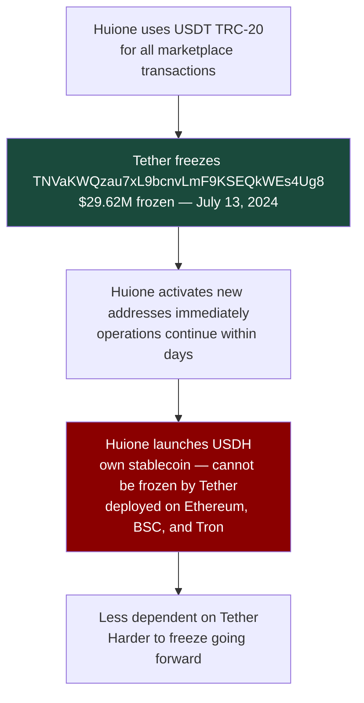
 
### AML Coverage Gap: Tron vs Ethereum
 
Most compliance systems were built for Bitcoin and Ethereum first.
Tron was added later and coverage is still less complete.
 
| AML Capability | Ethereum | Tron |
|---|---|---|
| Chainalysis address attribution | Extensive | Growing |
| TRM Labs risk scoring | Full | Partial |
| Travel Rule implementation | Better | Less consistent |
| Exchange screening | Most exchanges | Fewer exchanges |
| Regulatory guidance | Specific | General only |
 
This gap is narrowing. But between 2021 and 2024 criminals used it heavily.
 
---
 
## Part 5 — AML Gaps: Why Pig Butchering Is Hard to Stop
 
### Gap 1 - The Legitimate Exchange Problem
 
The victim buys USDT on a licensed exchange like Binance or Coinbase.
From the exchange's perspective this is a normal purchase. No red flags.
 
What the exchange sees:
- Customer passed KYC
- Bought USDT (normal behavior)
- Withdrew USDT to external wallet (normal behavior)

What the exchange does not see:
- Where the USDT is going
- That the destination is a pig butchering aggregation address
  
How to close this gap: screen destination wallets before allowing withdrawals.
This is what Chainalysis KYT does. Not all exchanges use it.
 
---
 
### Gap 2 — Withdrawal Destination Screening
 
Many exchanges screen incoming deposits but not outgoing withdrawals.
The victim sends money to a scam address — the exchange never checks if that destination is risky.
 
If exchanges screened all withdrawals against known pig butchering clusters — they could warn the victim before the money leaves.
 
Red flags at the withdrawal stage:
 
| Red Flag | Risk Level |
|---|---|
| Destination wallet created less than 7 days ago | 🟡 MEDIUM |
| Destination wallet has no prior transaction history | 🟡 MEDIUM |
| Destination wallet linked to known scam cluster | 🔴 CRITICAL |
| Multiple withdrawals to same new wallet in short period | 🔴 HIGH |
| New account making first large withdrawal | 🟡 MEDIUM |
| Customer mentions "investment platform" in support chat | 🔴 HIGH |
 
---
 
### Gap 3 — TRC-20 Monitoring Gap
 
Most compliance systems cover Ethereum better than Tron. Travel Rule applies inconsistently to Tron transfers.
Many smaller exchanges have limited TRC-20 monitoring.
 
Result: pig butchering moved heavily to Tron because AML coverage was weaker there.
 
How to close this gap: FATF guidance needs to be chain-agnostic.
The Travel Rule should apply to Tron transfers just like Ethereum.
 
---
 
### Gap 4 — Huione Jurisdictional Gap
 
Huione is based in Cambodia. FinCEN can issue rules — but cannot directly regulate a Cambodian company.
FATF can pressure Cambodia — but Cambodia has political reasons to protect Huione (Hun family).
 
Even after the FinCEN designation Huione created new infrastructure and launched USDH.
The only real solution is correspondent banking restrictions that cut off Cambodia from the US dollar system entirely.
 
---
 
### Gap 5 — Victim Reporting Gap
 
Most pig butchering victims do not report to police. They feel ashamed. 
They think nothing will help. Some face language barriers.
 
Without reports there are no SARs. Without SARs there is no FIU data.
Without FIU data there are no patterns. Without patterns there are no investigations.
 
How to close this gap: public awareness campaigns, simplified reporting, victim support programs, 
and protecting victims from prosecution when they were unknowingly used as money mules.
 
---
 
### Gap 6 — The Human Trafficking Complication
 
The people making the calls and building relationships with victims are often
victims themselves — trafficked and held in compounds against their will.
 
This creates a real problem:
- Arresting "scammers" may prosecute trafficking victims
- Law enforcement focused on financial crime can miss the human trafficking angle
- People in compounds need help, not criminal charges
  
This is why pig butchering is treated as a national security and human rights issue — not just an AML matter. 
It requires cooperation between financial intelligence, law enforcement, and anti-trafficking agencies.
 
---
 
## Part 6 — Red Flags and AML Response
 
### Red Flags at the Exchange Where Victim Buys Crypto
 
| Indicator | AML Significance | Recommended Action |
|---|---|---|
| New account, first transaction is large purchase | Velocity anomaly | EDD, source of funds request |
| Customer immediately withdraws full purchase to unhosted wallet | No delay time | Destination wallet screening |
| Customer mentions "trading platform" with high guaranteed returns | Investment fraud indicator | Customer education, hold |
| Multiple withdrawals to same new wallet in short period | Aggregation pattern | Alert, SAR consideration |
| Destination wallet flagged as pig butchering cluster | Confirmed risk | Freeze, SAR, alert customer |
| Customer is elderly with no prior crypto activity | Vulnerability indicator | Enhanced review |
 
### Red Flags at the Bank Where Victim Withdraws Funds
 
| Indicator | AML Significance |
|---|---|
| Large cash withdrawal followed by crypto purchase | Cash-to-crypto pattern |
| Customer explains "investment opportunity" with high returns | Investment fraud indicator |
| Multiple large transfers to MSB or crypto exchange | High-risk counterparty |
| Elderly or vulnerable customer, first large international transfer | Vulnerability + velocity |
| Customer is being coached on phone during transaction | Third party influence |
 
### Analyst Decision Tree
 
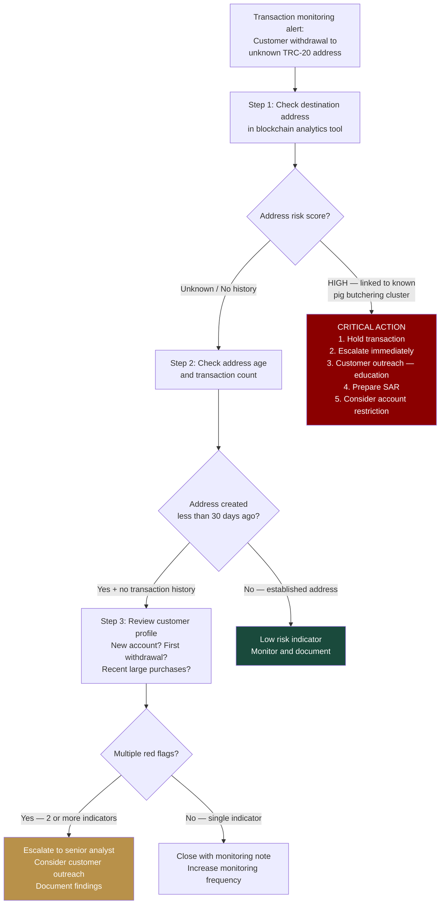
 
---
 
## Part 7 — Mock SAR: Pig Butchering Victim on Exchange
 
> **Disclaimer:** This is a fictional SAR written for educational and portfolio purposes. All institution details are fictional. Wallet addresses referenced are real public blockchain data.
 
> **Note on format:** In a real FinCEN BSA E-Filing System this would be submitted as plain text. Table format and headers are used here for portfolio readability only.
 
---
 
**Filing Institution:** Clear Exchange Ltd. · VASP · FinCEN Registration No. XXXXXXX · Wilmington, DE 19801
 
**Date of Report:** March 28, 2026
 
**SAR Type:** Suspected proceeds of fraud — pig butchering investment scam
 
**Prior SARs on Subject:** None on file
 
---
 
**Subject of Report:**
 
| Field | Detail |
|---|---|
| Name | Sarah M. (account holder) |
| Account ID | XXX-XXXXXX |
| Account opened | 45 days prior to flagged transaction |
| Occupation (stated) | Teacher |
| Annual income (stated) | $52,000 |
 
---
 
**Description of Suspicious Activity:**
 
On March 10, 2026, customer Sarah M. made her fourth consecutive withdrawal of USDT TRC-20 to address `TNVaKWQzau7xL9bcnvLmF9KSEQkWEs4Ug8` totalling $38,500 over a 14-day period. 
Our blockchain analytics system (Chainalysis KYT) flagged this address as associated with a pig butchering scam cluster linked to Huione Guarantee infrastructure.
 
Prior transaction history shows the customer purchased USDT on four separate occasions totalling $41,200 — consistent with a single source of funds (bank account transfers) — and 
withdrew the funds immediately to the same destination address on each occasion. No funds remained in the account between purchases and withdrawals.
 
When contacted by our compliance team on March 11, the customer stated she was "investing in a trading platform recommended by a friend" and that she expected "returns of 15–20% per month."
She was unable to provide the name of a licensed trading platform or verify that the destination platform held any regulatory licence.
 
The customer's stated occupation as a teacher with an annual income of $52,000 is inconsistent with the transaction volume of $41,200 over 14 days — representing approximately 79% of her stated annual income.
 
---
 
**Red Flags Identified:**
 
> Note: In a real FinCEN filing these would be submitted as numbered plain text paragraphs.
 
| Indicator | Risk Level |
|---|---|
| Destination address linked to Huione Guarantee pig butchering cluster per Chainalysis KYT | 🔴 CRITICAL |
| Four consecutive withdrawals to same high-risk address - no delay time | 🔴 HIGH |
| Transaction volume (79% of annual income in 14 days) inconsistent with customer profile | 🔴 HIGH |
| Customer described guaranteed returns of 15–20% monthly — consistent with investment fraud | 🔴 HIGH |
| Customer unable to identify or verify the destination platform | 🟡 MEDIUM |
| Account opened 45 days prior — limited transaction history | 🟡 MEDIUM |
 
---
 
**Actions Taken:**
 
| Date | Action |
|---|---|
| Mar 10 — 14:22 UTC | Chainalysis KYT alert generated on outgoing TRC-20 transfer |
| Mar 10 — 14:35 UTC | Transaction held pending compliance review |
| Mar 10 — 14:45 UTC | Account restricted pending investigation |
| Mar 10 — 15:00 UTC | Compliance officer notified — case escalated |
| Mar 11 — 10:00 UTC | Customer contacted — provided explanation consistent with investment fraud |
| Mar 11 — 10:30 UTC | Customer informed of general investment fraud risk — educational outreach conducted (no mention of SAR or specific investigation) |
| Mar 12 – Mar 18 | Additional blockchain analytics review — Chainalysis Reactor cluster expansion, identification of related addresses |
| Mar 19 | Senior AML officer reviewed case — SAR filing recommended |
| Mar 20 – Mar 25 | SAR narrative drafted, internal compliance review, legal team review |
| Mar 26 | Final SAR approval by MLRO |
| Mar 28 | SAR filed with FinCEN |
 
> Note: Customer was NOT informed that a SAR was filed — tipping off prohibition per 31 U.S.C. § 5318(g)(2).
 
> Note: Customer WAS informed of general investment fraud risk — not of the SAR filing or any specific investigation. This is a customer protection / consumer education measure consistent with
> our duty of care obligations. It does not constitute tipping off under 31 U.S.C. § 5318(g)(2) because no information about the SAR, the investigation, or law enforcement involvement was disclosed.
 
---
 
**Analyst Note:**
 
This activity is consistent with pig butchering investment fraud. The destination address is publicly linked to Huione Guarantee — a criminal marketplace designated as a money laundering concern by FinCEN. 
The customer appears to be a victim rather than a knowing participant. Educational outreach was conducted.
 
Frozen transaction: $8,500 USDT TRC-20 remains held pending law enforcement instruction. Previous three transactions totalling $32,700 were processed before the alert was triggered — this 
highlights the need for proactive outgoing withdrawal screening against known pig butchering clusters.
 
---
 
**END OF MOCK SAR**
 
---
 
## Key Takeaways
 
**1. Pig butchering is not a simple scam** — it is organised transnational crime with industrial infrastructure. Individual scammers are often victims themselves — trafficked and held against their will.
 
**2. Huione Guarantee was the central enabler** $4B+ in verified illicit funds, $55B+ total platform volume, providing every tool needed to run pig butchering operations at scale.
 
**3. TRC-20 USDT was chosen intentionally** near-zero fees, fast settlement, and weaker AML coverage made Tron the preferred infrastructure. USDH was created specifically to remove the last remaining freeze risk.
 
**4. Address-level freezes are insufficient** Tether froze $29.62M in July 2024 and Huione recovered within days. Only FinCEN's systemic Section 311 designation in October 2025 caused real operational collapse.
 
**5. The biggest gap is withdrawal screening** — exchanges that screen incoming deposits but not outgoing withdrawals miss the most important moment to protect victims.
 
**6. Victims need protection too** — AML response should include customer education and outreach alongside SAR filing when pig butchering is suspected.
 
---
 
## Sources
 
- Chainalysis Crypto Crime Report 2025 
- Chainalysis — Huione Group Shutdown and the Future of Crypto Scam Infrastructure (May 2025) — https://www.chainalysis.com/blog/huione-group-shutdown-future-of-crypto-scam-infrastructure/
- Elliptic — Huione: The Largest Ever Illicit Online Marketplace (July 2024) — https://www.elliptic.co/blog/huione-largest-ever-illicit-online-marketplace-stablecoin
- FinCEN NPRM — Huione Group Section 311 Proposed Rule (May 2025) — https://www.federalregister.gov/documents/2025/05/05/2025-07837/special-measure-regarding-huione-group-as-a-foreign-financial-institution-of-primary-money
- FinCEN Final Rule — Huione Group Section 311 (October 2025) — https://www.federalregister.gov/documents/2025/10/16/2025-19571/imposition-of-special-measure-regarding-huione-group-as-a-foreign-financial-institution-of-primary
- FATF Sixth Targeted Update on Virtual Assets/VASPs (June 2025) — https://www.fatf-gafi.org/en/publications/Fatfrecommendations/targeted-update-virtual-assets-vasps-2025.html
- Bitrace — Analysis of the Cambodian Huione Group's $29.62M USDT Freezing Incident — https://blog.bitrace.io/analysis-of-the-cambodian-huione-groups-29-62-million-usdt-freezing-incident-by-tether/
- SlowMist — On-Chain Analysis of HuionePay: $55 Billion USDT in Fund Flows (June 2025) — https://slowmist.medium.com/on-chain-analysis-of-huionepay-unveiling-the-over-55-billion-usdt-in-fund-flows-692e4a72d320
- SlowMist Dune Dashboard — HuionePay Data — https://dune.com/misttrack/huionepay-data
- TRM Labs — Pig Butchering Intelligence Reports 2024–2025
- UNODC — Transnational Organised Crime in Southeast Asia Report 2024 https://www.unodc.org/roseap/uploads/documents/Publications/2024/TOC_Convergence_Report_2024.pdf
- Tronscan.org — On-chain data: TNVaKWQzau7xL9bcnvLmF9KSEQkWEs4Ug8 and TL8TBpubVzBr1UWPXBXU8Pci5ZAip9SwEf
---
 
*Prepared by Andrey Kotsyk — AML/Blockchain Forensics Portfolio*
 
*All on-chain data is publicly available on Tronscan.org. SAR is fictional and created for educational purposes only. Huione addresses are documented in public reports cited above.*
 
*linkedin.com/in/andrey-kotsyk · github.com/KotsykAndrey/aml-blockchain-portfolio*
