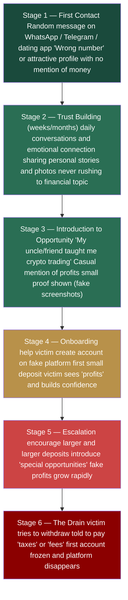
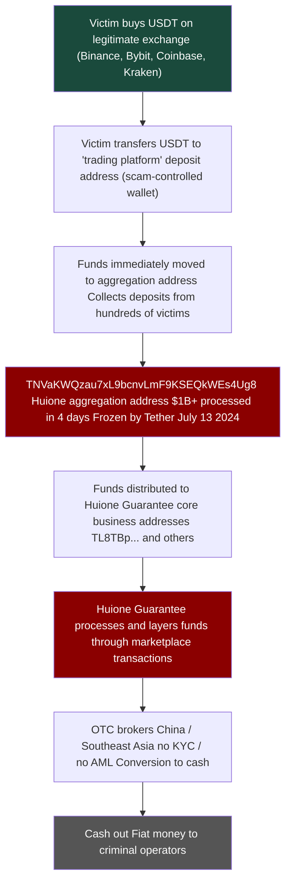
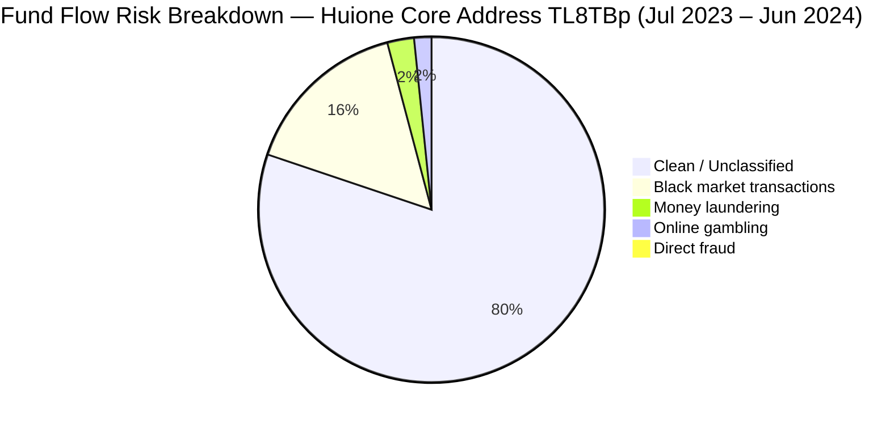
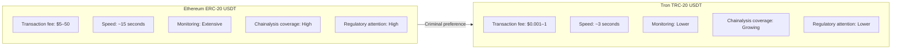
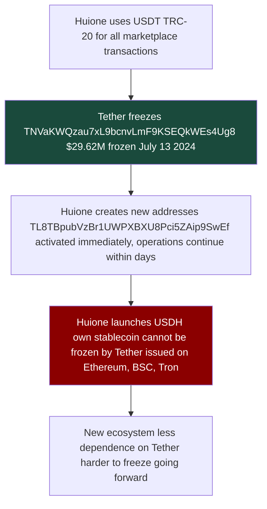

# Case 2 — Pig Butchering & Huione Guarantee: Full AML Analysis
 
**Type:** Financial Crime Typology, On-chain Analysis, AML Gap Assessment
 
**Date of Analysis:** May 2026
 
**Tools Used:** Tronscan.org (free, public)
 
**Addresses Analyzed:**
- `TNVaKWQzau7xL9bcnvLmF9KSEQkWEs4Ug8` — Huione Guarantee aggregation address (frozen by Tether July 2024, $29.62M frozen)
- `TL8TBpubVzBr1UWPXBXU8Pci5ZAip9SwEf` — HuionePay core business address ($1.66B+ deposits, created Oct 2022, still active May 2026, identified via SlowMist Dune dashboard + verified on Tronscan)
**Sources:** Chainalysis Crypto Crime Report 2025, Elliptic Huione Report 2024, FinCEN Proposed Rule 2024, Bitrace On-chain Analysis, TRM Labs Reports, UNODC Southeast Asia Reports
 
---
 
## Overview
 
This case study covers three connected topics:
 
1. **Pig Butchering** and how the scheme works from first contact to financial drain.
2. **Huione Guarantee** - the criminal marketplace that enables the entire pig butchering ecosystem.
3. **TRC-20 USDT and AML Gaps** and why Tron became the infrastructure of choice for organised financial crime.
All on-chain data in this case comes from publicly available blockchain records. No paid tools were used.
 
---
 
## Part 1:  Pig Butchering. How the Scheme Works
 
### What Is Pig Butchering
 
Pig butchering - is a long-term investment fraud that combines romance scam tactics with fake cryptocurrency trading platforms. The name comes from the idea of fattening a pig before slaughter, the scammer builds 
a relationship with the victim over weeks or months before draining their savings.
 
It is not a simple scam. It is an industrialised operation run by organised crime groups from Southeast Asia. Many of the "scammers" are themselves victims (trafficked people forced to work in scam compounds
in Cambodia, Myanmar, and Laos under threat of violence).
 
### Statistics
 
- **$75+ billion** in victim losses globally (Chainalysis 2025 estimate)
- **$64 billion** processed through Huione Group alone between 2021–2025 per FinCEN
- Tens of thousands of victims globally per year
- Operates from scam compounds with hundreds to thousands of forced workers

### The Psychological Cycle, 6 Stages:
 

 
### How the Fake Platform Works
 
The victim never trades on a real exchange. They use a fake platform that looks exactly like Binance or another legitimate exchange — professional design, real-time charts, support chat. But:
 
- All "trades" are fake, the platform shows whatever the scammer programs
- "Profits" are fake (they exist only to encourage larger deposits)
- Withdrawals are always blocked, victims are told they owe taxes, fees, or need to "unlock" their account
- The platform disappears once the scammer has extracted maximum funds
  
### Who Are the Scammers
 
This is important for AML context. The people making the calls and building the relationships are often:
 
- Trafficked workers from China, Taiwan, Malaysia, Vietnam, Myanmar
- Recruited with fake job advertisements promising IT or customer service work
- Held in compounds against their will
- Forced to meet daily quotas of victim conversations
  
This is why arresting individual scammers does not stop the operation. The criminal infrastructure is the compound operators, the technology providers, the money launderers, they are the real target.
 
---
 
## Part 2: On-Chain Flow, from Victim to Cash Out
 
### The Full Money Flow
 

 
### Real On-Chain Analysis. Aggregation Address
 
**Address:** `TNVaKWQzau7xL9bcnvLmF9KSEQkWEs4Ug8`
 

 
**Key data from Tronscan:**
- Created: **July 9, 2024**
- Frozen by Tether: **July 13, 2024**, only 4 days after creation
- Total transactions: **48,700**
- Total transfers: **82,429** (34,692 outgoing + 47,737 incoming)
- Current balance: **$1.14**, funds already moved or frozen
  
**What this means:** This address was created specifically for a large collection operation. In just 4 days it processed over $1 billion USDT from hundreds of different senders before Tether intervened. The pattern is clear (rapid creation, massive inflow from many sources, then freeze).
 
### Transfers, Aggregation Pattern
 

 
Looking at the transfers tab you can see the typical aggregation pattern:
 
- **Many different senders** — each from a different wallet (different victims)
- **Varied amounts** $1,200 / $1,500 / $2,000 / $2927 / $5,000 / $9,057 / $10,000 / **$270,000** / 
- **All in the same time period** — coordinated collection from active scam operations
- **All USDT TRC-20**, no other tokens, just stablecoins for easy conversion
The smaller amounts ($1,200–$10,000) are likely individual victims at different stages of the scam. The large amounts ($270K, $2.9M) are either high-value individual victims or sub-aggregation wallets
consolidating funds from multiple victims.
 
### HuionePay Scale, Dune Analytics (SlowMist Dashboard)
 
> Note: Tronscan's built-in analysis tab shows TRX balance only, not USDT transfers. For real USDT volume analysis, SlowMist built a public Dune dashboard: https://dune.com/misttrack/huionepay-data
 
#### Monthly USDT Volume
 

 
This graph shows the full scale of HuionePay USDT flows on Tron (Jan 2024 – Jan 2026):
 
- **Jan 2024** — ~$590M USDT per month in deposits and withdrawals
- **Jun–Jul 2024** — first peak ~$1B+ USDT monthly — maximum activity
- **Jul 2024** — minor dip after Tether froze TNVaKWQzau7xL9bcnvLmF9KSEQkWEs4Ug8 and operations recovered within weeks
- **Feb 2025** — second peak ~$1.1B USDT — showed that the Tether freeze had almost no long-term impact
- **May–Jun 2025** — still $800M–$1.1B monthly
- **Jul–Aug 2025** — sharp collapse, FinCEN Section 311 designation + Telegram channel ban
- **Oct 2025 onward** — near zero activity
**Key AML observation:** The Tether freeze in July 2024 barely slowed operations. Huione recovered within weeks by switching addresses. Only the FinCEN systemic designation in May 2025 — which cut off US correspondent banking access caused real operational disruption. This shows that address-level freezes are insufficient without systemic regulatory action.
 
#### Monthly Active Users
 

 
- **Jan 2024** — ~29,000 depositors and recipients per month
- **Peak (Jun–Jul 2025)** — 80,000+ unique users per month
- **Aug 2025** — sharp decline following regulatory action
- **Dec 2025** — near zero
  
At peak, Huione was processing transactions for more active monthly users than many legitimate regional banks. This is not a small criminal operation, it is industrial-scale financial infrastructure.
 
#### Total Volume Counters and Top Addresses
 

 
**Total flows (January 2024 – June 2025):**
- Total withdrawals: **$61,540,947,381** (~$61.5B USDT)
- Total deposits: **$68,964,360,769** (~$68.9B USDT)
- Combined throughput: **~$130B USDT** in 18 months
This data from SlowMist/MistTrack covers only the 2024–2025 period. FinCEN's assessment covering 2021–2025 estimates total flows at $64B+ which aligns with the scale visible here.
 
**Core business address identified:**
 
The deposits rank table reveals the full address of HuionePay's primary business address:
 
`TL8TBpubVzBr1UWPXBXU8Pci5ZAip9SwEf` — **$1,665,718,013 in deposits** is top address by volume
 
This matches the `TL8TBp...` address referenced in Bitrace reports. Verified on Tronscan:
 

 
**Key data from Tronscan:**

- Created: **October 6, 2022** — operational for 3+ years
- Latest activity: **May 10, 2026** — still active at time of analysis
- Total transactions: **141,734**
- Total transfers: **871,288** (860,825 outgoing + 10,463 incoming)
- Current balance: **$144.12** — near zero, funds constantly moving out
  
**Comparison: aggregation address vs core business address**
 
| | TNVaKWQzau7xL9bcnvLmF9KSEQkWEs4Ug8 (aggregation) | TL8TBpubVzBr1UWPXBXU8Pci5ZAip9SwEf (core business) |
|---|---|---|
| Created | July 9, 2024 | October 6, 2022 |
| Lifespan | 4 days before freeze | 3+ years, still active |
| Transactions | 48,700 | 141,734 |
| Transfers | 82,429 | 871,288 |
| Outgoing ratio | High inflow from victims | 98.8% outgoing |
| Status | Frozen by Tether | Still active |
 
The 98.8% outgoing ratio (860,825 out vs 10,463 in) confirms this is a **distribution node**, funds collected by aggregation addresses like TNVaKW are routed here and then redistributed to vendors, operators
and OTC cash-out points. This is the layering stage of the laundering process in action.

### Top Addresses by Volume, Deposits and Withdrawals Rank
 

 
**Top deposit addresses (639,025 total unique depositors):**
 
| Address | Total Deposited (USDT) |
|---|---|
| TL8TBpubVzBr1UWPXBXU8Pci5ZAip9SwEf | 1,665,718,013 |
| TVy8p6erwinkkfmvG3iPGpUkswMZU36uMV | 605,687,723 |
| TPepdLYtHr8cN1Jbwf6CGNB9Ppho7L2otr | 449,218,402 |
| TM1zzNDZD2DPASbKcgdVoTYhfmYgtfwx9R | 436,485,292 |
| TFTWNgDBkQ5wQoP8RXpRznnHvAVV8x5jLu | 402,144,129 |
 
**Top withdrawal addresses (960,910 total unique recipients):**
 
| Address | Total Withdrawn (USDT) |
|---|---|
| TWS84SZ2GE2EgyZDCrfVuEJXpoXYuBxteS | 816,288,490 |
| T9yFi9yxwBUjMbHwBFKDdwFdBwvzUAqBfR | 580,787,004 |
| TTSSC4TEYtQMAMURND6i1FPYaaBJMGY4ed | 512,389,323 |
| TDRkHLDxnBu2XtkxwKZMm5qwSuguKHmWDB | 479,470,912 |
| TVy8p6erwinkkfmvG3iPGpUkswMZU36uMV | 379,550,762 |
 
**Key observation:** TVy8p6erwinkkfmvG3iPGpUkswMZU36uMV appears in **both** top deposits and top withdrawals — this is a typical pass-through address that receives and immediately re-sends funds. 
960,910 unique withdrawal addresses confirms the scale of the distribution network.
 
### Outgoing Transfers, Layering in Action
 

 
Filtering for outgoing transfers reveals a critical pattern, the core business address sends massive amounts repeatedly to a **single destination address**: `TQUvJ5HEfazJtEzdjF9GbN8rKdCgzKeqWX`
 
Sample of outgoing transactions visible on a single page — all amounts in USDT:
 
| Amount (USDT) | Destination |
|---|---|
| 67,813 | TQUvJ5HEfazJtEzdjF9GbN8rKdCgzKeqWX |
| 600,000 | TQUvJ5HEfazJtEzdjF9GbN8rKdCgzKeqWX |
| 1,000,000 | TQUvJ5HEfazJtEzdjF9GbN8rKdCgzKeqWX |
| 1,000,000 | TQUvJ5HEfazJtEzdjF9GbN8rKdCgzKeqWX |
| 2,000,000 | TQUvJ5HEfazJtEzdjF9GbN8rKdCgzKeqWX |
| 2,000,000 | TQUvJ5HEfazJtEzdjF9GbN8rKdCgzKeqWX |
| 2,000,000 | TQUvJ5HEfazJtEzdjF9GbN8rKdCgzKeqWX |
| 2,000,000 | TQUvJ5HEfazJtEzdjF9GbN8rKdCgzKeqWX |
| 1,080,000 | TQUvJ5HEfazJtEzdjF9GbN8rKdCgzKeqWX |
| 1,310,000 | TQUvJ5HEfazJtEzdjF9GbN8rKdCgzKeqWX |
| 1,050,000 | TQUvJ5HEfazJtEzdjF9GbN8rKdCgzKeqWX |
| 1,260,000 | TQUvJ5HEfazJtEzdjF9GbN8rKdCgzKeqWX |
| 1,130,000 | TQUvJ5HEfazJtEzdjF9GbN8rKdCgzKeqWX |
 
This single page of transfers represents over **$20,000,000 USDT** in outgoing transactions and all going to the same destination address. These are not retail transfers. 
This is wholesale movement of criminal proceeds between infrastructure layers.
 
Every single outgoing transaction goes to the same destination address (a pattern that would immediately trigger a transaction monitoring alert at any regulated exchange).
 
**What this shows:**
 
This is textbook layering. The core business address acts as a pass-through, it receives funds from hundreds of aggregation addresses and then concentrates them into large transfers to a single next-level address. The destination `TQUvJ5HEfazJtEzdjF9GbN8rKdCgzKeqWX` is likely either another Huione-controlled consolidation address or a direct OTC cash-out point.
 
**The full layering chain visible on-chain:**
 

 
This three-level structure is deliberately designed to make tracing difficult, by the time funds reach level 3, the connection to individual victims is buried under thousands of intermediate transactions.
 
**Top withdrawal addresses (960,910 total unique addresses):**
- `TWS84SZ2GE2EgyZDCrfVuEJXpoXYuBxteS` — $816M
- `T9yFi9yxwBUjMbHwBFKDdwFdBwvzUAqBfR` — $580M
- `TTSSC4TEYtQMAMURND6i1FPYaaBJMGY4ed` — $512M
**639,025 unique deposit addresses**, each representing a different user or sub-account within the HuionePay ecosystem.
 
#### Transaction Count
 

 
- Withdrawals peaked at **150,000 transactions per month** (Jun–Jul 2025)
- Deposits peaked at **100,000+ transactions per month**
- Both metrics collapsed after July 2025
  
150,000 monthly withdrawal transactions means approximately **5,000 transactions per day** at peak. This level of throughput requires automated infrastructure, not manual processing.
Huione was running a fully automated money laundering platform.
 
---

## Part 3: Huione Guarantee. The Criminal Marketplace
 
### What Is Huione Group
 
Huione Group is a Cambodian financial conglomerate with links to the Hun family (Cambodia's ruling political dynasty). It operates multiple business lines including:
 - **HuionePay** — cryptocurrency payment platform
- **Huione Guarantee** — escrow and marketplace service (became criminal marketplace)
- Insurance, travel, and other businesses
  
Originally Huione Guarantee was a legitimate escrow service for high-value transactions in Southeast Asia. 
Over time it evolved into the largest criminal marketplace for fraud infrastructure on the internet.
 
### Scale of Huione
 
| Metric | Data | Source |
|---|---|---|
| Verified illicit funds laundered (Aug 2021–Jan 2025) | **$4 billion** | FinCEN NPRM May 2025 (official) |
| Total HuionePay flows (2024–Jun 2025) | **$55+ billion** | SlowMist / MistTrack |
| Total crypto volume including legal (since 2021) | **$49 billion** | FinCEN NPRM |
| Dune dashboard combined flows (Jan 2024–Jun 2025) | **~$130 billion** | SlowMist Dune dashboard |
| Core address inflow (Jul 2023–Jun 2024) | **$2.158 billion** | Bitrace Analysis |
| Active deposit addresses | **80,000+** | SlowMist 2025 |
| Frozen by Tether (Jul 2024) | **$29.62 million** | Bitrace / Tronscan |
| DPRK-linked funds laundered | **$37.6 million** | FinCEN |
 
> Note: The difference between $4B (FinCEN illicit) and $55B+ (SlowMist total) is important. FinCEN explicitly acknowledged that Huione also runs legitimate businesses in Cambodia: bill payments,
> QR codes used in restaurants and hotels. The $4B figure represents only verified criminal proceeds. The $55B+ is total platform volume.
 
### What Is Sold on Huione Guarantee
 
Elliptic researchers identified thousands of vendors on the platform selling:
 
| Category | What Is Sold | Approx. Price |
|---|---|---|
| AI Tools | Deepfake software, voice cloning, fake profile generators | $50–500 |
| Identity Documents | Fake passports, KYC bypass kits, synthetic identities | $100–2,000 |
| Scam Infrastructure | Fake trading platform templates, romance scam scripts | $500–10,000 |
| Money Laundering | Crypto-to-cash conversion, mixing, layering services | 3–5% commission |
| Victim Data | Contact lists, victim databases, lead generation | $10–100 per 1,000 |
| Physical Items | Electrified shackles for use on compound workers | Varied |
 
The presence of electrified shackles in the marketplace catalogue illustrates the direct connection between Huione and human trafficking operations in scam compounds.
 
### Fund Flow Risk Breakdown
 
Based on Bitrace analysis of core address TL8TBpubVzBr1UWPXBXU8Pci5ZAip9SwEf (July 2023 – June 2024):
 

 
Note: The low "direct fraud" percentage does not mean fraud is rare. It means the funds are already layered by the time they reach the core address is direct pig butchering deposits go to 
aggregation addresses first (like TNVaKWQzau7xL9bcnvLmF9KSEQkWEs4Ug8), not directly to the core address.
 
### Regulatory Response to Huione
 
**July 2024:** Tether froze aggregation address TNVaKWQzau7xL9bcnvLmF9KSEQkWEs4Ug8 ($29.62 million USDT blocked). Huione switched to new addresses within days. Operations continued.
 
**Late 2024:** Huione launched **USDH** — their own stablecoin specifically designed to be unfreezable. Also acquired a 30% stake in Tudou Guarantee is expanding their infrastructure.
 
**May 1, 2025:** FinCEN issued a Notice of Proposed Rulemaking (NPRM) under Section 311 of the USA PATRIOT Act — proposing to designate Huione Group as a "primary money laundering concern." 
This would prohibit all US financial institutions from maintaining correspondent accounts with Huione. 30-day public comment period opened.
 
**October 15, 2025:** FinCEN issued the final rule under Section 311 — fully prohibiting US financial institutions from conducting business with Huione Group. OFAC and FinCEN jointly with the 
UK FCDO conducted the largest-ever action against a Southeast Asian cyber fraud ring (sanctions against Chen Zhi of Prince Group and full disconnection of Huione from the US financial system).
 
This explains the sharp activity collapse visible on the Dune dashboard after July–August 2025.
 
**Key lesson for AML:** Address-level freezes (Tether July 2024) bought days. Systemic regulatory action (FinCEN Section 311 October 2025) caused real operational disruption. The difference is clear 
on the Dune activity charts, the Tether freeze barely registers while the FinCEN designation caused a collapse from $800M+ monthly to near zero.
 
---

## Part 4: Why USDT on Tron (TRC-20)? Technical and AML Analysis
 
### Tron vs Ethereum: Why Criminals Chose Tron
 

 
**The economics are clear:**

- A single USDT transfer on Ethereum costs $5–50 at normal gas prices, and can spike to $100–500 during network is overloaded
- A single USDT transfer on Tron costs $0.001–1 regardless of conditions
- Pig butchering collects from hundreds of victims daily approximately 1,000 transactions per day the fee difference is $5,000–50,000 per day on Ethereum vs under $1,000 on Tron
- Speed matters, faster transactions means faster layering before any freeze can be applied
  
### USDT — Why a Stablecoin
 
Scammers need stability. If they collected ETH or BTC:
- Price fluctuates and their holdings lose value while waiting to layer
- Conversion to fiat requires extra steps
USDT is pegged 1:1 to USD, it is already dollars in crypto form. This makes the cash-out step simpler and reduces value leakage during layering.
 
### USDH — Huione's Own Unfreezable Stablecoin
 
After Tether froze $29.62M in July 2024, Huione's biggest vulnerability became clear (dependence on a centralised stablecoin that a third party could freeze). 
Their response was to remove that dependency entirely.
 
In late 2024 Huione launched **USDH** (their own stablecoin pegged 1:1 to USD, deployed on Ethereum, BNB Chain, and Tron).
 
**Key difference from USDT:**
 
| | USDT (Tether) | USDH (Huione) |
|---|---|---|
| Issuer | Tether Ltd — regulated | Huione Group — unregulated |
| Can be frozen | ✅ Yes, Tether has freeze function | ❌ No, no central freeze authority |
| Regulatory oversight | Growing | None |
| Purpose | General payments | Criminal marketplace transactions |
| Backing | US Treasury bonds (claimed) | Unknown |
 
**Why this matters for AML:**
 
USDH is specifically designed to be immune to the main tool (asset freezing) that stopped Huione temporarily. If exchanges and compliance systems do not screen for USDH specifically, 
transactions in this token will pass through undetected.
 
This is a direct example of **regulatory arbitrage in action** — criminals building infrastructure specifically to exploit gaps in existing AML controls. Every time a control is applied, 
the criminal ecosystem adapts to work around it.
 
**Current status:** USDH remains active. It represents an emerging AML gap that most compliance systems have not yet addressed, blockchain analytics providers are still building coverage for this token.
 
USDT is issued by Tether — a centralised company that can freeze any wallet. This is actually a law enforcement tool, Tether has frozen hundreds of millions in criminal wallets.
 
But Huione's response shows how criminals adapt:
 

 
### AML Coverage Gap: Tron vs Ethereum
 
Most compliance systems were built primarily for Bitcoin and Ethereum. Tron was added later and coverage is less comprehensive:
 
| AML Capability | Ethereum | Tron |
|---|---|---|
| Chainalysis address attribution | Extensive | Growing |
| TRM Labs risk scoring | Full | Partial |
| Travel Rule implementation | Better | Less consistent |
| Exchange screening | Most exchanges | Fewer exchanges |
| Regulatory guidance | Specific | General only |
 
This gap is narrowing but remains real. Criminals exploited it heavily between 2021–2024.
 
---

## Part 5: AML Gaps. Why Pig Butchering Is Hard to Stop
 
### Gap 1 - The Legitimate Exchange Problem
 
**The problem:** The victim buys USDT on a fully licensed, regulated exchange (Binance, Bybit, Coinbase). From the exchange's perspective this is a normal purchase. No red flags at point of purchase.
 
**What the exchange sees:**
- Customer passes KYC
- Buys USDT — normal transaction
- Withdraws USDT to external wallet, it is normal transaction
**What the exchange does NOT see:**
- Where the USDT is going
- That the destination wallet is a pig butchering aggregation address
**How to close the gap:** Outgoing transaction screening — check destination wallet risk score before allowing withdrawal. This is what Chainalysis KYT does. Not all exchanges use it.
 
---
 
### Gap 2 - Withdrawal Destination Screening
 
**The problem:** Many exchanges screen incoming deposits but not outgoing withdrawals. The victim sends money OUT to a scam address, the exchange never checks if that destination is high risk.
 
**Why this matters:** If exchanges screened all withdrawal destinations against known pig butchering clusters, they could warn the victim or block the transfer.
 
**AML Red Flags at withdrawal stage:**
 
| Red Flag | Risk Level |
|---|---|
| Destination wallet created less than 7 days ago | 🟡 MEDIUM |
| Destination wallet has no prior transaction history | 🟡 MEDIUM |
| Destination wallet associated with known scam cluster | 🔴 CRITICAL |
| Customer made multiple withdrawals to same new wallet in short period of time | 🔴 HIGH |
| Customer is new account making first large withdrawal | 🟡 MEDIUM |
| Customer mentions "investment platform" in support chat | 🔴 HIGH |
 
---
 
### Gap 3 - TRC-20 Monitoring Gap
 
**The problem:** Most compliance systems have less comprehensive Tron coverage than Ethereum. Travel Rule applies inconsistently to Tron transfers. Many smaller exchanges have limited TRC-20 transaction monitoring.
 
**Result:** Pig butchering operations shifted heavily to Tron specifically because they knew AML coverage was weaker there.
 
**How to close the gap:** Extend full compliance coverage to all chains. FATF guidance needs to be independent in every chain, the Travel Rule should apply to Tron transfers just as it applies to Ethereum.
 
---
 
### Gap 4 - Huione Jurisdictional Gap
 
**The problem:** Huione is based in Cambodia. FinCEN can issue a proposed rule, but they cannot directly regulate a Cambodian company. FATF can pressure Cambodia, but Cambodia has political reasons 
to protect Huione (Hun family connections).
 
**The result:** Even after FinCEN action and Tether freezes — Huione continues to operate. They simply created new addresses and a new stablecoin.
 
**How to close the gap:**

- Correspondent banking restrictions (US and EU banks refuse any relationship with Cambodian banks that have Huione exposure)
- This cuts off Huione from the USD financial system entirely
- International law enforcement cooperation is harder but more effective long-term
  
---
 
### Gap 5 - Victim Reporting Gap
 
**The problem:** Most pig butchering victims do not report to police. Reasons:

- Shame — they feel responsible for being deceived
- Distrust of police, especially in countries where fraud reporting is difficult
- Belief that nothing can be done
- Language barriers for international victims
  
**Why this matters for AML:** Without victim reports, there are no SAR filings. Without SARs, there is no FIU data. Without FIU data there are no patterns. Without patterns there are no investigations.
 
**How to close the gap:** Public awareness campaigns, simplified reporting processes, victim support programs, and protecting victims from prosecution when they were used as money mules unknowingly.
 
---
 
### Gap 6 - The Human Trafficking Complication
 
**The problem:** The people making the calls and building relationships with victims are often themselves victims — trafficked and held against their will in scam compounds. This creates a moral and legal complexity:
 
- Arresting "scammers" may result in trafficking victims being prosecuted
- Law enforcement focus on financial crime can miss the human trafficking aspect
- Victims in compounds need rescue, not prosecution
  
**AML implication:** This is why pig butchering is treated as a national security and human rights issue — not just an AML matter. It requires a multi-agency response beyond standard compliance procedures.
 
---
