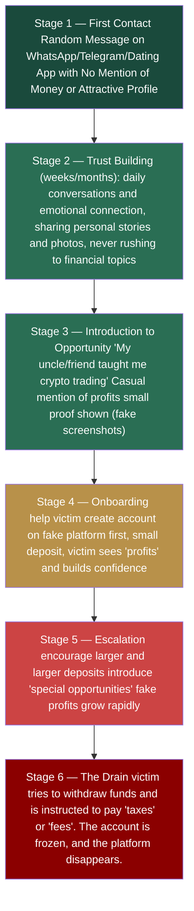
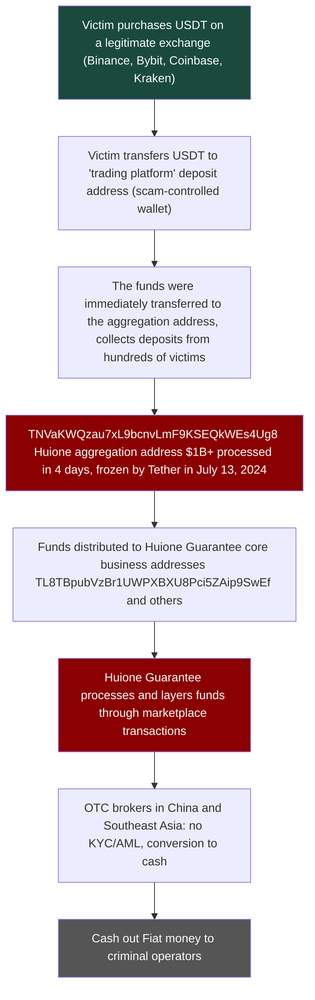
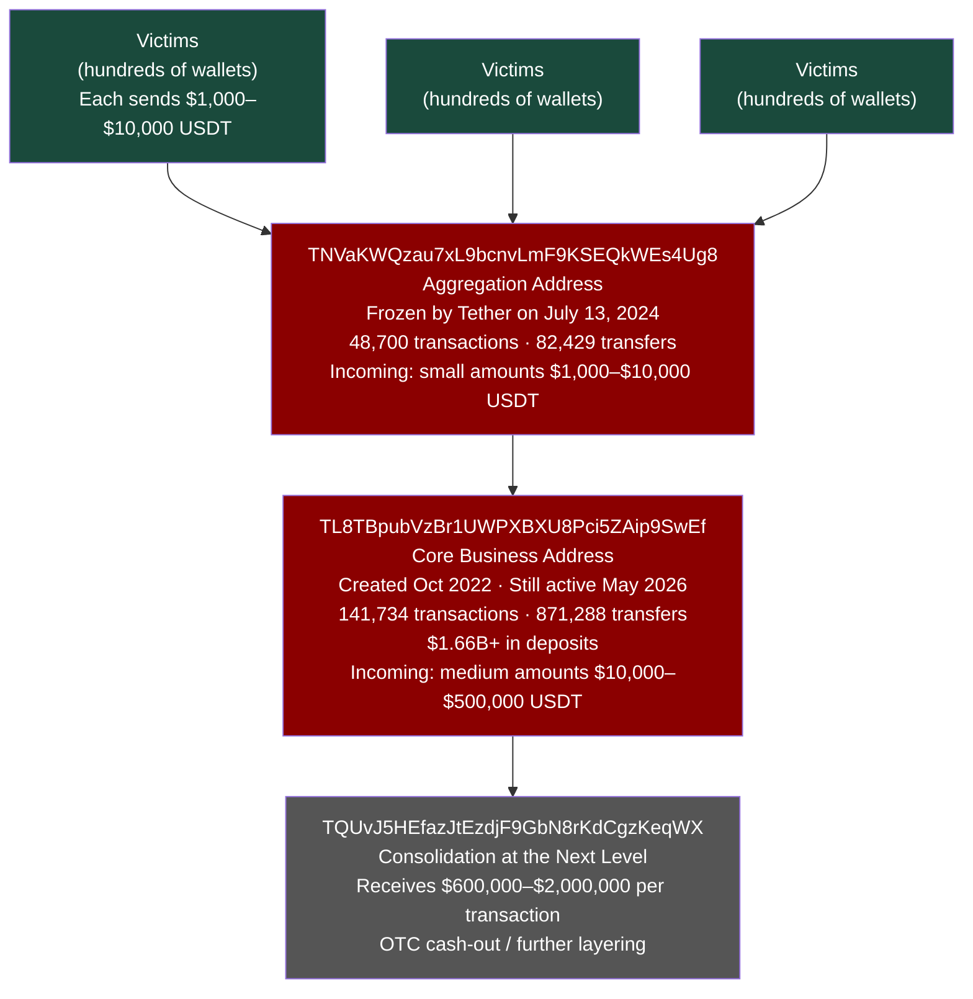
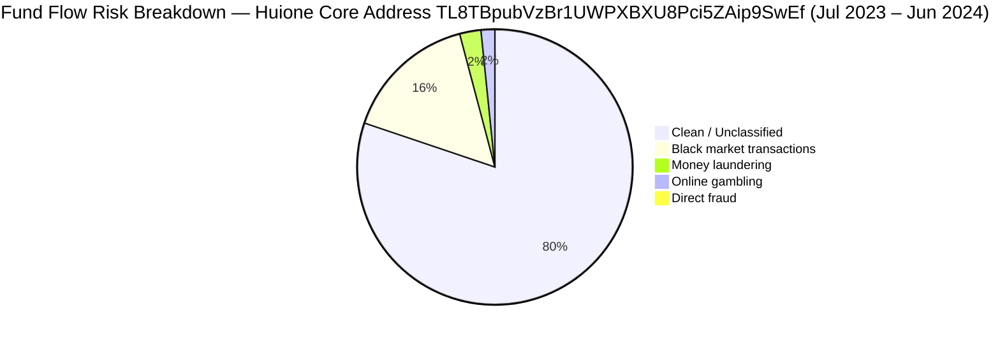

# Case 2: Full AML Analysis of Pig Butchering and Huione Guarantee

**Type:** Financial Crime Typology, On-chain Analysis, AML Gap Assessment

**Analysis Date:** May 2026

**Tools Employed:** TronScan.org (free, public)

**Addresses Analyzed:**
- `TNVaKWQzau7xL9bcnvLmF9KSEQkWEs4Ug8` — Huione Guarantee aggregation address ($29.62M frozen by Tether in July 2024)
- `TL8TBpubVzBr1UWPXBXU8Pci5ZAip9SwEf` — HuionePay's core business address ($1.66B+ deposits, created in October 2022, still active in May 2026, identified via SlowMist Dune dashboard + verified on Tronscan)
**Sources:** Chainalysis Crypto Crime Report 2025, Elliptic Huione Report 2024, FinCEN Proposed Rule 2024, Bitrace On-chain Analysis, TRM Labs Reports, UNODC Southeast Asia Reports

---

## Introduction

This case study covers three topics:

1. **Pig Butchering** and how the scheme works from first contact to financial drain.
2. **Huione Guarantee** - the criminal marketplace that enebles to exist pig butchering ecosystem.
3. **TRC-20 USDT and AML Gaps** and the reasons why Tron became the preferred infrastructure for organised financial crime.
All on-chain data in this case comes from publicly available blockchain records. No paid tools.
---

## Part 1: The Process of Pig Butchering. How the Scheme Works

### What Is Pig Butchering

Pig butchering is a long-term investment fraud that combines false cryptocurrency trading platforms with romance scam tactics. The term is derived from the concept of fattening a pig prior to slaughter,
and the fraudster constructs a relationship with the victim for a period of weeks or months prior to drain their savings.
It is not a straightforward fraud. An industrialised operation is being conducted by organised crime organisations from Southeast Asia. Numerous "scammers" are themselves victims, as they are trafficked
individuals who are forced to work in scam compounds under threat of violence in Cambodia, Myanmar, and Laos).

### Statistics:

- **Global victim losses of over $75 billion** (Chainalysis 2025 estimate)
- FinCEN reported that Huione Group alone processed $64 billion between 2021 and 2025.
- Tens of thousands of victims worldwide each year
- Operates from fraudulent compounds that house hundreds to thousands of forced workers

### The Psychological Cycle, 6 Stages:



### How the Fake Platform Works

The victim never trades on a real exchange. They use a fake platform that looks exactly like Binance or another legitimate exchange — professional design, real-time charts, support chat. But:
- The platform displays whatever the scammers' programs(all "trades" are fake).
- "Profits" are fake, they exist only to motivate larger deposits.
- Withdrawals are always blocked, and victims are told that they are required to pay taxes, fees, or "unlock" their account.
- The platform disappears after the scammer has extracted the maximum of money.

### Who Are the Scammers

This is important in the context of anti-money laundering. The people who are responsible for initiating the conversations and building the relationships are often:
- Workers who have been trafficked from China, Taiwan, Malaysia, Vietnam, and Myanmar
- Recruited with fake job advertisements that advertised (positions in IT or customer service)
- Held in compounds against their will
- Compelled to fulfil daily targets for victim conversations

This is the reason why the operation does not stop by the arrest of individual scammers. The compound administrators, technology providers, and money launderers are the true targets of the criminal infrastructure.

---

## Part 2: On-Chain Flow, from Victim to Cash Out

### The Complete Money Flow



### Real On-Chain Analysis. Aggregation Address

**Address:** `TNVaKWQzau7xL9bcnvLmF9KSEQkWEs4Ug8`


**Key data from Tronscan:**
- Created: **July 9, 2024**
- Frozen by Tether: **July 13, 2024**, only 4 days after creation
- Total transactions: **48,700**
- Total transfers: **82,429** (34,692 outgoing + 47,737 inbound)
- Current balance: **$1.14**, funds already moved or frozen

**What this means:** This address was created specifically for a large collection operation. Before Tether intervened, it processed more than $1 billion USDT from hundreds of distinct senders in just 4 days. 
The pattern is clear (rapid creation, massive inflow from many sources, then freeze).

### Aggregation Pattern, Transfers


Looking at the transfers tab you can see the typical aggregation pattern:

- **Many different senders** — each from a different wallet (different victims)
- **Varied amounts** $1,200 / $1,500 / $2,000 / $2927 / $5,000 / $9,057 / $10,000 / **$270,000** / 
- **All within the same time frame** — coordinated collection from active fraud operations
- **All USDT TRC-20**, no other tokens, just stablecoins for easy conversion
The smaller sums ($1,200–$10,000) are likely to be individual victims at different stages of the scam. Large sums ($270K, $2.9M) are either high-value individual victims
or sub-aggregation purses(combining funds from numerous victims)

Dune Analytics (SlowMist Dashboard), HuionePay Scale

> Note: The TRX balance is the sole item displayed in the built-in analysis tab of Tronscan, and USDT transfers are not displayed. For real USDT volume analysis
> SlowMist developed a public Dune dashboard: https://dune.com/misttrack/huionepay-data

#### Monthly USDT Volume


This graph shows the full scope of HuionePay USDT flows on Tron from January 2024 to January 2026:

- **January 2024** — approximately ~$590 million USDT in monthly deposits and withdrawals
- **Jun–Jul 2024** — first peak of approximately $1 billion USDT per month (maximum activity)
- **Jul 2024** — little decline following Tether's freeze TNVaKWQzau7xL9bcnvLmF9KSEQkWEs4Ug8 and operations recovery within weeks
- **Feb 2025** — second peak was approximately ~$1.1 billion USDT. This data indicates that the Tether freeze had minimal long-term impact.
- **May–June 2025** — monthly volume between $800M and $1.1B
- **July–August 2025** — sharp collapse, FinCEN Section 311 designation, and Telegram channel ban
- **From October 2025 onwards** — near zero activity
  
**Key AML observation:** The Tether freeze in July 2024 barely slowed operations. Huione recovered within weeks by switching addresses. Real operational disruption was only caused by the FinCEN 
systemic designation in May 2025, which barred access to US correspondent banking. This demonstrates that address-level restrictions are insufficient in the absence of systemic regulatory action.

#### Monthly Active Users


- **January 2024** — approximately 29,000 depositors and recipients per month
- **Jun–Jul 2025** — peak 80,000+ unique users per month
- **August 2025** — sharp decline following regulatory action
- **December 2025** — near zero activity

At peak, Huione was processing transactions with more active monthly users than many legitimate regional banks. This is not a small criminal enterprise.
It is a financial infrastructure of industrial magnitude.

#### Top Addresses and Total Volume Counters


**Total flows from January 2024 to June 2025:**
- Total withdrawals: **$61,540,947,381** (~$61.5B USDT)
- Total deposits: **$68,964,360,769** (~$68.9B USDT)
- Total deposits and withdrawals: **~$130B USDT** within 18 months
The data from SlowMist/MistTrack covers only the 2024–2025 period. The scale evident here is consistent with the estimated total flows of $64B+ in FinCEN's assessment for 2021–2025.

**Core business address identified:**

The complete address of HuionePay's primary business address is disclosed in the deposits rank table:

`TL8TBpubVzBr1UWPXBXU8Pci5ZAip9SwEf` is the highest address by volume, with **$1,665,718,013 in deposits**.

This corresponds to the `TL8TBp...` address that is mentioned in Bitrace reports. Confirmed through TronScan:


**Key data from Tronscan:**

- Created: **October 6, 2022** — operational for 3+ years
- Latest activity: **May 10, 2026** — still active at time of analysis
- Total transactions: **141,734**
- Total transfers: **871,288** (860,825 outgoing + 10,463 inbound)
- Current balance: **$144.12** — near zero, funds constantly moving out

**Comparison: aggregation address vs core business address**

| | TNVaKWQzau7xL9bcnvLmF9KSEQkWEs4Ug8 (aggregation) | TL8TBpubVzBr1UWPXBXU8Pci5ZAip9SwEf (core business) |
|---|---|---|
| Created | July 9, 2024 | October 6, 2022 |
| Lifespan | 4 days before freeze | 3+ years, still active |
| Transactions | 48,700 | 141,734 |
| Transfers | 82,429 | 871,288 |
| Outgoing ratio | High inflow from victims | 98.8% outgoing |
| Status | Frozen by Tether | Still active |

This is a **distribution node**, as evidenced by the 98.8% outgoing ratio (860,825 out vs 10,463 in). Aggregation addresses, such as TNVaKWQzau7xL9bcnvLmF9KSEQkWEs4Ug8, collect funds that are 
redirected to this distribution node for redistribution to operators and vendors and points for OTC cash-out points. This is the layering stage of the laundering procedure in action.

### Top Addresses by Volume, Deposits, and Withdrawals Rank


**Top deposit addresses (639,025 total unique depositors):**

| Address | Total Deposited (USDT) |
|---|---|
| TL8TBpubVzBr1UWPXBXU8Pci5ZAip9SwEf | 1,665,718,013 |
| TVy8p6erwinkkfmvG3iPGpUkswMZU36uMV | 605,687,723 |
| TPepdLYtHr8cN1Jbwf6CGNB9Ppho7L2otr | 449,218,402 |
| TM1zzNDZD2DPASbKcgdVoTYhfmYgtfwx9R | 436,485,292 |
| TFTWNgDBkQ5wQoP8RXpRznnHvAVV8x5jLu | 402,144,129 |

**Top withdrawal addresses (960,910 total unique recipients):**
 
| Address | Total Withdrawn (USDT) |
|---|---|
| TWS84SZ2GE2EgyZDCrfVuEJXpoXYuBxteS | 816,288,490 |
| T9yFi9yxwBUjMbHwBFKDdwFdBwvzUAqBfR | 580,787,004 |
| TTSSC4TEYtQMAMURND6i1FPYaaBJMGY4ed | 512,389,323 |
| TDRkHLDxnBu2XtkxwKZMm5qwSuguKHmWDB | 479,470,912 |
| TVy8p6erwinkkfmvG3iPGpUkswMZU36uMV | 379,550,762 |

**Key observation:** TVy8p6erwinkkfmvG3iPGpUkswMZU36uMV is present in **both** top deposits and top withdrawals. This is a typical pass-through address that receives and immediately re-sends funds. 
The distribution network's scope is confirmed by the 960,910 unique withdrawal addresses.

### Layering in Action: Outgoing Transfers


Filtering for outgoing transfers reveals a critical pattern, the core business address sends massive amounts repeatedly to a **single destination address**: `TQUvJ5HEfazJtEzdjF9GbN8rKdCgzKeqWX`.

A single page displays a sample of outgoing transactions, all of which are in USDT.

| Amount (USDT) | Destination |
|---|---|
| 67,813 | TQUvJ5HEfazJtEzdjF9GbN8rKdCgzKeqWX |
| 600,000 | TQUvJ5HEfazJtEzdjF9GbN8rKdCgzKeqWX |
| 1,000,000 | TQUvJ5HEfazJtEzdjF9GbN8rKdCgzKeqWX |
| 1,000,000 | TQUvJ5HEfazJtEzdjF9GbN8rKdCgzKeqWX |
| 2,000,000 | TQUvJ5HEfazJtEzdjF9GbN8rKdCgzKeqWX |
| 2,000,000 | TQUvJ5HEfazJtEzdjF9GbN8rKdCgzKeqWX |
| 2,000,000 | TQUvJ5HEfazJtEzdjF9GbN8rKdCgzKeqWX |
| 2,000,000 | TQUvJ5HEfazJtEzdjF9GbN8rKdCgzKeqWX |
| 1,080,000 | TQUvJ5HEfazJtEzdjF9GbN8rKdCgzKeqWX |
| 1,310,000 | TQUvJ5HEfazJtEzdjF9GbN8rKdCgzKeqWX |
| 1,050,000 | TQUvJ5HEfazJtEzdjF9GbN8rKdCgzKeqWX |
| 1,260,000 | TQUvJ5HEfazJtEzdjF9GbN8rKdCgzKeqWX |
| 1,130,000 | TQUvJ5HEfazJtEzdjF9GbN8rKdCgzKeqWX |

This single page of transfers contains more than **$20,000,000 USDT** in outgoing transactions, and all going to the same destination address. These are not retail transfers. 
This is the wholesale transfer of criminal proceeds between infrastructure layers.

A transaction monitoring alert would be promptly triggered at any regulated exchange if every outgoing transaction were directed to the same destination address.

**What this demonstrates:**

This is textbook layering. The primary business address functions as a pass-through, receiving funds from hundreds of aggregation addresses and concentrates them into large transfers to a 
single next-level address. It is probable that the destination `TQUvJ5HEfazJtEzdjF9GbN8rKdCgzKeqWX` is either another Huione-controlled consolidation address or a direct OTC cash-out point.

**The full layering chain visible on-chain:**



This three-level structure is specially constructed to make the process of tracing harder. By the time funds reach level 3, the connection to individual victims is obscured by thousands of intermediate transactions.

**The following are the top withdrawal addresses, with a total of 960,910 unique addresses:**
- `TWS84SZ2GE2EgyZDCrfVuEJXpoXYuBxteS` — $816M
-- $580M - `T9yFi9yxwBUjMbHwBFKDdwFdBwvzUAqBfR`
- $512M `TTSSC4TEYtQMAMURND6i1FPYaaBJMGY4ed`
The HuionePay ecosystem contains **639,025 unique deposit addresses**, each of which corresponds to different users or sub-accounts.

#### Transaction Count


- **150,000 transactions per month** was the peak withdrawal rate from June to July 2025.
- **100,000+ transactions per month** was the zenith of deposits.
- Both metrics collapsed after July 2025

150,000 monthly withdrawal transactions means approximately **5,000 transactions per day** at peak. Automated infrastructure is necessary for this level of throughput, not manual processing.
Huione was operating a completely automated money laundering platform.

---

## Part 3: Huione Guarantee. The criminal marketplace

### What Is Huione Group

Huione Group is a financial conglomerate in Cambodia that has connections to the Hun family, which is the dominant political dynasty of the country. It is involved in a variety of commercial sectors, such as:
- **HuionePay** is a cryptocurrency payment platform.
- **Huione Guarantee** — escrow and marketplace service (became criminal marketplace)
- Insurance, travel, and other businesses

Huione Guarantee was initially a legitimate escrow service for high-value transactions in Southeast Asia. 
It has become into the largest criminal marketplace for fraud infrastructure on the internet over time.

### Huione Scale

| Metric | Data | Source |
|---|---|---|
| Verified illicit funds laundered (Aug 2021–Jan 2025) | **$4 billion** | FinCEN NPRM May 2025 (official) |
| Total HuionePay flows (2024–Jun 2025) | **$55+ billion** | SlowMist / MistTrack |
| Total crypto volume including legal (since 2021) | **$49 billion** | FinCEN NPRM |
| Dune dashboard combined flows (Jan 2024–Jun 2025) | **~$130 billion** | SlowMist Dune dashboard |
| Core address inflow (Jul 2023–Jun 2024) | **$2.158 billion** | Bitrace Analysis |
| Active deposit addresses | **80,000+** | SlowMist 2025 |
| Frozen by Tether (Jul 2024) | **$29.62 million** | Bitrace / Tronscan |
| DPRK-linked funds laundered | **$37.6 million** | FinCEN |

> Note: The difference between $4B (FinCEN illicit) and $55B+ (SlowMist total) is important. Huione operates legitimate enterprises in Cambodia, including bill payments, as confirmed by FinCEN.
QR codes are used in hotels and restaurants. The $4 billion figure is only from criminal proceeds that have been verified. The total platform volume exceeds $55 billion.

### What is sold on the Huione Guarantee

Elliptic researchers identified thousands of vendors on the platform that sell:

| Category | What Is Sold | Approx. Price |
|---|---|---|
| AI Tools | Deepfake software, voice cloning, and fake profile generators | $50–500 |
| Identity Documents | Synthetic identities, fake passports, and KYC bypass kits | $100–2,000 |
| Scam Infrastructure | Fake trading platform templates and romance scam scripts | $500–10,000 |
| Money Laundering | Crypto-to-cash conversion, mixing, layering services | 3–5% commission |
| Victim Data | Contact lists, victim databases, and lead generation | $10–100 per 1,000 |
| Physical Items | Electrified shackles for use on compound workers | Varied |

The direct correlation between Huione and human trafficking operations in scam compounds is demonstrated by the presence of electrified shackles in the marketplace catalogue.

### Breakdown of Fund Flow Risk

Based on the Bitrace analysis of core address TL8TBpubVzBr1UWPXBXU8Pci5ZAip9SwEf (July 2023 – June 2024):



Note: The low "direct fraud" percentage does not mean that fraud is uncommon. It implies that the funds have already been layered by the time they reach the core address, 
where direct pig butchering deposits are sent. Aggregation addresses are addressed first (like TNVaKWQzau7xL9bcnvLmF9KSEQkWEs4Ug8), rather than the primary address.

### Regulatory Response to Huione

**July 2024:** The aggregation address TNVaKWQzau7xL9bcnvLmF9KSEQkWEs4Ug8 was frozen by Tether, resulting in a block of $29.62 million USDT. Within days, Huione relocated to new addresses. Operations persisted.

**Huione launched **USDH** in late 2024, a stablecoin that was specifically engineered to be unfreezable. They also acquired a 30% stake in Tudou Guarantee, which is in the process of expanding its infrastructure.

**May 1, 2025:** FinCEN issued a Notice of Proposed Rulemaking (NPRM) under Section 311 of the USA PATRIOT Act, proposing to designate Huione Group as a "primary money laundering concern." 
This would prohibit all financial institutions in the United States from maintaining correspondent accounts with Huione. Opened a 30-day public comment period.

**October 15, 2025:** FinCEN issued the final rule under Section 311, which entirely prohibits US financial institutions from conducting business with Huione Group. OFAC and FinCEN, in collaboration with the 
The UK FCDO implemented the most extensive action against a Southeast Asian cyber fraud operation to date, which included the complete disconnection of Huione from the US financial system and the 
introduction of sanctions against Chen Zhi of Prince Group.

This explains the sharp activity collapse visible on the Dune dashboard between July and August 2025.

**Critical lesson for anti-money laundering:** Address-level freezes (Tether July 2024) resulted in days. Real operational disruption was the result of systemic regulatory action (FinCEN Section 311, October 2025). 
The difference is clearly visible on the Dune activity charts. The Tether freeze had almoust zero impact, while the FinCEN designation resulted in a collapse from over $800M per month to nearly zero.

---

## Part 4: Why USDT on Tron (TRC-20)? Technical and AML Analysis
 
### Tron vs Ethereum: Why Criminals Chose Tron

```mermaid
flowchart LR
subgraph ETH["Ethereum ERC-20 USDT"]
E1["Transaction fee: $5–50"]
E2["Speed: ~15 seconds"]
E3["Extensive Monitoring"]
E4["Chainalysis coverage: High"]
E5["Regulatory attention: High"]
end

subgraph TRX["Tron TRC-20 USDT"]
T1["Transaction fee: $0.001–1"]
T2["Speed: ~3 seconds"]
T3 ["Monitoring: Lower"]
T4["Chainalysis coverage: Expanding"]
T5["Regulatory attention: Reduced"]
end

ETH -->|"Criminal preference"| TRX
```

**The economics are unambiguous:**

- A single USDT transmission on Ethereum costs $5–50 at standard gas prices and can increase to $100–500 during network overloads.
- The cost of a single USDT transmission on Tron is $0.001–1, irrespective of the circumstances.
- Pig butchering collects from hundreds of victims daily, resulting in approximately 1,000 transactions per day. The fee difference between Ethereum and Tron is $5,000–50,000 per day, while Tron's charge is less than $1,000.
- Transactions that are processed at a quicker pace result in faster layering, which is necessary before any freeze can be implemented.

### USDT — The Reason for a Stablecoin

Scammers require stability. In the event that they accumulated ETH or BTC:
- Their holdings lose value while they wait to consolidate, and the price fluctuates.
- Additional procedures are necessary for the conversion to fiat.
USDT is already dollars in crypto form, as it is pegged 1:1 to USD. This simplifies the cash-out process and mitigates value leakage during compounding.
### USDH — Huione's Own Unfreezable Stablecoin

After Tether frozen $29.62M in July 2024, Huione's greatest vulnerability was revealed: its dependence on a centralised stablecoin that could be frozen by a third party. 
Their response was to eliminate that dependence entirely.
Huione introduced **USDH** in late 2024, a stablecoin that is 1:1 pegged to USD and is currently deployed on Ethereum, BNB Chain, and Tron.
**Principal distinction from USDT:**

| | USDT (Tether) | USDH (Huione) |
|---|---|---|
| Issuer | Tether Ltd — regulated | Huione Group — unregulated |
| Can be frozen? | ✅ Yes, Tether has a freeze function. | ❌ No, there is no central freeze authority.
| Lack of regulatory oversight | Expanding | None |
| Purpose | General expenditures | Criminal marketplace transactions |
| Supporting | Unknown | US Treasury bonds (claimed)

**The significance of this for anti-money laundering (AML):**

USDH is expressly engineered to be impervious to the primary tool (asset freezing) that temporarily halted Huione. In the event that exchanges and compliance systems do not specifically screen for USDH, 
Transactions in this token will be undetected.
This is an explicit illustration of **regulatory arbitrage in action**, in which criminals construct infrastructure with the intention of exploiting deficiencies in current anti-money laundering regulations. Each time a control is implemented, 
The illicit ecosystem adjusts to circumvent it.
**Present status:** USDH continues to operate. This token represents an emergent AML gap that has not yet been addressed by the majority of compliance systems. Blockchain analytics providers are currently in the process of expanding their coverage of this token.
USDT is issued by Tether, a centralised corporation that has the ability to freeze any wallet. Tether is a law enforcement instrument that has frozen hundreds of millions of dollars in criminal wallets.
But Huione's response demonstrates how criminals adjust:

```mermaid
flowchart TD
A["Huione utilises USDT TRC-20 for all marketplace transactions"] --> B

B["Tether freezes TNVaKWQzau7xL9bcnvLmF9KSEQkWEs4Ug8 $29.62M on July 13, 2024"] --> C

C["Huione activates new addresses TL8TBpubVzBr1UWPXBXU8Pci5ZAip9SwEf immediately; operations continue within days"] --> D

D["Huione launches USDH's own stablecoin, which cannot be frozen by Tether, and is issued on Ethereum, BSC, and Tron"] --> E

E["New ecosystem less reliant on Tether; more difficult to freeze in the future"]

style B, fill: #1A4A3C, colour: #fff
style D, fill: #8b0000, colour: #fff

```



### AML Coverage Gap: Ethereum vs. Tron

Most compliance systems were developed with Bitcoin and Ethereum as their primary objectives. Tron was incorporated at a later date, and the coverage is less comprehensive.

| Ethereum | Tron | AML Capability
|---|---|---|
attribution of chainalysis address | Extensive | Increasing |
| TRM Labs risk scoring | Full | Partial |
| Implementation of the Travel Rule | Improved | Less consistent |
| Exchange vetting | The majority of exchanges | A smaller number of exchanges |
| Regulatory guidance | Specific | General only |

Although this disparity is diminishing, it continues to exist. Between 2021 and 2024, criminals extensively exploited it.
---

## Part 5: AML Gaps. The Reasons for the Difficulty of Stopping Pig Butchering

### Gap 1 - The Issue of Legitimate Exchange

**The issue:** The victim purchases USDT on a completely licensed, regulated exchange (coinbase, bybit, or binance). This is a typical purchase from the exchange's perspective. There were no indications of an issue at the time of purchase.
**The exchange's perspective:**
- The customer successfully completes the Know Your Customer (
- Purchases USDT in a standard transaction
- A standard transaction, the withdrawal of USDT to an external wallet.
**What the exchange does not observe:**
- The destination of the USDT
- The destination wallet is an aggregation address for swine butchering
**Method for bridging the gap:** Prior to permitting withdrawals, verify the risk score of the destination wallet during the outgoing transaction screening process. This is the function of Chainalysis KYT. It is not implemented by all exchanges.
---

### Gap 2 - Screening of Withdrawal Destinations

The issue is that numerous exchanges screen incoming deposits but not outgoing withdrawals. The victim transfers money to a scam address, and the exchange fails to verify whether the destination is high-risk.
**The significance of this:** Exchanges could either alert the victim or prevent the transfer if they screened all withdrawal destinations against known pig butchering clusters.
**AML Red Flags during the withdrawal process:**

| Risk Level | Red Flag |
|---|---|
| 🟡 MEDIUM | Destination wallet created within the past seven days
| The destination wallet lacks a prior transaction history | 🟡 MEDIUM |
| Destination wallet linked to a known scam complex | 🔴 IMPORTANT |
| The customer made multiple withdrawals to the same new wallet within a brief period of time | 🔴 HIGH |
| Customer is a new account making their first substantial withdrawal | 🟡 MEDIUM |
| Customer mentions "investment platform" in support conversation | 🔴 HIGH |

---

### Gap 3 - Monitoring Gap for TRC-20

**The issue:** Ethereum is more comprehensively covered by most compliance systems than Tron. Tron transfers are inconsistently subject to the Travel Rule. TRC-20 transaction surveillance is restricted on numerous smaller exchanges.
**Result:** Due to the fact that Tron's AML coverage was less robust, pig butchering operations were substantially relocated there.
**A Method to Address the Gap:** Achieve comprehensive compliance coverage across all chains. The Travel Rule should be applicable to Tron transfers in the same way as it is to Ethereum transfers, and FATF guidance must be independent in every chain.
---

### Gap 4 - Jurisdictional Gap in Huione

**The issue:** Huione is situated in Cambodia. FinCEN is capable of issuing a proposed rule; however, they are unable to directly regulate a Cambodian company. FATF has the ability to exert pressure on Cambodia; however, Cambodia has political considerations. 
to safeguard Huione (Hun family connections).
**The outcome:** Huione continues to operate despite the FinCEN action and Tether pauses. They merely generated new addresses and a new stablecoin.
**Method for narrowing the gap:**

- Correspondent banking restrictions (US and EU banks refuse to establish any relationship with Cambodian banks that have Huione exposure)
- This completely isolates Huione from the USD financial system.
- International law enforcement cooperation is more difficult, but it is more effective in the long term.

---

Gap 5 - Victim Reporting Gap

**The issue:** The majority of victims of pig butchering do not disclose the incident to the police. Motives:

- Shame - they experience feelings of guilt for being deceived
- A lack of confidence in law enforcement, particularly in countries where it is challenging to report misconduct
- The conviction that there is no action that can be taken
- Language barriers for victims from abroad

**The significance of this for AML:** SAR filings are not possible in the absence of victim reports. FIU data is not available in the absence of SARs. There are no patterns in the absence of FIU data. Investigations are impossible without patterns.
**Strategies for bridging the gap:** Victim support programs, simplified reporting processes, public awareness campaigns, and the protection of victims from prosecution when they were unknowingly used as money couriers.
---

### Gap 6 - The Human Trafficking Complication

**The issue:** The individuals who are making the contacts and establishing relationships with victims are frequently themselves victims, as they are trafficked and confined to scam compounds against their will. It generates a moral and legal complication:

Arresting "scammers" may lead to the prosecution of trafficking victims.
- The human trafficking aspect may be overlooked by law enforcement due to their emphasis on financial crime.
- Rescue is the primary concern for victims in compounds, not prosecution.

**AML implication:** This is the reason why pig mutilation is regarded as a national security and human rights issue, rather than merely an AML matter. There is a need for a multi-agency response that exceeds the typical compliance procedures.
---
