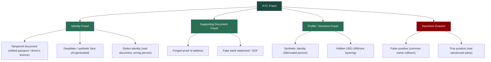

# Case 3 - KYC Document Forensics & Sanctions Screening

### Type: KYC Fraud Detection / Document Forensics / Sanctions Screening

### Date: June 2026

### Tools: PRADO (EU public document register), ICAO 9303 MRZ logic, PDF/EXIF metadata viewers (exiftool, metadata2go.com), Google Maps (address verification)

## Overview

This case is a practical demonsration of the following skills:
1. KYC AI fraud prevention (deepfake, AI-generated images/videos/documents, synthetic identity)
3. KYC verification - passport, driver's licence, proof of address, and establishing SoF / SoW. Detection of: tampered passports, MRZ mismatches, forged proof of address, fake bank statements, and stolen identities
4. Sanctions screening (concept level, in real case a tool such as world-check.com would be used
5. Identify red flags
6. Writing alert disposition notes (document false/true positives, escalation to senior management, and RFIs to clients) 
7. Mock SAR for suspicious activity, and a mock OFAC blocking report for a true-positive sanctions match

This case contains ten fictional fraud scenarious accross different document types and jurisdictions. I split it into four parts follow the real onboarding process.


| # | Document | Country | Fraud type | Decision |
|---|---|---|---|---|
| 1 | Passport | Italy | Tampered, MRZ mismatch | Reject (+ SAR if prior funds) |
| 2 | Driver's licence | USA (New York) | Edited ID / front-back mismatch | Reject (+ SAR if prior funds) |
| 3 | Selfie | - | Deepfake / AI-generated | Reject + SAR |
| 4 | Passport | Nigeria | Stolen identity | Reject + SAR |
| 5 | Utility bill | UK | Forged proof of address | Request more (+ SAR if refuses) |
| 6 | Bank statement | UAE bank | Fake, PDF metadata + math | Reject (+ SAR if account active) |
| 7 | Passport | Ukraine | Synthetic identity | EDD + SAR |
| 8 | Corporate docs | HK + BVI + Panama | Hidden UBO | EDD |
| 9 | Passport | Saudi Arabia | Sanctions false positive | Close + document |
| 10 | Passport | Russia | Sanctions true positive | Freeze + SAR + OFAC report |

---

> **Disclaimer:** All scenarios are fictional and created only for educational and portfolio purposes. All passport images are specimens from the EU public document register. No real identities were used.
> (the source for each document is linked in the end). Mock SARs are fictional. All institution details are fictional.
> For passports I use official PRADO specimens; the driver's licence is an official public sample from the New York State DMV. For utility bills, bank statements, and corporate documents, which have no
> safe specimens, I use schematic layouts and diagrams that show the structure.

---

## KYC Fraud Methods
 
The ten documents map onto the main families of KYC fraud an analyst sees in crypto onboarding:
 

 
---

## Part 1 — Identity Documents
 
The first question in any onboarding: is this person who they claim to be? Three ways that fails (the document is edited, the face is fake, or the document is real but belongs to someone else).
 
> **Note on SAR thresholds at onboarding.** Several decisions below say "reject, and file a SAR if funds were already deposited." This reflects a real threshold question. For US MSBs the mandatory SAR trigger
> is a transaction conducted or attempted at or through the institution at or above the reporting threshold (31 CFR 1022.320). A fake document submitted at sign-up with no transaction and no funds does not
> automatically meet that bar — but many firms still file a *voluntary* SAR on attempted identity fraud, and firm policy may require it. So the pattern is: always reject and record internally; file a SAR when
> funds/transactions are present, when it fits a known fraud pattern, or where firm policy directs filing on attempted fraud.
 
---
 
### Document 1 — Italian Passport (Tampered MRZ)
 
**Document type:** Passport — Repubblica Italiana
**Specimen reference:** PRADO ITA-AO-02005 — https://www.consilium.europa.eu/prado/en/ITA-AO-02005/index.html
 

 
*Specimen source: PRADO (Council of the EU), document ITA-AO-02005. The data shown (ROSSI, MARIA — passport KK6000533) is the public PRADO specimen. The tampering in the scenario below is fictional, applied to these specimen details for the exercise.*
 
#### The scenario
 
A customer submits an Italian passport for **ROSSI, MARIA** during onboarding. At first glance it looks fine (correct layout, photo, Italian text). But when I verify the MRZ check digits, the math on the 
passport number fails - a sign the document number was altered after the passport was issued.
 
#### Step 1 — Visual inspection against the specimen
 
I compare the submitted passport against the genuine PRADO specimen — PRADO is the reference for what a real Italian passport looks like. In a remote KYC review I work from a scan or photo, 
so I rely on what is visible in an image; UV and physical magnification checks are only possible in an in-person review.
 
I look at three things that are visible on a good scan:
 
**Personal data (biodata page)**

 
The biodata page shows the photo, surname (ROSSI), given name (MARIA), passport number (KK6000533), dates, and the two MRZ lines at the bottom. On a genuine Italian passport the personal data is laser-engraved, 
which has a specific texture and tone. Typed-over or reprinted data looks flat and often a slightly different colour. I check that fonts, spacing, and field positions match the specimen exactly.
 
**Optically variable device (hologram / OVD)**

 
A genuine biodata page carries an OVD (hologram) that overlaps the photo and changes appearance when tilted. On a scan I cannot tilt it, but I can check whether the overlay sits correctly over the photo 
and whether its edges look natural rather than digitally pasted. Forgers often damage or misalign this when they swap a photo.
 
**Laser-perforated numbering**

 
The passport number (KK6000533) is laser-perforated through the pages — each digit is physically punched through the paper, which cannot be reproduced by image editing. If the number on the scan looks 
flat or printed rather than perforated, that is a forgery indicator. This number must also match the number encoded in the MRZ.
 
> Note: the Italian passport also carries UV features (fluorescent overprint, fibres, security thread) and a watermark. These are listed in PRADO but I do not rely on them for a remote review,
> they can only be checked physically under UV light. I mention them for completeness, not as checks I perform on a scan.
 
#### Step 2 — MRZ verification and check digits
 
The Machine-Readable Zone (ICAO 9303, TD3 format) is two lines of 44 characters at the bottom of the biodata page. It carries built-in check digits that must validate mathematically. 
This is the single most reliable technical check on a passport - you do not need special equipment, just the algorithm.
 
```
Check-digit algorithm (ICAO 9303)
1. Map characters:  0-9 = face value · A=10, B=11, ... Z=35 · '<' = 0
2. Apply repeating weights:  7, 3, 1, 7, 3, 1 ...
3. Sum all (value × weight)
4. Check digit = sum mod 10
```
 
**Passport number check — worked example.**
The genuine specimen number is `KK6000533`. First let me confirm the genuine check digit, then show the tampered version.
 
```
Genuine — KK6000533
K  K  6  0  0  0  5  3  3
20 20 6  0  0  0  5  3  3     ← character values (K = 20)
7  3  1  7  3  1  7  3  1     ← weights
140 60 6  0  0  0  35 9  3    ← products
 
Sum = 253
253 mod 10 = 3
 
Correct check digit = 3   ← matches the genuine specimen MRZ (…533‹3›)
```
 
The genuine passport validates correctly — check digit `3`. Now the tampered version. The forger changed the last digit of the number to disguise the document (`KK6000538`) but left the printed check digit as `3`:
 
```
Tampered — KK6000538 (printed check digit still 3)
K  K  6  0  0  0  5  3  8
20 20 6  0  0  0  5  3  8
7  3  1  7  3  1  7  3  1
140 60 6  0  0  0  35 9  8
 
Sum = 258
258 mod 10 = 8
 
Correct check digit = 8
MRZ prints          = 3     ← MISMATCH
```
 
The printed check digit is `3`, but for `KK6000538` it must be `8`. This does not happen by accident - a valid passport always has matching check digits. A mismatch means the document number was altered 
after the passport was made, or the MRZ was fabricated. This is strong evidence of tampering.
 
**Date of birth check — second example, to show the method holds.**
The genuine specimen DOB is `901101` (1 November 1990). Let me confirm the genuine check digit, then show a tampered version.
 
```
Genuine - 901101 (1 Nov 1990)
9  0  1  1  0  1
7  3  1  7  3  1
63 0  1  7  0  1
 
Sum = 72
72 mod 10 = 2
 
Correct check digit = 2   ← matches the genuine specimen MRZ (901101‹2›)
```
 
Now a tampered version. Suppose the forger changes the year of birth to make the holder appear five years younger (`951101`) but leaves the printed check digit as `2`:
 
```
Tampered — 951101 (1 Nov 1995, printed check digit still 2)
9  5  1  1  0  1
7  3  1  7  3  1
63 15 1  7  0  1
 
Sum = 87
87 mod 10 = 7
 
Correct check digit = 7
MRZ prints          = 2     ← MISMATCH
```
 
A genuine passport's DOB check digit for 901101 is `2`. If someone alters the date of birth, the check digit no longer matches - another independent tampering signal, exactly like the passport-number check.
 
#### Step 3 — Cross-reference
 
I line up every data point — passport, MRZ, and the application form:
 
| Field | Passport (visual) | MRZ | Application form |
|---|---|---|---|
| Surname | ROSSI | ROSSI | ROSSI |
| Given name | MARIA | MARIA | MARIA |
| Passport number | KK6000538 | KK6000538**3** (bad check) | KK6000538 |
| DOB | 01/11/1990 | 901101 | 01/11/1990 |
 
Here the names and DOB all agree - the problem is purely the MRZ check digit on the altered passport number. (In another common pattern the names would also disagree - e.g. a form name that is a different name 
from the passport, not just a spelling variant - which is a second, independent red flag.)
 
#### Red flags
 
| Red flag | Type | Severity |
|---|---|---|
| MRZ passport-number check digit does not validate | Document tampering | 🔴 CRITICAL |
| Passport number on scan looks printed, not laser-perforated | Document integrity | 🔴 HIGH |
| (If found) given name on form ≠ name on passport | Identity mismatch | 🔴 HIGH |
| (If found) visual DOB ≠ MRZ DOB | Document integrity | 🔴 HIGH |
 
#### Decision & action
 
❌ **REJECT** — do not onboard. Action path:
 
- **Reject + RFI** — decline the document and request a clean re-submission of the original passport, plus a second independent identity document
- **Verify** — re-run sanctions / adverse-media on the verified identity; flag the profile HIGH RISK pending verification
- **Escalate** — route to senior with the findings if the re-submission also fails or anything else is suspicious
- **SAR** — file if funds were already deposited before this review, or if this matches a pattern of similar fraudulent applications. A tampered document with no funds is usually a reject plus
  an internal fraud note; one attached to money already on the platform is a SAR (see the note on attempted-onboarding SAR thresholds in Part 1)
- If the customer cannot produce a valid document → offboard and file a SAR
  
#### Key learning
 
Check digits are the fastest way to catch a tampered passport. I confirmed the genuine number validates (`KK6000533` → 3), then showed how an altered number breaks the check. On a scan UV is unavailable, 
so the laser-perforated number and the OVD over the photo are the visual features I rely on, alongside the MRZ math.
 
---
 
### Document 2 — USA Driver's Licence (Edited Card / Front–Back Mismatch)
 
**Document type:** Driver's licence — New York State (USA)
**Sample reference:** NY DMV — Sample Photo Documents — https://dmv.ny.gov/driver-license/sample-photo-documents
 


 
*Sample source: New York State DMV official "Sample Photo Documents" page. Public reference document.*
 
#### Why a driver's licence is different from a passport
 
In the United States there is no national ID card, so the driver's licence is the primary identity document — which makes it the most-forged ID in US-facing onboarding. Two things change versus a passport:
 
- **There is no ICAO MRZ.** The machine-readable part is a **PDF417 2D barcode on the back**, which encodes the same data printed on the front.
- **There are two different numbers**, and they sit on different sides of the card. This gives you a built-in front-to-back cross-check.
| Number | Where | What it is |
|---|---|---|
| **Client ID (CID)** | Front, 9 digits (e.g. `123 456 789`) | Identifies the person - does not change on renewal |
| **Document Number** | Back, 8–10 characters after "Doc #" (e.g. `ASD4567890`) | Identifies the card - changes every time the card is reissued |
 
There is also a card-type distinction that matters for compliance:
 
- **Standard** licence - marked "NOT FOR FEDERAL PURPOSES". Since 7 May 2025 it cannot be used to board a domestic US flight or enter a federal building.
- **Enhanced (EDL)** - has a US flag image; REAL ID compliant.
- **REAL ID** - has a star; REAL ID compliant.
  
#### The scenario
 
A US customer submits the front and back of a New York driver's licence. The front looks clean — photo, name (Marie Michelle Motorist), CID `123 456 789`. But two things fail: the data on the front 
does not match the PDF417 barcode on the back, and the **Document Number format is wrong**. This is the driver's-licence equivalent of an MRZ mismatch — the human-readable side was edited, but 
the machine-readable side was not updated to match.
 
#### Step 1 — Visual inspection (front)
 
I compare the front against the official NY DMV sample:
 
- Photo placement, fonts, and the NY State background/security print match the template
- "Class D" and the date format are correct for NY
- Look for editing signs around the name, DOB, and photo — mismatched fonts, uneven spacing, a photo that sits slightly wrong
  
#### Step 2 — Barcode (PDF417) cross-check — the key test
 
The barcode on the back is the machine-readable truth of the card. It encodes the same data printed on the front. In a real KYC platform (Jumio, Onfido, Sumsub) the barcode is decoded automatically 
and compared against the front - the analyst sees a match/mismatch result, not the raw decoded data. I do not decode the barcode by hand; the 2D code cannot be read by eye.
 
For this educational case the comparison below is illustrative - it shows what the platform would flag, not data I personally decoded:
 
| Field | Front (printed) | Back barcode (decoded) | Result |
|---|---|---|---|
| Name | MICHELLE, MARIE | MICHELLE, MARIE | ✅ OK |
| DOB | 10/31/1990 | 03/14/1988 | ❌ MISMATCH |
| ID | 123 456 789 | 123 456 789 | ✅ OK |
| Expiry | 10/31/2029 | 10/31/2029 | ✅ OK |
 
A genuine licence is produced in one process, so the front and the barcode always agree. A DOB that differs between the printed front and the encoded barcode means the front was altered after issue. 
This is decisive evidence of tampering - the same logic as a failed passport check digit.
 
#### Step 3 — Document Number format check
 
NY Document Numbers are an 8–10 character mix of letters and numbers. I check the format and the front/back relationship:
 
- The Document Number lives on the back ("Doc #"). If a submitted "Document Number" is presented as the 9-digit front number, the submitter has confused CID with Document Number - a sign they do not actually hold the card.
- A Document Number that is the wrong length or character pattern for NY is a red flag.
  
#### Step 4 — Cross-reference
 
| Field | Front (visual) | Back barcode | Application form |
|---|---|---|---|
| Name | Michelle, Marie | Michelle, Marie | matches |
| DOB | 10/31/1990 | **03/14/1988** | 10/31/1990 |
| CID | 123 456 789 | 123 456 789 | 123 456 789 |
| Card type | Standard ("Not for Federal Purposes") | — | (submitted for full identity) |
 
The DOB on the front does not match the barcode. The customer also "aged up" on the front (1988 → 1990), which is a common edit to defeat age or to match a stolen profile.
 
#### Red flags
 
| Red flag | Type | Severity |
|---|---|---|
| Front DOB does not match the PDF417 barcode | Document tampering | 🔴 CRITICAL |
| Document Number wrong format / confused with CID | Document integrity | 🔴 HIGH |
| Editing signs around DOB / photo area | Tampering signal | 🔴 HIGH |
| Standard ("Not for Federal Purposes") card offered as full ID | Document-tier limitation | 🟡 MEDIUM |
 
#### Decision & action
 
❌ **REJECT** — do not onboard. Action path:
 
- **Reject + RFI** - request the original document and a second independent ID (passport)
- **Verify** - re-scan the barcode at higher quality to confirm the mismatch is real, not a poor image; flag the profile HIGH RISK
- **Escalate** - route to senior if the re-submission also fails or other red flags appear
- **SAR** - file if funds were already deposited, or if the edited licence is part of a wider fraud pattern (same threshold logic as Document 1)
- If the customer cannot produce a consistent document → offboard and file a SAR
  
#### Key learning
 
A US driver's licence has no MRZ, but the PDF417 barcode on the back must match the printed front - comparing the two sides is the licence equivalent of validating a passport's check digit. 
Knowing the difference between the CID and the Document Number is what lets you spot a submitter who does not actually hold the card.
 
---

