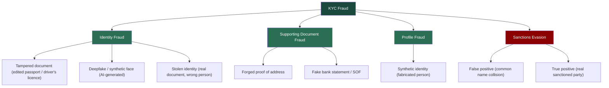

# Case 3 - KYC Document Forensics & Sanctions Screening
 
### Type: KYC Fraud Detection / Document Forensics / Sanctions Screening
 
### Date: June 2026
 
### Tools: PRADO (EU public document register), ICAO 9303 MRZ logic, PDF/EXIF metadata viewer (metadata2go.com), Google Maps (address verification)
 
## Overview
 
This case is a practical demonstration of the following skills:
1. KYC AI fraud prevention (deepfake, AI-generated images/videos/documents, synthetic identity)
2. KYC verification (passport, driver's licence, proof of address, and establishing SoF / SoW). Detection of: tampered passports, MRZ mismatches, forged proof of address, fake bank statements, and stolen identities
3. Sanctions screening (concept level; in a real case a tool such as world-check.com would be used)
4. Red flag identification
5. Writing alert disposition notes (documenting false/true positives, escalation to senior management, and RFIs to clients)
6. Mock SAR for suspicious activity, and a mock OFAC blocking report for a true-positive sanctions match
   
This case contains nine fictional fraud scenarios across different document types and jurisdictions. I split it into four parts that follow the real onboarding process.
This matters specifically for a crypto platform. Onboarding KYC is the only point where a real-world identity is tied to an account, and from there to on-chain activity.
A crypto withdrawal is irreversible and there is no chargeback, unlike a bank. If a fraudster opens an account with a fake or stolen identity and moves funds out, the money is unrecoverable.
An account opened on a synthetic identity is exactly what laundering and account-takeover theft rely on. Detecting fraudulent documents at onboarding is what prevents a fake identity from ever being attached to a wallet.
 
| # | Document | Country / Type | Fraud type | Decision |
|---|---|---|---|---|
| 1 | Passport | Italy | Tampered (MRZ mismatch) | Reject (+ SAR if prior funds) |
| 2 | Driver's licence | USA (New York) | Edited card / front–back mismatch | Reject (+ SAR if prior funds) |
| 3 | Selfie | - | Deepfake / AI-generated | Reject + SAR |
| 4 | Passport | Nigeria | Stolen identity | Reject + SAR |
| 5 | Utility bill | UK | Forged proof of address | Request more (+ SAR if refuses) |
| 6 | Bank statement | UAE bank | Fake (PDF metadata, arithmetic) | Reject (+ SAR if account active) |
| 7 | Passport | Ukraine | Synthetic identity | EDD + SAR |
| 8 | Passport | Saudi Arabia | Sanctions false positive | Close + document |
| 9 | Passport | Russia | Sanctions true positive | Freeze + SAR + OFAC report |
 
---
 
> **Disclaimer:** All scenarios are fictional and created only for educational and portfolio purposes. All passport images are specimens from the EU public document register. No real identities were used.
> (the source for each document is linked at the end). Mock SARs are fictional. All institution details are fictional.
> For passports I use official PRADO specimens; the driver's licence is an official public sample from the New York State DMV. For utility bills and bank statements, which have no
> safe specimens, I use schematic layouts that show the structure.
 
---
 
## KYC Fraud Methods
 
The nine documents map onto the main families of KYC fraud an analyst sees in crypto onboarding:
 

 
---
 
## Part 1 - Identity Documents
 
The first question in any onboarding is whether the person is who they claim to be. There are three ways this can fail (the document is edited, the face is fake, or the document is genuine but belongs to someone else).
 
> **Note on SAR thresholds at onboarding.** Several ns below say "reject, and file a SAR if funds were already deposited." This reflects a real threshold question. For US MSBs the mandatory SAR trigger
> is a transaction conducted or attempted at or through the institution at or above the reporting threshold (31 CFR 1022.320). A fake document submitted at sign-up with no transaction and no funds does not
> automatically meet that bar - but many firms still file a *voluntary* SAR on attempted identity fraud, and firm policy may require it. So the pattern is: always reject and record internally; file a SAR when
> funds/transactions are present, when it fits a known fraud pattern, or where firm policy directs filing on attempted fraud.
 
### Document 1 - Italian Passport (Tampered MRZ)
 
**Document type:** Passport, Repubblica Italiana 

**Specimen reference:** PRADO ITA-AO-02005 - https://www.consilium.europa.eu/prado/en/ITA-AO-02005/index.html
 

 
*Specimen source: PRADO (Council of the EU), document ITA-AO-02005. The data shown (ROSSI MARIA, passport KK6000533) is the public PRADO specimen. The tampering in the scenario below is fictional, applied to these specimen details for the exercise.*

---

#### The scenario
 
A customer submits an Italian passport for ROSSI MARIA during onboarding. At first inspection the document appears correct. The layout, photo, and Italian text match the template. However, when I verify
the MRZ check digits, the calculation on the passport number fails. This indicates that the document number was altered after the passport was issued.

---

#### Step 1 - Visual inspection against the specimen
 
I compare the submitted passport against the genuine PRADO specimen, which is the reference standard for a real Italian passport. In a remote KYC review I work from a scan or a photo, so
I can only rely on features that are visible in an image. UV and physical magnification checks are possible only during an in-person review.

---

I check three features that are visible on a good scan:
 
**Facial photograph (biodata page)**
 

 
This screenshot shows the holder's photograph on the biodata page. On a genuine Italian passport the photograph is printed directly into the page surface during production, not attached on top, so it cannot be
replaced without damaging the page. I check the photograph for signs of substitution. I look for edges that appear added, a print texture that differs from the rest of the page, or a face that does not sit
naturally within the frame. A clean, evenly printed photograph that matches the surrounding page is what I expect on a genuine document.

---

**Personal data and optically variable device (hologram / OVD)**
 

 
This screenshot shows the full biodata page: the surname (ROSSI), the given name (MARIA), the passport number (KK6000533), the dates, the two MRZ lines at the bottom, and the OVD (hologram) that overlaps the
photo. On a genuine Italian passport the personal data is laser-engraved, which gives it a specific texture and tone. Data that has been typed over or reprinted appears flat and often shows a slightly different
colour, so I confirm that the fonts, spacing, and field positions match the specimen. The OVD changes appearance when tilted. On a scan I cannot tilt it, but I can check that the overlay sits correctly over the
photo and that its edges look natural rather than digitally pasted. Forgers often damage or misalign this feature when they replace a photo.

---

**Laser-perforated numbering**
 

 
The passport number (KK6000533) is laser-perforated through the pages. Each digit is physically punched through the paper, which cannot be reproduced by image editing. If the number on the scan appears
flat or printed rather than perforated, that is a forgery indicator. This number must also match the number encoded in the MRZ.

> Note: the Italian passport also carries UV features (fluorescent overprint, fibres, security thread, and a watermark). These are listed in PRADO, but I do not rely on them for a remote review because
> they can only be checked physically under UV light. I mention them for completeness, not as checks I perform on a scan.

---

#### Step 2 - MRZ verification and check digits
 
The Machine-Readable Zone (ICAO 9303, TD3 format) is two lines of 44 characters at the bottom of the biodata page. It carries built-in check digits that must validate mathematically.
This is the single most reliable technical check on a passport, because it requires no special equipment, only the algorithm.
 
```
Check-digit algorithm (ICAO 9303)
1. Map characters:  0-9 = face value · A=10, B=11 ... Z=35 · '<' = 0
2. Apply repeating weights:  7, 3, 1, 7, 3, 1 ...
3. Sum all (value × weight)
4. Check digit = sum mod 10
```
 
**Passport number check - worked example.**
 
The genuine specimen number is `KK6000533`. First let me confirm the genuine check digit, then show the tampered version.
 
```
Genuine - KK6000533
K  K  6  0  0  0  5  3  3
20 20 6  0  0  0  5  3  3     ← character values (K = 20)
7  3  1  7  3  1  7  3  1     ← weights
140 60 6  0  0  0  35 9  3    ← products
 
Sum = 253
253 mod 10 = 3
 
Correct check digit = 3   ← matches the genuine specimen MRZ (…533‹3›)
```
 
The genuine passport validates correctly with check digit `3`. Now consider the tampered version. The forger changed the last digit of the number to disguise the document (`KK6000538`) but left
the printed check digit as `3`.
 
```
Tampered - KK6000538 (printed check digit still 3)
K  K  6  0  0  0  5  3  8
20 20 6  0  0  0  5  3  8
7  3  1  7  3  1  7  3  1
140 60 6  0  0  0  35 9  8
 
Sum = 258
258 mod 10 = 8
 
Correct check digit = 8
MRZ prints          = 3     ← MISMATCH
```
 
The printed check digit is `3`, but for `KK6000538` it must be `8`. This does not happen by accident, because a valid passport always has matching check digits. A mismatch means that the document number
was altered after the passport was made, or that the MRZ was fabricated. This is strong evidence of tampering.

---

**Date of birth check, second example to show the method holds.**

The genuine specimen DOB is `901101` (1 November 1990). I first confirm the genuine check digit, then show a tampered version.
 
```
Genuine - 901101 (1 Nov 1990)
9  0  1  1  0  1
7  3  1  7  3  1
63 0  1  7  0  1
 
Sum = 72
72 mod 10 = 2
 
Correct check digit = 2   ← matches the genuine specimen MRZ (901101‹2›)
```
 
Now consider a tampered version. Suppose the forger changes the year of birth to make the holder appear five years younger (`951101`) but leaves the printed check digit as `2`.
 
```
Tampered - 951101 (1 Nov 1995, printed check digit still 2)
9  5  1  1  0  1
7  3  1  7  3  1
63 15 1  7  0  1
 
Sum = 87
87 mod 10 = 7
 
Correct check digit = 7
MRZ prints          = 2     ← MISMATCH
```
 
A genuine passport's DOB check digit for 901101 is `2`. If someone alters the date of birth, the check digit no longer matches. This is another independent tampering signal, exactly like the passport-number check.
 
---
 
#### Step 3 - Cross-reference
 
I compare every data point across the passport, the MRZ, and the application form.
 
| Field | Passport (visual) | MRZ | Application form |
|---|---|---|---|
| Surname | ROSSI | ROSSI | ROSSI |
| Given name | MARIA | MARIA | MARIA |
| Passport number | KK6000538 | KK6000538**3** (bad check) | KK6000538 |
| DOB | 01/11/1990 | 901101 | 01/11/1990 |
 
Here the names and the date of birth all agree. The problem is only the MRZ check digit on the altered passport number. In another common pattern the names would also disagree, for example a form name
that is a different name from the one on the passport rather than a spelling variant, which would be a second independent red flag.

---

#### Red flags
 
| Red flag | Type | Severity |
|---|---|---|
| MRZ passport-number check digit does not validate | Document tampering | 🔴 CRITICAL |
| Passport number on scan looks printed, not laser-perforated | Document integrity | 🔴 HIGH |
| (If found) given name on form ≠ name on passport | Identity mismatch | 🔴 HIGH |
| (If found) visual DOB ≠ MRZ DOB | Document integrity | 🔴 HIGH |
 
---
 
#### Decision & Action
 
❌ **REJECT.** Do not onboard. The action path is as follows.
 
- **Reject and issue an RFI.** Decline the document and request a clean re-submission of the original passport, together with a second independent identity document.
- **Verify.** Re-run sanctions and adverse-media screening on the verified identity, and flag the profile as HIGH RISK pending verification.
- **Escalate.** Route the case to a senior analyst with the findings if the re-submission also fails or if anything else is suspicious.
- **SAR.** File a SAR if funds were already deposited before this review, or if the case matches a pattern of similar fraudulent applications. A tampered document with no funds is normally a rejection
  and an internal fraud note. A tampered document attached to funds already on the platform is a SAR (see the note on attempted-onboarding SAR thresholds in Part 1).
- If the customer cannot produce a valid document, offboard and file a SAR.

---

#### Key learning
 
Check digits are the fastest way to detect a tampered passport. I first confirmed that the genuine number validates (`KK6000533` produces check digit 3), then showed how an altered number breaks the check.
On a scan UV is not available, so the laser-perforated number and the OVD over the photo are the visual features I rely on, together with the MRZ calculation.
 
---
 
### Document 2 - USA Driver's Licence (Edited Card / Front–Back Mismatch)
 
**Document type:** Driver's licence, New York State (USA)

**Sample reference:** NY DMV - Sample Photo Documents - https://dmv.ny.gov/driver-license/sample-photo-documents
 


 
*Sample source: New York State DMV official "Sample Photo Documents" page. Public reference document.*

---
 
#### Why a driver's licence is different from a passport
 
In the United States there is no national ID card, so the driver's licence is the primary identity document. This makes it the most forged ID in US-facing onboarding. Two things change compared with a passport.
 
- **There is no ICAO MRZ.** The machine-readable part is a PDF417 2D barcode on the back, which encodes the same data printed on the front.
- **There are two different numbers**, and they sit on different sides of the card. This gives a built-in front-to-back cross-check.
  
| Number | Where | What it is |
|---|---|---|
| **Client ID (CID)** | Front, 9 digits (e.g. `123 456 789`) | Identifies the person. Does not change on renewal. |
| **Document Number** | Back, 8–10 characters after "Doc #" (e.g. `ASD4567890`) | Identifies the card. Changes every time the card is reissued. |
 
There is also a card-type distinction that matters for compliance.
 
- **Standard** licence. Marked "NOT FOR FEDERAL PURPOSES" in top right corner. Since 7 May 2025 it cannot be used to board a domestic US flight or enter a federal building.
- **Enhanced (EDL)**. Has a US flag image and is REAL ID compliant.
- **REAL ID**. Has a star and is REAL ID compliant.

---

#### The scenario
 
A US customer submits the front and back of a New York driver's licence. The front appears clean, with a photo, the name (Marie Michelle Motorist), and CID `123 456 789`. However, two checks fail.
The data on the front does not match the PDF417 barcode on the back, and the Document Number format is wrong. This is the driver's-licence equivalent of an MRZ mismatch.
The human-readable side was edited, but the machine-readable side was not updated to match.

---

#### Step 1 - Visual inspection (front)
 
I compare the front against the official NY DMV sample:
 - Photo placement, fonts, and the NY State background and security print match the template
- "Class D" and the date format are correct for NY
- I check for editing signs around the name, DOB, and photo, such as mismatched fonts, uneven spacing, or a photo that sits incorrectly

---

#### Step 2 - Barcode (PDF417) cross-check, the key test
 
The barcode on the back is the machine-readable record of the card. It encodes the same data printed on the front. In a real KYC platform (Jumio, Onfido, Sumsub) the barcode is decoded automatically
and compared against the front, so the analyst sees a match or mismatch result, not the raw decoded data. I do not decode the barcode by hand, because the 2D code cannot be read by eye.
 
For this educational case the comparison below is illustrative. It shows what the platform would flag, not data I personally decoded.
 
| Field | Front (printed) | Back barcode (decoded) | Result |
|---|---|---|---|
| Name | MICHELLE, MARIE | MICHELLE, MARIE | ✅ OK |
| DOB | 10/31/1990 | 03/14/1988 | ❌ MISMATCH |
| ID | 123 456 789 | 123 456 789 | ✅ OK |
| Expiry | 10/31/2029 | 10/31/2029 | ✅ OK |
 
A genuine licence is produced in one process, so the front and the barcode always agree. A DOB that differs between the printed front and the encoded barcode means the front was altered after issue.
This is decisive evidence of tampering, following the same logic as a failed passport check digit.

---

#### Step 3 - Document Number format check
 
NY Document Numbers are an 8 to 10 character mix of letters and numbers. I check the format and the front-to-back relationship.
 - The Document Number is on the back ("Doc #"). If a submitted "Document Number" is presented as the 9-digit front number, the submitter has confused the CID with the Document Number,
    which suggests they do not actually hold the card.
- A Document Number that is the wrong length or character pattern for NY is a red flag.
  
---

#### Step 4 - Cross-reference
 
| Field | Front (visual) | Back barcode | Application form | Result |
|---|---|---|---|---|
| Name | Michelle, Marie | Michelle, Marie | Michelle, Marie | Match |
| DOB | 10/31/1990 | 03/14/1988 | 10/31/1990 | Mismatch |
| CID | 123 456 789 | 123 456 789 | 123 456 789 | Match |
 
The DOB on the front does not match the barcode. The customer also moved the year forward on the front (1988 to 1990), which is a common edit to defeat an age check or to match a stolen profile.
 
Separately, the card is a Standard licence, marked "Not for Federal Purposes". This is not a comparison field, but it is a limitation worth noting: the card is not REAL ID compliant and represents a weaker identity tier.

---

#### Red flags
 
| Red flag | Type | Severity |
|---|---|---|
| Front DOB does not match the PDF417 barcode | Document tampering | 🔴 CRITICAL |
| Document Number wrong format / confused with CID | Document integrity | 🔴 HIGH |
| Editing signs around DOB / photo area | Tampering signal | 🔴 HIGH |
| Standard ("Not for Federal Purposes") card offered as full ID | Document-tier limitation | 🟡 MEDIUM |

---

#### Decision & Action
 
❌ **REJECT.** Do not onboard. The action path is as follows:
- **Reject and issue an RFI.** Request the original document and a second independent ID (a passport).
- **Verify.** Re-scan the barcode at higher quality to confirm that the mismatch is real and not caused by a poor image, and flag the profile as HIGH RISK.
- **Escalate.** Route the case to a senior analyst if the re-submission also fails or if other red flags appear.
- **SAR.** File a SAR if funds were already deposited, or if the edited licence is part of a wider fraud pattern (the same threshold logic as Document 1).
- If the customer cannot produce a consistent document, offboard and file a SAR.

---

#### Key learning
 
A US driver's licence has no MRZ, but the PDF417 barcode on the back must match the printed front. Comparing the two sides is the licence equivalent of validating a passport's check digit.
Knowing the difference between the CID and the Document Number is what allows me to identify a submitter who does not actually hold the card.
 
---
 
### Document 3 - Deepfake Selfie
 
**Document type:** Liveness selfie (face verification)

#### The scenario
 
The customer passes the document stage and submits a selfie for face matching and liveness. The selfie matches the document photo at a high score on commercial KYC platforms (Jumio, Onfido, Sumsub).
That high match is expected here, because the image was AI-generated from the document holder's own photo, not captured live from the real person. The attacker takes the photo on the genuine document, usually
stolen or purchased, and uses an AI model to produce a new image of that same face, which then passes the face-match check against the document. Several signals show that the selfie was AI-generated rather than
taken by a real person in front of the camera.

---

#### Step 1 - Visual indicators of AI generation
 
Modern GAN and diffusion faces are convincing, but they still leave indicators. I check for the following:
 
- **Hair edges.** Strands that blur or dissolve unnaturally into the background.
- **Ear and jaw symmetry.** AI faces are often too symmetrical, whereas real faces are not.
- **Eye reflections.** Real eyes reflect the room, while AI eyes often have mismatched or missing reflections.
- **Skin texture.** Too smooth, with no pores and no small imperfections.
- **Background.** The lighting on the face does not match the background lighting.
- **Accessories.** Glasses frames or earrings that are asymmetric or blend into the skin.

---

#### Step 2 - Metadata analysis (EXIF and C2PA provenance)
 
A photograph taken on a real camera carries device metadata (EXIF): the make, the model, the lens, and the capture settings. An AI-generated image does not carry any of this, because no camera was involved.
What matters is not when the image was created, but whether the file shows a real capture device at all. One signal is the absence of any camera data, because every phone and camera records make, model, and lens data.
 
To demonstrate the difference, I compared a real photo taken on an iPhone with an image I generated in ChatGPT:
 
**Metadata of a genuine photo (taken on an iPhone)**
 


 
The file carries a full set of capture metadata: "Make: Apple", "Model: iPhone 14 Pro", the Lensmodel ("iPhone 14 Pro back triple camera 6.86mm f/1.78"), and the 
exposure settings ("FNumber: 1.8", "ExposureTime: 1/35", "ISO: 320", "FocalLength: 6.9 mm"). 
These fields are written by the camera at the moment of capture, and they are exactly what I expect on a genuine photo from a real device.

---

**Metadata of an AI-generated image (created in ChatGPT)**
 


 
The AI image carries no camera fields at all. There is no make, model, lens, or exposure data, because no camera produced it. Moreover, it carries a C2PA provenance manifest that openly identifies the file
as AI-generated. The `Actionssoftwareagentname` is `gpt-image`, the `Claim Generator Infoname` is `OpenAI Media Service API`, and the `Actionsdigitalsourcetype` value is a full IPTC link ending in `trainedAlgorithmicMedia`, which is the standard code for content produced by a generative model. The file is also C2PA-watermarked.

---

**The comparison**
 
```
Field                 Genuine photo (iPhone)              AI image (ChatGPT)
Make / Model      :   Apple / iPhone 14 Pro               none                       ← RED FLAG
Lensmodel         :   iPhone 14 Pro back triple camera    none                       ← RED FLAG
Exposure / ISO    :   f/1.8, 1/35, ISO 320                none                       ← RED FLAG
C2PA provenance   :   none                                gpt-image / OpenAI API     ← RED FLAG (declares AI)
digitalSourceType :   none                                trainedAlgorithmicMedia    ← RED FLAG (declares AI)
--- weaker signals, not red flags on their own ---
GPS / location    :   none                                none                       weak (geolocation can be off in settings)
Timestamp         :   capture time present                generation time present    not a flag (on-demand selfie is normal)
Color profile     :   Apple embedded profile              sRGB                       weak (most devices use sRGB)
File type         :   DNG (Apple ProRAW)                  PNG                        weak (PNG is also used for screenshots and on Android. DNG is just Apple's RAW format)
```
 
Two things expose the AI image. First, the absence of any camera capture data, because every phone and camera records make, model, and lens. Second, the presence of C2PA provenance that names the 
generator and marks the file as AI-generated. The first is a negative signal and the second is a positive one, and together they are decisive.

Metadata is not equally reliable in every case, and different AI tools behave differently. Mainstream generators such as ChatGPT now embed C2PA provenance that declares the image as AI-generated, but 
specialised fraud tools do the opposite: they strip all metadata, or spoof the camera fields to imitate a real device, and they never add C2PA. So in practice I read the metadata together with the visual 
indicators and the liveness result, rather than relying on a single layer. The presence of C2PA AI provenance is strong evidence that the image is generated. The absence of camera data is only suspicious, 
not proof, because a genuine photo can also lose its metadata after passing through a messaging app such as Telegram or WhatsApp.
 
If the metadata is missing or looks edited, I do not clear the image on that basis, and I do not reject it on that basis alone. I fall back to the layers an attacker cannot remove from the file: the visual AI
indicators, the liveness result, and the behavioural signals. Clean-looking metadata never clears a face by itself, and missing metadata never confirms fraud by itself. The decision comes from the combination.

> **Note:** The full metadata extractions for both files are attached in this repository: [genuine iPhone photo](attachments/doc-3-metadata-genuine.pdf) and [AI image](attachments/doc-3-metadata-ai.pdf).
> I produced both files myself to demonstrate the method. Neither file contains GPS or geolocation data.

---

#### Step 3 - Liveness detection and bypass techniques
 
How the attacker tries to bypass liveness check:
- **Virtual camera injection.** Software such as OBS or ManyCam feeds a pre-recorded or generated video into the KYC flow instead of a real webcam.
- **Replay attack.** A pre-recorded video of the AI face nodding and blinking.
- **Real-time deepfake.** AI generates the face live during the check.
How liveness detection catches it:
 - **Motion blur analysis.** Genuine head movement produces physically correct blur that matches the direction and speed of the movement. Deepfakes often show incorrect blur at the face edges,
   or "ghosting", where the face briefly doubles during a fast turn.
- **Depth and occlusion analysis.** Active liveness systems track how the face responds to small head movements. A flat photo or a replayed video does not produce correct parallax, so the depth
   relationship between facial features collapses. Some advanced systems also project random light patterns onto the face and verify that the skin responds correctly. A flat screen cannot reproduce this response.
- **Object occlusion test.** Passing a hand or an object in front of the face is one of the most reliable checks. A real face has a correct depth relationship with objects in front of it.
   A deepfake often loses face tracking at the moment of occlusion, so the real face briefly reappears, or artifacts appear at the boundary. A pre-recorded video simply shows the hand on top of the recording
   with no correct depth interaction.
- **3D depth liveness.** Unlike 2D (passive) liveness, infrared depth mapping cannot be faked with a flat screen or a replayed video, so it defeats most virtual-camera attacks.

---

#### Red flags
 
| Red flag | Type | Severity |
|---|---|---|
| Multiple AI-generation artifacts in the selfie | AI-generated image | 🔴 HIGH |
| No camera capture metadata (no make, model, or lens) | Not produced by a camera | 🔴 HIGH |
| C2PA provenance marks the file as AI-generated (gpt-image, trainedAlgorithmicMedia) | AI provenance | 🔴 HIGH |
| Face match high but image provenance suspect | Synthetic identity | 🔴 HIGH |
| Liveness passed but background and lighting inconsistent | Possible injection attack | 🟡 MEDIUM |

---

#### Decision
 
❌ **REJECT + SAR.**
 
A deepfake selfie is not an innocent mistake. Someone deliberately generated a synthetic face to defeat identity verification. This is a clear fraud attempt, and the recommended practice is to file a SAR.
See the mock SAR below.
 
---
 
#### Mock SAR #1 - Deepfake / Synthetic Identity at Onboarding
 
> **Disclaimer:** Fictional SAR for educational purposes. Institution and subject details are fictional.
 
**Filing institution:** Clear Exchange Ltd. (VASP / MSB), FinCEN Registration No. XXXXXXX, Wilmington, DE 19801

**Date of report:** June 18, 2026

**Subject:** name as submitted, not verified; Application ID XXX-XXXXXX; no account opened, onboarding declined

**Prior SARs on subject:** none on file
 
**Narrative**
 
Clear Exchange Ltd. files this report to document an attempt to open an account using a genuine identity document together with an artificially generated (deepfake) selfie to pass identity verification.
No account was opened and no funds were received. The institution reports the attempt because the conduct shows a deliberate effort to defeat identity verification, which is
consistent with the early stage of account-takeover or money-laundering activity.
 
On June 17, 2026, the applicant submitted a passport and a liveness selfie through the institution's remote onboarding flow. The selfie passed the automated face-matching check
against the passport photograph, with a similarity score of 92 percent. During manual review, however, the analyst identified several indicators that the selfie was an artificially
generated image rather than a genuine photograph. The image showed unnatural rendering at the hair edges, facial features that were unusually symmetrical, and reflections in the eyes that
did not match a real environment. The file also carried no camera metadata of any kind. It contained no make, model, or lens information, which a photograph taken on a genuine device always records.
 
The liveness check was recorded as passed, but the captured video showed lighting and background characteristics that did not match a live capture. These characteristics are consistent
with a virtual-camera injection attack, in which pre-recorded or generated video is fed into the verification flow in place of a live webcam.
 
Taken together, the artificially generated facial image, the complete absence of camera metadata, and the signs of a virtual-camera injection indicate that the applicant attempted to create
a verified account under a fabricated or stolen identity. The institution considers this conduct consistent with the methods used to open accounts for the laundering of illicit funds or for fraud.
 
The institution declined the application on the same day and added the applicant's device fingerprint and the submitted image hash to its internal fraud watchlist. The submitted document, the selfie,
the associated metadata, and the device fingerprint have been retained and are available to law enforcement upon request. Any future application matching the retained device fingerprint or image hash
will be escalated immediately. The institution did not notify the applicant that this report was filed.
 
Point of contact: AML Compliance Officer, Clear Exchange Ltd.
 
**END OF MOCK SAR**
 
---
