# Case 3 - KYC Document Forensics & Sanctions Screening
 
### Type: KYC Fraud Detection / Document Forensics / Sanctions Screening
 
### Date: June 2026
 
### Tools: ICAO 9303 MRZ logic, PDF/EXIF metadata viewer (metadata2go.com), Google Maps, OpenSanctions, Georgian public registries, TinEye reverse image search
 
## Overview
 
This case is a practical demonstration of the following skills:
1. KYC document verification (passport, driver's licence, and proof-of-address review; establishing Source of Funds and Source of Wealth from bank statements and asset declarations)
2. Fraud detection (AI-generated deepfakes with liveness countermeasures, tampered documents and MRZ mismatches, forged proof of address, fake bank statements, stolen and synthetic identities)
3. Document and image metadata forensics (ICAO 9303 MRZ check digits, PDF metadata via metadata2go.com, EXIF camera fields, C2PA provenance, font and layout consistency)
4. Sanctions screening (concept level: fuzzy matching algorithms, identifier disambiguation, sectoral vs comprehensive vs SDN designation logic)
5. PEP screening and OSINT verification (FATF Recommendation 12, a hidden foreign PEP, public registries, and an evidence log)
6. Adverse media screening (severity × credibility framework, allegation vs fact, leak databases)
7. Wallet risk screening (concept level, demonstrated via a mock report)
8. Red flag identification (single-signal vs combination reasoning)
9. Alert disposition notes and customer RFIs (documenting false / true positives, escalation to senior management, and tipping-off-safe wording under 31 U.S.C. § 5318(g)(2))
10. Mock SAR for suspicious activity, with an explanation of why a confirmed SDN match requires both a SAR and an OFAC blocking report as two separate legal duties

This case contains ten fictional scenarios across different document types and jurisdictions. I split it into five parts that follow the real onboarding process. This is critical for a crypto platform. 
Onboarding is the only stage where a real identity is linked to an account, and from the account to on-chain activity. A crypto withdrawal is irreversible. There is no chargeback, unlike a bank transfer. 
If a fraudster opens an account with a fake or stolen identity and moves funds out, the money is unrecoverable. An account opened on a synthetic identity is exactly what laundering and account-takeover theft rely on. Detecting fraudulent documents at onboarding is what prevents a fake identity from ever being attached to an account.
 
| # | Document | Country / Type | Fraud / risk type | Decision |
|---|---|---|---|---|
| 1 | [Passport](#document-1---italian-passport-tampered-mrz) | Italy | Tampered (MRZ mismatch) | Reject + SAR (if prior funds / fraud pattern) |
| 2 | [Driver's licence](#document-2---usa-drivers-licence-edited-card--front-back-mismatch) | USA (New York) | Edited card / front–back mismatch | Reject + SAR (if prior funds / fraud pattern) |
| 3 | [Selfie](#document-3---deepfake-selfie) | - | Deepfake / AI-generated | Reject + SAR |
| 4 | [Passport](#document-4---stolen-identity-nigerian-passport) | Nigeria | Stolen identity | Reject + SAR |
| 5 | [Utility bill](#document-5---forged-uk-utility-bill) | UK | Forged proof of address | Request more + SAR (if refuses / fraud pattern) |
| 6 | [Bank statement](#document-6---fake-bank-statement-uae-bank) | UAE bank | Fake (PDF metadata, arithmetic) | Reject + SAR (if account active) |
| 7 | [Passport](#document-7---synthetic-identity-ukrainian-passport) | Ukraine | Synthetic identity | EDD + SAR |
| 8 | [Passport](#document-8---sanctions-false-positive-saudi-arabia) | Saudi Arabia | Sanctions false positive | Close + document |
| 9 | [Passport](#document-9---sanctions-true-positive-russian---sdn-match) | Russia | Sanctions true positive | Freeze + SAR + OFAC blocking report |
| 10 | [Passport](#document-10---hidden-foreign-pep-georgia) | Georgia | Hidden foreign PEP | EDD + senior approval |
 
---
 
> **Disclaimer:** All scenarios are fictional and created only for educational and portfolio purposes. All passport images are specimens from the EU public document register. No real identities were used.
> (the source for each document is linked at the end). Mock SARs are fictional. All institution details are fictional. The portals named in Document 10 are real, and the screenshots show real sources for format only;
> any real record shown belongs to an unrelated official or company. For passports I use official PRADO specimens; the driver's licence is an official public sample from the New York State DMV. For the utility bill,
> which has no safe specimen, I use a schematic layout that shows the structure. The bank statement is a test PDF I created myself to demonstrate the forensic method, not to reproduce a real document.
 
---
 
## KYC Fraud Methods
 
Documents 1 to 9 cover the main families of KYC fraud an analyst sees in crypto onboarding. Document 10 covers PEP screening, which is a risk category, not a fraud type:
 
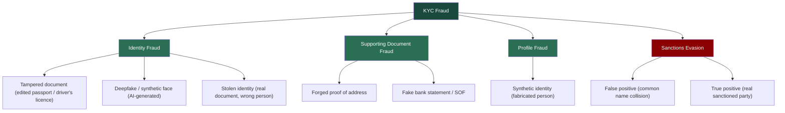
 
---
 
## Part 1 - Identity Documents
 
The first question in any onboarding is whether the person is who they claim to be. There are three ways this can fail (the document is edited, the face is fake, or the document is genuine but belongs to someone else).
 
> **Note on SAR thresholds at onboarding.** Several decisions below say "reject, and file a SAR if funds were already deposited." This reflects a real threshold question. For US MSBs the mandatory SAR trigger
> is a transaction conducted or attempted at or through the institution at or above the reporting threshold (31 CFR 1022.320). A fake document submitted at sign-up with no transaction and no funds does not
> automatically meet that bar - but many firms still file a *voluntary* SAR on attempted identity fraud, and firm policy may require it. So the pattern is: always reject and record internally; file a SAR when
> funds/transactions are present, when it fits a known fraud pattern, or where firm policy directs filing on attempted fraud.
 
### Document 1 - Italian Passport (Tampered MRZ)
 
**Document type:** Passport, Repubblica Italiana 

**Specimen reference:** PRADO ITA-AO-02005 - https://www.consilium.europa.eu/prado/en/ITA-AO-02005/image-365289.html
 
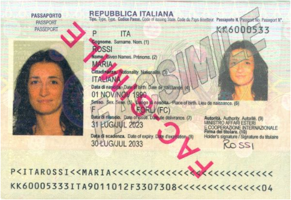
 
*Specimen source: PRADO (Council of the EU), document ITA-AO-02005. The data shown (ROSSI MARIA, passport KK6000533) is the public PRADO specimen. 
The tampering in the scenario below is fictional, applied to these specimen details for the exercise.*

---

#### The scenario
 
A customer submits an Italian passport for ROSSI MARIA during onboarding. At first inspection the document appears correct. The layout, photo, and Italian text match the template. However, when I verify
the MRZ check digits, the calculation on the passport number fails. This indicates that the document number was altered after the passport was issued.

---

#### Step 1 - Visual inspection against the specimen
 
I compare the submitted passport against the genuine PRADO specimen, which is the reference standard for a real Italian passport. In a remote KYC review I work from a scan or a photo, so
I can only rely on features that are visible in an image. UV and physical magnification checks are possible only during an in-person review.

---

I check three features that are visible on a good scan:
 
**Facial photograph (biodata page)**
 
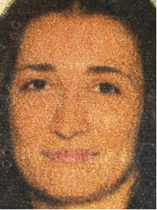
 
This screenshot shows the holder's photograph on the biodata page. On a genuine Italian passport, the photograph is printed directly onto the page surface during production, not attached on top, so it cannot be
replaced without damaging the page. I check the photograph for signs of substitution. I look for edges that appear added, a print texture that differs from the rest of the page, or a face that does not sit
naturally within the frame. A clean, evenly printed photograph that matches the surrounding page is what I expect on a genuine document.

---

**Personal data and optically variable device (hologram / OVD)**
 
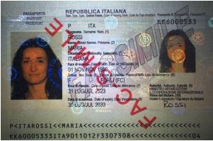
 
This screenshot shows the full biodata page: the surname (ROSSI), the given name (MARIA), the passport number (KK6000533), the dates, the two MRZ lines at the bottom, and the OVD (hologram) that overlaps the
photo. On a genuine Italian passport the personal data is laser-engraved, which gives it a specific texture and tone. Data that has been typed over or reprinted appears flat and often shows a slightly different
colour, so I confirm that the fonts, spacing, and field positions match the specimen. The OVD changes appearance when tilted. On a scan I cannot tilt it, but I can check that the overlay sits correctly over the
photo and that its edges look natural rather than digitally pasted. Forgers often damage or misalign this feature when they replace a photo.

---

**Laser-perforated numbering**
 
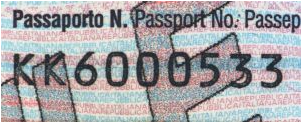
 
The passport number (KK6000533) is laser-perforated through the pages. Each digit is physically punched through the paper, which cannot be reproduced by image editing. If the number on the scan appears
flat or printed rather than perforated, that is a forgery indicator. This number must also match the number encoded in the MRZ.

> Note: the Italian passport also carries UV features (fluorescent overprint, fibres, security thread, and a watermark). These are listed in PRADO, but I do not rely on them for a remote review because
> they can only be checked physically under UV light. I mention them for completeness, not as checks I perform on a scan.

---

#### Step 2 - MRZ verification and check digits
 
The Machine-Readable Zone (ICAO 9303, TD3 format) is two lines of 44 characters at the bottom of the biodata page. It carries built-in check digits that must validate mathematically.
This is the single most reliable technical check on a passport, because it requires no special equipment, only the algorithm.
 
```
Check-digit algorithm (ICAO 9303)
1. Map characters:  0-9 = face value | A=10, B=11 ... Z=35 | '<' = 0
2. Apply repeating weights:  7, 3, 1, 7, 3, 1 ...
3. Sum all (value × weight)
4. Check digit = sum mod 10
```
 
**Passport number check - worked example.**
 
The genuine specimen number is `KK6000533`. First let me confirm the genuine check digit, then show the tampered version.
 
```
Genuine - KK6000533
K  K  6  0  0  0  5  3  3
20 20 6  0  0  0  5  3  3     ← character values (K = 20)
7  3  1  7  3  1  7  3  1     ← weights
140 60 6  0  0  0  35 9  3    ← products
 
Sum = 253
253 mod 10 = 3
 
Correct check digit = 3   ← matches the genuine specimen MRZ (…533‹3›)
```
 
The genuine passport validates correctly with check digit `3`. Now consider the tampered version. The forger changed the last digit of the number to disguise the document (`KK6000538`) but left
the printed check digit as `3`.
 
```
Tampered - KK6000538 (printed check digit still 3)
K  K  6  0  0  0  5  3  8
20 20 6  0  0  0  5  3  8
7  3  1  7  3  1  7  3  1
140 60 6  0  0  0  35 9  8
 
Sum = 258
258 mod 10 = 8
 
Correct check digit = 8
MRZ prints          = 3     ← MISMATCH
```
 
The printed check digit is `3`, but for `KK6000538` it must be `8`. This does not happen by accident, because a valid passport always has matching check digits. A mismatch means that the document number
was altered after the passport was made, or that the MRZ was fabricated. This is strong evidence of tampering.

---

**Date of birth check, second example to show the method holds.**

The genuine specimen DOB is `901101` (1 November 1990). I first confirm the genuine check digit, then show a tampered version.
 
```
Genuine - 901101 (1 Nov 1990)
9  0  1  1  0  1
7  3  1  7  3  1
63 0  1  7  0  1
 
Sum = 72
72 mod 10 = 2
 
Correct check digit = 2   ← matches the genuine specimen MRZ (901101‹2›)
```
 
Now consider a tampered version. Suppose the forger changes the year of birth to make the holder appear five years younger (`951101`) but leaves the printed check digit as `2`.
 
```
Tampered - 951101 (1 Nov 1995, printed check digit still 2)
9  5  1  1  0  1
7  3  1  7  3  1
63 15 1  7  0  1
 
Sum = 87
87 mod 10 = 7
 
Correct check digit = 7
MRZ prints          = 2     ← MISMATCH
```
 
A genuine passport's DOB check digit for 901101 is `2`. If someone alters the date of birth, the check digit no longer matches. This is another independent tampering signal, exactly like the passport-number check.
 
---
 
#### Step 3 - Cross-reference
 
I compare every data point across the passport, the MRZ, and the application form.
 
| Field | Passport (visual) | MRZ | Application form |
|---|---|---|---|
| Surname | ROSSI | ROSSI | ROSSI |
| Given name | MARIA | MARIA | MARIA |
| Passport number | KK6000538 | KK6000538**3** (bad check) | KK6000538 |
| DOB | 01/11/1990 | 901101 | 01/11/1990 |
 
Here the names and the date of birth all agree. The problem is only the MRZ check digit on the altered passport number. In another common pattern the names would also disagree, for example a form name
that differs from the one on the passport rather than a spelling variant, which would be a second independent red flag.

The laser-perforated number is a further data point on the passport itself. In this scenario it still reads KK6000533, while the printed number and the MRZ read KK6000538. This internal disagreement confirms that the printed number and the MRZ were altered after issue.

---

#### Red flags
 
| Red flag | Type | Severity |
|---|---|---|
| MRZ passport-number check digit does not validate | Document tampering | 🔴 CRITICAL |
| Laser-perforated number (KK6000533) does not match the printed number and MRZ (KK6000538) | Document integrity | 🔴 HIGH |
| (If found) given name on form ≠ name on passport | Identity mismatch | 🔴 HIGH |
| (If found) visual DOB ≠ MRZ DOB | Document integrity | 🔴 HIGH |
 
---
 
#### Decision & Action
 
❌ **REJECT.** Do not onboard. The action path is as follows:
- **Reject and issue an RFI.** Decline the document and request a clean re-submission of the original passport, together with a second independent identity document.
- **Verify.** Re-run sanctions and adverse-media screening on the verified identity, and flag the profile as HIGH RISK pending verification.
- **Escalate.** Route the case to a senior analyst with the findings if the re-submission also fails or if anything else is suspicious.
- **SAR.** Recommend filing a SAR if funds were already deposited before this review, or if the case matches a pattern of similar fraudulent applications. A tampered document with no funds is normally a rejection
  and an internal fraud note. A tampered document attached to funds already on the platform warrants a SAR (see the note on attempted-onboarding SAR thresholds in Part 1).
- If the customer cannot produce a valid document, offboard and recommend filing a SAR.

---

#### Key learning

Check digits are the fastest way to detect a tampered passport. I first confirmed that the genuine number validates (`KK6000533` produces check digit 3), then showed how an altered number breaks the check. 
The laser-perforated number adds a second, independent check, because it cannot be altered on an existing passport: when the printed number and the MRZ read `KK6000538` but the perforation still reads `KK6000533`, 
the document contradicts itself. On a scan UV is not available, so the perforated number and the OVD over the photo are the visual features I rely on, together with the MRZ calculation.
 
---
 
### Document 2 - USA Driver's Licence (Edited Card / Front-Back Mismatch)
 
**Document type:** Driver's licence, New York State (USA)

**Sample reference:** NY DMV - Sample Photo Documents - https://dmv.ny.gov/driver-license/sample-photo-documents
 
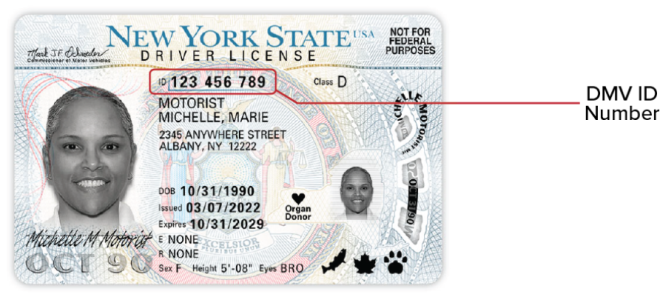
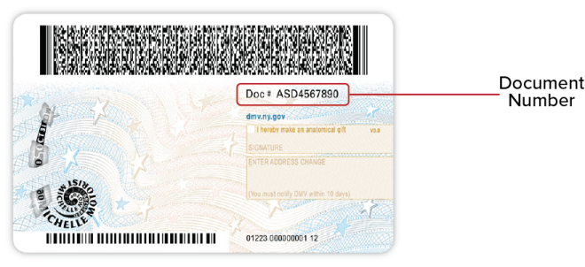
 
*Sample source: New York State DMV official "Sample Photo Documents" page. Public reference document.*

---
 
#### Why a driver's licence is different from a passport
 
In the United States there is no national ID card, so the driver's licence is the primary identity document. This makes it the most forged ID in US-facing onboarding. Two things change compared with a passport.
 
- **There is no ICAO MRZ.** The machine-readable part is a PDF417 2D barcode on the back, which encodes the same data printed on the front.
- **There are two different numbers**, and they sit on different sides of the card. This gives a built-in front-to-back cross-check.
  
| Number | Where | What it is |
|---|---|---|
| **Client ID (CID)** | Front, 9 digits (e.g. `123 456 789`) | Identifies the person. Does not change on renewal. |
| **Document Number** | Back, 8–10 characters after "Doc #" (e.g. `ASD4567890`) | Identifies the card. Changes every time the card is reissued. |
 
There is also a card-type distinction that matters for compliance.
 
- **Standard** licence. Marked "NOT FOR FEDERAL PURPOSES" in the top right corner. Since 7 May 2025 it cannot be used to board a domestic US flight or enter a federal building.
- **Enhanced (EDL)**. Has a US flag image and is REAL ID compliant.
- **REAL ID**. Has a star and is REAL ID compliant.

---

#### The scenario
 
A US customer submits the front and back of a New York driver's licence. The front appears clean, with a photo, the name (Marie Michelle Motorist), and CID `123 456 789`. However, two checks fail.
The data on the front does not match the PDF417 barcode on the back, and the Document Number format is wrong. This is the driver's-licence equivalent of an MRZ mismatch.
The human-readable side was edited, but the machine-readable side was not updated to match.

---

#### Step 1 - Visual inspection (front)
 
I compare the front against the official NY DMV sample:
- Photo placement, fonts, and the NY State background and security print match the template
- "Class D" and the date format are correct for NY
- I check for editing signs around the name, DOB, and photo, such as mismatched fonts, uneven spacing, or a photo that sits incorrectly

---

#### Step 2 - Barcode (PDF417) cross-check, the key test
 
The barcode on the back is the machine-readable record of the card. It encodes the same data printed on the front. In a real KYC platform (Jumio, Onfido, Sumsub) the barcode is decoded automatically
and compared against the front, so the analyst sees a match or mismatch result, not the raw decoded data. I do not decode the barcode by hand, because the 2D code cannot be read by eye.
 
For this educational case the comparison below is illustrative. It shows what the platform would flag, not data I personally decoded.
 
| Field | Front (printed) | Back barcode (decoded) | Result |
|---|---|---|---|
| Name | MICHELLE, MARIE | MICHELLE, MARIE | ✅ OK |
| DOB | 10/31/1990 | 03/14/1988 | ❌ MISMATCH |
| ID | 123 456 789 | 123 456 789 | ✅ OK |
| Expiry | 10/31/2029 | 10/31/2029 | ✅ OK |
 
A genuine licence is produced in one process, so the front and the barcode always agree. A DOB that differs between the printed front and the encoded barcode means the front was altered after issue.
This is decisive evidence of tampering, following the same logic as a failed passport check digit.

---

#### Step 3 - Document Number format check
 
NY Document Numbers are an 8 to 10 character mix of letters and numbers. I check the format and the front-to-back relationship.
- The Document Number is on the back ("Doc #"). If a submitted "Document Number" is presented as the 9-digit front number, the submitter has confused the CID with the Document Number, which suggests
    they do not actually hold the card.
- A Document Number that is the wrong length or character pattern for NY is a red flag.
  
In this submission the customer entered the 9-digit front CID in the "Document Number" field of the application. This fails the format check and suggests that the submitter does not hold 
the physical card, because the real Document Number is printed only on the back.
  
---

#### Step 4 - Cross-reference
 
| Field | Front (visual) | Back barcode | Application form | Result |
|---|---|---|---|---|
| Name | Michelle, Marie | Michelle, Marie | Michelle, Marie | Match |
| DOB | 10/31/1990 | 03/14/1988 | 10/31/1990 | Mismatch |
| CID | 123 456 789 | 123 456 789 | 123 456 789 | Match |
 
The DOB on the front does not match the barcode. The customer also moved the year forward on the front (1988 to 1990), which is a common edit to defeat an age check or to match a stolen profile.
 
Separately, the card is a Standard licence, marked "Not for Federal Purposes". This is not a comparison field, but it is a limitation worth noting: the card is not REAL ID compliant and represents a weaker identity tier.

---

#### Red flags
 
| Red flag | Type | Severity |
|---|---|---|
| Front DOB does not match the PDF417 barcode | Document tampering | 🔴 CRITICAL |
| Document Number wrong format / confused with CID | Document integrity | 🔴 HIGH |
| Editing signs around DOB / photo area | Tampering signal | 🔴 HIGH |
| Standard ("Not for Federal Purposes") card offered as full ID | Document-tier limitation | 🟡 MEDIUM |

---

#### Decision & Action
 
❌ **REJECT.** Do not onboard. The action path is as follows:
- **Reject and issue an RFI.** Request the original document and a second independent ID (a passport).
- **Verify.** Re-scan the barcode at higher quality to confirm that the mismatch is real and not caused by a poor image, and flag the profile as HIGH RISK.
- **Escalate.** Route the case to a senior analyst if the re-submission also fails or if other red flags appear.
- **SAR.** Recommend filing a SAR if funds were already deposited, or if the edited licence is part of a wider fraud pattern (the same threshold logic as Document 1).
- If the customer cannot produce a consistent document, offboard and recommend filing a SAR.

---

#### Key learning
 
A US driver's licence has no MRZ, but the PDF417 barcode on the back must match the printed front. Comparing the two sides is the licence equivalent of validating a passport's check digit.
Knowing the difference between the CID and the Document Number is what allows me to identify a submitter who does not actually hold the card.
 
---
 
### Document 3 - Deepfake Selfie
 
**Document type:** Liveness selfie (face verification)

#### The scenario
 
The customer passes the document stage and submits a selfie for face matching and liveness. The selfie matches the document photo at a high score on commercial KYC platforms (Jumio, Onfido, and Sumsub).
That high match is expected here, because the image was AI-generated from the document holder's own photo, not captured live from the real person. The attacker photographs the genuine document, usually
stolen or purchased, and uses an AI model to produce a new image of that same face, which then passes the face-match check against the document. Several signals show that the selfie was AI-generated rather than
taken by a real person in front of the camera.

---

#### Step 1 - Visual indicators of AI generation
 
Modern GAN and diffusion faces are convincing, but they still leave indicators. I check for the following:
 
- **Hair edges.** Strands that blur or dissolve unnaturally into the background.
- **Ear and jaw symmetry.** AI faces are often too symmetrical, whereas real faces are not.
- **Eye reflections.** Real eyes reflect the room, while AI eyes often have mismatched or missing reflections.
- **Skin texture.** Too smooth, with no pores and no small imperfections.
- **Background.** The lighting on the face does not match the background lighting.
- **Accessories.** Glasses frames or earrings that are asymmetric or blend into the skin.

These visual indicators are useful, but they are weakening over time. Older models left clear artifacts, while current AI models can produce faces with none of the indicators listed above. 
For that reason I treat the visual layer as corroborating, not decisive. The weight of the decision rests on the layers that remain more reliable against a strong generator: the provenance metadata in Step 2, 
and the active or 3D liveness in Step 3.

---

#### Step 2 - Metadata analysis (EXIF and C2PA provenance)
 
A photograph taken on a real camera carries device metadata (EXIF): the make, the model, the lens, and the capture settings. An AI-generated image does not carry any of this, because no camera was involved.
What matters is not when the image was created, but whether the file shows a real capture device at all. One signal is the absence of any camera data, because every phone and camera records make, model, and lens data.
 
To demonstrate the difference, I compared a real photo taken on an iPhone with an image I generated in ChatGPT:
 
**Metadata of a genuine photo (taken on an iPhone)**
 
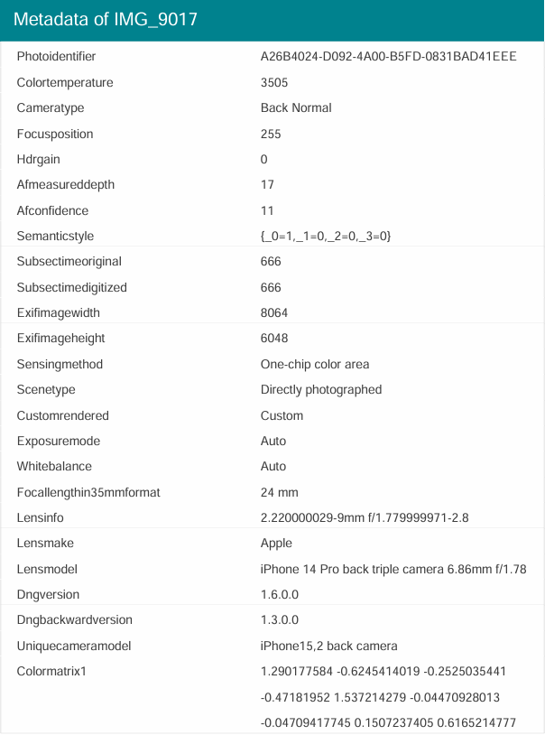
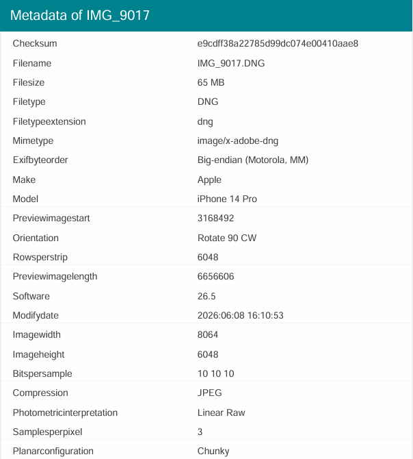
 
The file carries a full set of capture metadata: "Make: Apple", "Model: iPhone 14 Pro", the Lensmodel ("iPhone 14 Pro back triple camera 6.86mm f/1.78"), and the 
exposure settings ("FNumber: 1.8", "ExposureTime: 1/35", "ISO: 320", "FocalLength: 6.9 mm"). 
These fields are written by the camera at the moment of capture, and they are exactly what I expect on a genuine photo from a real device.

---

**Metadata of an AI-generated image (created in ChatGPT)**
 
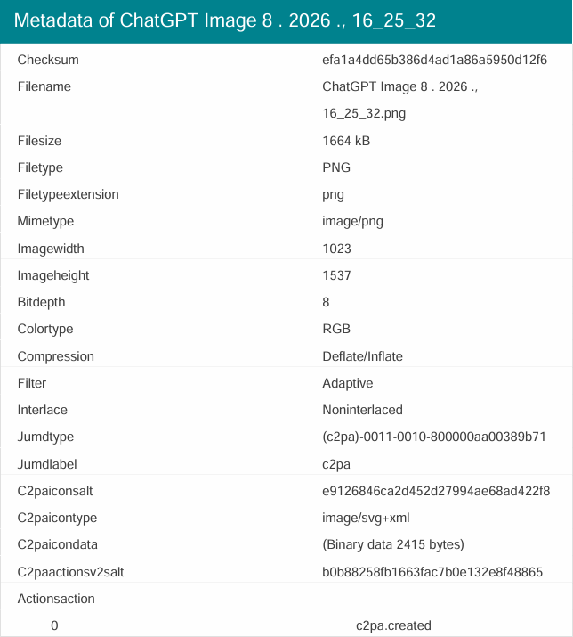
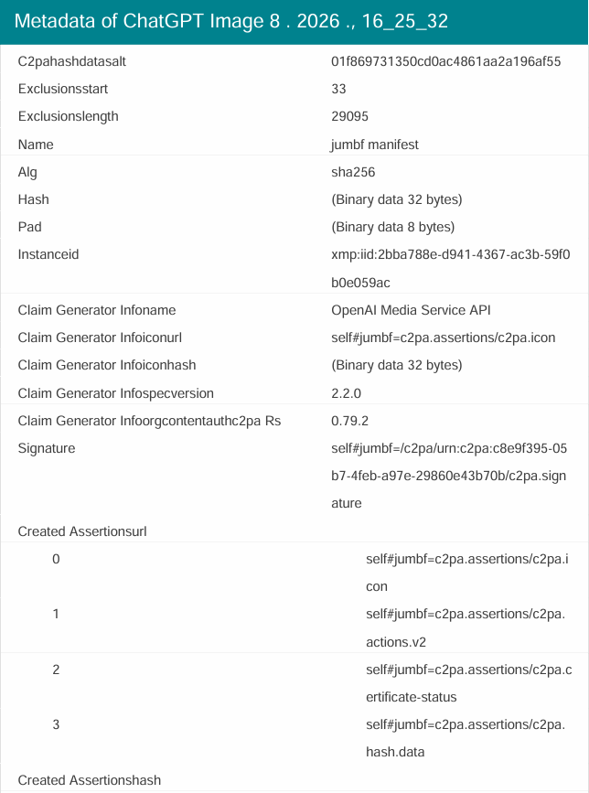
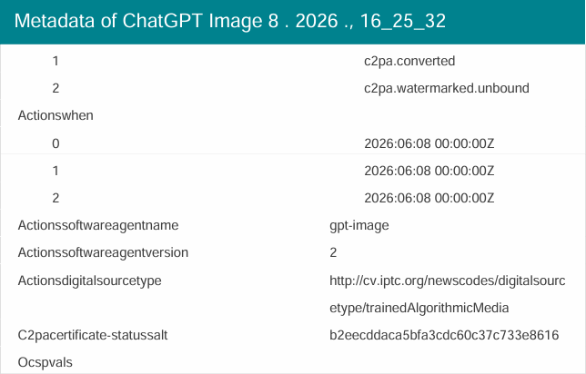
 
The AI image carries no camera fields at all. There is no make, model, lens, or exposure data, because no camera produced it. Moreover, it carries a C2PA provenance manifest that openly identifies the file
as AI-generated. The `Actionssoftwareagentname` is `gpt-image`, the `Claim Generator Infoname` is `OpenAI Media Service API`, and the `Actionsdigitalsourcetype` value is a full IPTC link ending in `trainedAlgorithmicMedia`, which is the standard code for content produced by a generative model. The file is also C2PA-watermarked.

---

**The comparison**
 
```
Field                 Genuine photo (iPhone)              AI image (ChatGPT)
Make / Model      :   Apple / iPhone 14 Pro               none                       ← RED FLAG
Lensmodel         :   iPhone 14 Pro back triple camera    none                       ← RED FLAG
Exposure / ISO    :   f/1.8, 1/35, ISO 320                none                       ← RED FLAG
C2PA provenance   :   none                                gpt-image / OpenAI API     ← RED FLAG (declares AI)
digitalSourceType :   none                                trainedAlgorithmicMedia    ← RED FLAG (declares AI)
--- weaker signals, not red flags on their own ---
GPS / location    :   none                                none                       weak (geolocation can be off in settings)
Timestamp         :   capture time present                generation time present    not a flag (on-demand selfie is normal)
Color profile     :   Apple embedded profile              sRGB                       weak (most devices use sRGB)
File type         :   DNG (Apple ProRAW)                  PNG                        weak (PNG is also used for screenshots and on Android. DNG is just Apple's RAW format)
```
 
Two things expose the AI image. First, the absence of any camera capture data, because every phone and camera records make, model, and lens. Second, the presence of C2PA provenance that names the 
generator and marks the file as AI-generated. The first is a negative signal and the second is a positive signal, and together they are decisive.

Metadata is not equally reliable in every case, and different AI tools behave differently. Mainstream generators such as ChatGPT now embed C2PA provenance that declares the image as AI-generated, but 
specialised fraud tools do the opposite: they strip all metadata, or spoof the camera fields to imitate a real device, and they never add C2PA. So in practice I read the metadata together with the visual 
indicators and the liveness result, rather than relying on a single layer. The presence of C2PA AI provenance is strong evidence that the image is generated. The absence of camera data is only suspicious, 
not proof, because a genuine photo can also lose its metadata after passing through a messaging app such as Telegram or WhatsApp.
 
If the metadata is missing or looks edited, I do not clear the image on that basis, and I do not reject it on that basis alone. I fall back to the layers an attacker cannot remove from the file: the visual AI
indicators, the liveness result, and the behavioural signals. Clean-looking metadata never clears a face by itself, and missing metadata never confirms fraud by itself. The decision comes from the combination.

> **Note:** The full metadata extractions for both files are attached in this repository: [genuine iPhone photo](attachments/doc-3-metadata-genuine.pdf) and [AI image](attachments/doc-3-metadata-ai.pdf).
> I produced both files myself to demonstrate the method. Neither file contains GPS or geolocation data.

---

#### Step 3 - Liveness detection and bypass techniques
 
How the attacker tries to bypass liveness check:
- **Virtual camera injection.** Software such as OBS or ManyCam feeds a pre-recorded or generated video into the KYC flow instead of a real webcam.
- **Replay attack.** A pre-recorded video of the AI face nodding and blinking.
- **Real-time deepfake.** AI generates the face live during the check.
  
How liveness detection catches it:
 - **Motion blur analysis.** Genuine head movement produces physically correct blur that matches the direction and speed of the movement. Deepfakes often show incorrect blur at the face edges,
   or "ghosting", where the face briefly doubles during a fast turn.
- **Depth and occlusion analysis.** Active liveness systems track how the face responds to small head movements. A flat photo or a replayed video does not produce correct parallax, so the depth
   relationship between facial features collapses. Some advanced systems also project random light patterns onto the face and verify that the skin responds correctly. A flat screen cannot reproduce this response.
- **Object occlusion test.** Passing a hand or an object in front of the face is one of the most reliable checks. A real face has a correct depth relationship with objects in front of it.
   A deepfake often loses face tracking at the moment of occlusion, so the real face briefly reappears, or artifacts appear at the boundary. A pre-recorded video simply shows the hand on top of the recording
   with no correct depth interaction.
- **3D depth liveness.** Unlike 2D (passive) liveness, infrared depth mapping cannot be faked with a flat screen or a replayed video, so it defeats most virtual-camera attacks.

---

#### Red flags
 
| Red flag | Type | Severity |
|---|---|---|
| Multiple AI-generation artifacts in the selfie | AI-generated image | 🔴 HIGH |
| No camera capture metadata (no make, model, or lens) | Not produced by a camera | 🔴 HIGH |
| C2PA provenance marks the file as AI-generated (gpt-image, trainedAlgorithmicMedia) | AI provenance | 🔴 HIGH |
| Face match high but image provenance suspect | Synthetic identity | 🔴 HIGH |
| Liveness passed but background and lighting inconsistent | Possible injection attack | 🟡 MEDIUM |

---

#### Decision
 
❌ **REJECT + SAR.**
 
A deepfake selfie is not an innocent mistake. Someone deliberately generated a synthetic face to defeat identity verification. 
This is a clear fraud attempt, and the recommended practice is to file a SAR.
See the mock SAR below.
 
---
 
#### Mock SAR #1 - Deepfake / Synthetic Identity at Onboarding
 
> **Disclaimer:** Fictional SAR for educational purposes. Institution and subject details are fictional.
 
**Filing institution:** Clear Exchange Ltd (VASP / MSB), FinCEN Registration No. XXXXXXX, Wilmington, DE 19801

**Date of report:** June 18, 2026

**Subject:** name as submitted, not verified; Application ID XXX-XXXXXX; no account opened, onboarding declined

**Prior SARs on subject:** none on file
 
**Narrative**
 
Clear Exchange Ltd files this report to document an attempt to open an account using a genuine identity document together with an artificially generated (deepfake) selfie to pass identity verification.
No account was opened and no funds were received. The institution reports the attempt because the conduct shows a deliberate effort to defeat identity verification, which is
consistent with the early stage of account-takeover or money-laundering activity.
 
On June 17, 2026, the applicant submitted a passport and a liveness selfie through the institution's remote onboarding flow. The selfie passed the automated face-matching check
against the passport photograph, with a similarity score of 92 percent. During manual review, however, the analyst identified several indicators that the selfie was an artificially
generated image rather than a genuine photograph. The image showed unnatural rendering at the hair edges, facial features that were unusually symmetrical, and reflections in the eyes that
did not match a real environment. The file also carried no camera metadata of any kind. It contained no make, model, or lens information, which a photograph taken on a genuine device always records.
 
The liveness check was recorded as passed, but the captured video showed lighting and background characteristics that did not match a live capture. These characteristics are consistent
with a virtual-camera injection attack, in which pre-recorded or generated video is fed into the verification flow in place of a live webcam.
 
Taken together, the artificially generated facial image, the complete absence of camera metadata, and the signs of a virtual-camera injection indicate that the applicant attempted to create
a verified account under a fabricated or stolen identity. The institution considers this conduct consistent with the methods used to open accounts for the laundering of illicit funds or for fraud.
 
The institution declined the application on the same day and added the applicant's device fingerprint and the submitted image hash to its internal fraud watchlist. The submitted document, the selfie,
the associated metadata, and the device fingerprint have been retained and are available to law enforcement upon request. Any future application matching the retained device fingerprint or image hash
will be escalated immediately. The institution did not notify the applicant that this report was filed.
 
Point of contact: AML Compliance Officer, Clear Exchange Ltd.
 
**END OF MOCK SAR**
 
---
 
### Document 4 - Stolen Identity (Nigerian Passport)

**Document type:** Passport, Federal Republic of Nigeria

**Specimen reference:** PRADO NGA-AO-03001 - https://www.consilium.europa.eu/prado/en/NGA-AO-03001/image-319086.html
 
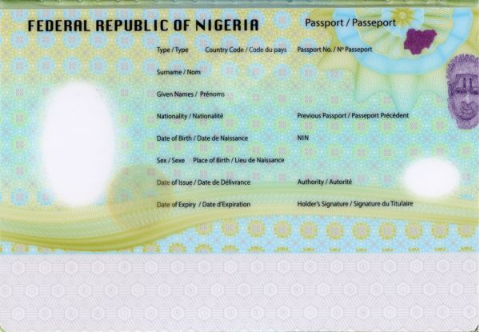
 
*Specimen source: PRADO (Council of the EU), document NGA-AO-03001. Public reference document.*

#### The scenario
 
This is the hardest identity fraud to catch. The passport is completely genuine, with a real document, a real person, a valid MRZ, and correct check digits. The problem is that the person
submitting it is not the person it belongs to. It is a stolen, borrowed, or purchased identity.
Because the document itself is real, every document-level check passes. The fraud is only visible at the biometric and behavioural layer.

---

#### Step 1 - Document checks all pass

- MRZ valid, check digits correct
- Security features present
- Document not expired
- Name and DOB internally consistent
  
Nothing here fails. If I only checked the document, I would onboard a criminal.

---
 
#### Step 2 - Biometric mismatch (the main detection point)
 
The selfie does not match the passport photo. This is the primary detection layer for stolen identity. The detection has two forms: either the face-match score falls below threshold, or the same 
face matches a different applicant already on file, which means one face is being used with several documents.

---

#### Step 3 - Velocity and cross-platform signals
 
Registering on two platforms in one day is not suspicious on its own, because people compare exchanges and sign up on several at once. The signal is the combination:
- The same passport number is linked to a different face on another platform. One document cannot belong to two different people.
- The same passport appears across many platforms in a very short period of time (industrial identity farming).
- The same passport is used where the account was recently closed for fraud elsewhere.
- The device or IP is linked to previous fraud attempts.

---

#### Step 4 - Behavioural biometrics (backend signal)
 
This layer is not visible to the analyst directly. It runs on the backend (tools such as BioCatch or NeuroID) and produces a behavioural risk score that feeds into the onboarding decision.
It tracks how the form is filled, not only what is entered.
- **Typing speed.** A person who knows their own DOB and address types without hesitation. Slow, paused entry on personal fields suggests reading from someone else's document.
- **Copy-paste patterns.** Genuine users type their name and address manually. Fields pasted in seconds suggest an automated or pre-prepared submission.
- **Completion time.** The average KYC form takes 8 to 12 minutes. Completion in under 2 minutes with no corrections suggests a script.
- **Mouse and touchscreen movement.** Natural movement has acceleration and micro-jitter, whereas programmatic input is perfectly straight.
- **Hesitation patterns.** Someone filling another person's profile pauses on fields that require genuine personal knowledge.
  
No single behavioural signal confirms fraud. The system combines them into one score, and a high-risk score triggers a manual-review flag for the analyst.

---

#### Red flags
 
| Red flag | Type | Severity |
|---|---|---|
| Selfie does not match passport photo | Biometric mismatch | 🔴 CRITICAL |
| Same passport linked to a different face on another platform | Identity abuse / document sharing | 🔴 HIGH |
| Same passport used across many platforms in a short period of time | Industrial identity farming | 🔴 HIGH |
| Same passport used after an account was recently closed for fraud elsewhere | Cross-platform fraud signal | 🔴 HIGH |
| Same face linked to other names/applications | Identity farming | 🔴 HIGH |
| High-risk behavioural-biometrics score (backend) | Behavioural mismatch | 🟡 MEDIUM |

---

#### Decision & Action
 
❌ **REJECT + SAR.**
 
A genuine document with a non-matching person points to a stolen identity. The real document-holder may be a victim of identity theft, or may be complicit and have sold their identity.
Either way the activity is suspicious. Unlike the no-funds document cases above, the deliberate use of someone else's genuine identity is a clear fraud, so I file a SAR.

---

#### Alert disposition note
 
> **Disclaimer:** Fictional internal note for educational purposes.
 
```
Case ID:        KYC-2026-00xxx
Applicant:      (passport holder name), onboarding
Review type:    Onboarding, identity verification
Risk rating:    High
Status:         REJECTED (fraud)
 
Trigger:        Genuine passport, but selfie does not match the document photo.
                Biometric mismatch on an authentic document.
 
Review conducted:
  - Document checks: MRZ valid, security features present, not expired
  - Biometric: face match below threshold vs document photo
  - Cross-platform: same passport linked to a different face elsewhere
  - No innocent explanation for an authentic document with a wrong face
 
Decision:       REJECT onboarding. Recommend filing a SAR (MLRO approval required).
 
Rationale:      Use of a genuine third party's identity document by a different person is deliberate identity fraud.
                The true holder may be a victim, and the activity is reportable.
 
Analyst:        A. Kotsyk
Escalated to:   Senior AML Officer / MLRO
Next action:    Reject. Preserve device fingerprint and submitted image hash. SAR recommended to the MLRO. Watch for re-attempts on the same identifiers.
Tipping off:    Applicant not told a SAR was filed (31 U.S.C. § 5318(g)(2)).
```
 
#### Key learning
 
When the document is real, document checks are not enough. The whole defence rests on biometric comparison and velocity checks. A perfect document is not a clean customer.
 
---
 
## Part 2 - Supporting Documents
 
Once identity is established, the next question is where the money comes from and whether the person actually lives where they say. These documents, utility bills and bank statements, are
the most commonly forged, because they are easy to edit in basic software.
 
### Document 5 - Forged UK Utility Bill
 
**Document type:** Utility bill (proof of address)
 
#### The scenario
 
The customer submits a UK electricity bill as proof of address. The address on the bill is 14 Kingsway, London WC2B 6LH. The document is forged. Someone used a template and typed in the customer's details,
or edited a real bill. The purpose of a proof of address is to confirm that the customer genuinely lives where they claim, which matters for jurisdiction, tax, and risk rating. A forged document breaks
that foundation, so I cannot accept it.

---

Schematic of the submitted bill (this is a layout, not a real document):
 
```
+--------------------------------------------------+
|  [LOGO]   BRITGRID ENERGY            Bill         |
|                                                   |
|  Daniel R. Whitfield          Account: 8839201    |
|  14 Kingsway, London                              |
|  WC2B 6LH                   Bill date: 15 Jan 2026|
|---------------------------------------------------|
|  Previous balance          £0.00                  |
|  Electricity (Jan)         £84.00                 |
|  --------------------------------                 |
|  Total due                 £84.00                 |
+--------------------------------------------------+
```
 
#### Step 1 - Font and layout consistency
 
A genuine utility bill is generated automatically by the utility's billing system, so every field uses the same fonts and alignment. On a forged bill I look for the following.
- The customer name in a slightly different font or weight from the rest, which suggests it was typed in later
- Numbers that are not aligned the way an automated system aligns them
- Uneven spacing where fields were edited

---

#### Step 2 - Logo quality
 
The logo is often taken from a web image at low resolution. A real bill uses a clean vector logo (SVG). JPEG artifacts or a blurred logo on an otherwise clean, sharp document is a red flag.

---

#### Step 3 - Metadata
 
If the file is a PDF, I check the metadata (see Document 6 for the full method). A utility bill "PDF" created in an image editor or a word processor is suspect.

---

#### Step 4 - Address verification
 
I check the address (14 Kingsway, London WC2B 6LH) in Google Maps and against postal data.
- Does the address exist?
- Does the postcode match the street?
- Is it residential or commercial?
  
On the residential versus commercial point, a commercial address is not automatically a red flag. There are legitimate situations, for example:
- **Mixed-use buildings.** Many city-centre buildings have shops on the ground floor and flats above, and people genuinely live there.
- **Live-work units.** These are common for self-employed people and freelancers.
- **Registered business address.** A sole trader may receive post at their business.
  
It becomes a red flag only in specific cases, such as:
- The address is a mailbox or virtual-office service, where post is forwarded and no one actually lives there.
- The address is a purely industrial or commercial building where residence is implausible, such as a warehouse or a shopping-centre unit.
- The address does not exist, or the postcode does not match the street.
  
I therefore treat a commercial address as a prompt to look closer, not as proof of fraud.

---

#### Step 5 - Date
 
Proof of address is normally accepted only if it was issued within the last 3 months (this depends on internal policies and procedures). An older bill is rejected on age alone.

---

#### Red flags
 
| Red flag | Type | Severity |
|---|---|---|
| Customer name in different font from document body | Document integrity | 🔴 HIGH |
| Low-resolution / JPEG-artifact logo | Forgery signal | 🟡 MEDIUM |
| Address is a mailbox service or implausible for residence | Address concern | 🟡 MEDIUM |
| Bill older than 3 months | Stale document | 🟡 MEDIUM |

---

#### Decision & Action
 
⚠️ **REQUEST ADDITIONAL INFORMATION.** Do not onboard on this document.
 
Why request more rather than reject outright? A proof of address is a supporting document, and the correct first step when one appears forged is to give the customer a clear opportunity to provide a genuine,
independent one, which a legitimate customer can do easily. I do not accept the suspect bill, but I also do not yet assume a crime. Further actions:
- Issue a Request for Information (RFI) asking for a second, independent proof of address.
- Do not verify the address until it is confirmed from an independent source.
- If the customer provides a clean document, proceed. The original is noted but set aside.
- If the customer refuses, delays, or sends another forged document, escalate and recommend filing a SAR, especially if funds are already on the platform.
- If the forgery is combined with other red flags, such as a suspect identity or suspicious funds, escalate immediately rather than only requesting more.

---

#### Mock RFI to the customer
 
> **Disclaimer:** Fictional RFI for educational purposes. Institution and customer details fictional.
> **Note:** Neutral, document-focused wording. There is no accusation and no mention of fraud, an investigation, or any report. This protects the process and avoids tipping off.
 
```
From:    Clear Exchange, Compliance / Onboarding
To:      Daniel R. Whitfield
Subject: Additional document required to verify your account
 
Hello,
 
Thank you for your recent submission. To complete the verification of your account, we need one additional proof of address.
The document you provided could not be accepted in its current form.
 
Please upload ONE of the following, issued within the last 3 months and clearly showing your full name and residential address:
  - Bank or credit-card statement
  - Utility bill (gas, electricity, or water)
  - Government or tax authority letter (e.g. council tax)
 
Requirements:
  - The document must be a full, original PDF or photo (no edits or cropping)
  - Name and address must match the details on your account
 
You can upload the document securely in your account under Settings, then Verification. If you have any questions, reply to this message.
 
Thank you,
Clear Exchange, Compliance Team
```
 
#### Key learning
 
Font consistency is the first and fastest check on a utility bill. Automated billing systems produce uniform documents, so any variation in the customer-specific fields is a strong sign of manual editing.
A commercial address is a reason to look closer, not an automatic red flag, because the context decides.
 
---

### Document 6 - Fake Bank Statement (UAE Bank)
 
**Document type:** Bank statement (source of funds)
 
#### The scenario
 
The customer is asked for a bank statement to support the source of funds for a large deposit. They submit a PDF that claims to be from a UAE bank. It is fabricated. This document has the largest set of red flags 
in the case, because a fake statement usually fails on several independent layers at once: the metadata, the running balance, the transaction patterns, and the visible consistency of the document itself.
 
---
 
The submitted statement is shown below, captured from the actual PDF file (which is also attached). It uses a single amount column, where income is positive and spending is negative:
 
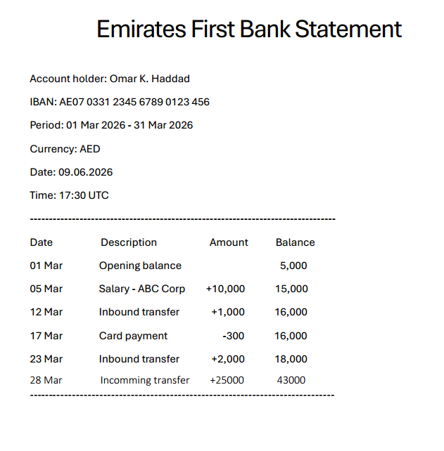
 
On the submitted PDF, the final row (28 March) is set in a different font and weight from the rest of the statement. The same row misspells "Incoming" as "Incomming" and drops the thousands separator that 
every other row uses, showing 25000 and 43000 rather than 25,000 and 43,000. An automated banking system renders every figure in one consistent font and one consistent number format, so a row that differs in font, spelling, and formatting was typed in by hand. This is the same font-consistency check used on the utility bill in Document 5, applied here to the exact row the forger edited: the large incoming transfer added 
to support the deposit.

---
 
#### Step 1 - PDF metadata (the fastest check)
 
A genuine bank statement is produced by the bank's core-banking system, and its PDF metadata reflects that. A fake one, edited in Word, reveals itself immediately.
 
The screenshot below shows a real metadata analysis from metadata2go.com. To demonstrate the technique, I created a test PDF in Microsoft Word, edited it once, and analysed it with the same tool 
I would use on a submitted document. The result shows two separate red flags in a single file.
 
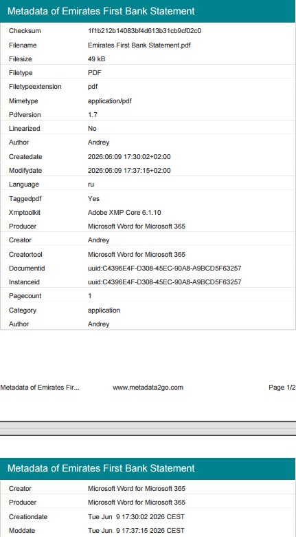
 
> **Note:** The "author" field shows "Andrey" because this is a test file I created specifically to demonstrate the forensic method. In a real case the author field would show the username of the person who fabricated
> the document, which is itself a red flag. The key indicators are `creator_tool` and `producer`, both showing Microsoft® Word for Microsoft 365, not a banking system.
 
```
Metadata          Expected (genuine statement)               Found in this file
creator_tool  :   Core-banking PDF engine                    Microsoft Word for Microsoft 365       ← RED FLAG
producer      :   Adobe PDF Library / banking system         Microsoft Word for Microsoft 365       ← RED FLAG
creator       :   none (system-generated)                    Andrey (a personal windows username)   ← RED FLAG
create_date   :   matches the printed statement date         2026:06:09 17:30:02 (matches it)       ✓ consistent here
modify_date   :   identical to create_date                   2026:06:09 17:37:15 (7 minutes later)  ← RED FLAG (edited)
language      :   English or Arabic (UAE bank)               ru (Russian)                           ← minor indicator
```
 
A "bank statement" whose creator and producer are Microsoft Word was written in Word, not by a banking system. This is a 30-second check that catches the majority of fake financial documents. 
In this file the `create_date`, 2026:06:09 17:30:02, matches the generation date printed on the statement, 09.06.2026 at 17:30, so that particular check is consistent. A careful forger sets the printed date 
to match the file. The document is exposed by two other signals. First, the `creator` and `producer` are Microsoft Word for Microsoft 365, which a banking system would never produce. 
Second, the `modify_date`, 17:37:15, is seven minutes later than the `create_date`, which proves the file was opened and edited after it was created. A genuine statement is generated once and is never edited, so 
its create and modify dates are identical. Either signal on its own is enough to reject the document. The metadata carries smaller tells in the same direction: the author is a personal username rather than 
a banking system, the document language is set to Russian, and the `create_date` offset is +02:00 (Central European) rather than the +04:00 offset a UAE bank would use.
 
> **Note:** I created and edited the fake statement myself in Microsoft Word to demonstrate the method. The metadata report was generated automatically by metadata2go.com from that file, not written by me.
> Both are attached in this repository: the statement, [fake bank statement](attachments/doc-6-bank-statement.pdf), and its [metadata extraction](attachments/doc-6-bank-statement-metadata.pdf).
 
---
 
#### Step 2 - Balance arithmetic
 
This is the second most common mistake forgers make. They edit a number and forget to recompute the running balance. I verify the statement above.
 
```
17 Mar  Card payment  -300
Balance before: 16,000
16,000 - 300 = 15,700
Statement shows: 16,000     ← the 300 debit is not reflected
```
 
The running balance does not add up. The 17 March debit of AED 300 is not reflected, so the balance stays at 16,000 instead of falling to 15,700, and every later line is then 300 too high.
A real banking system never makes an arithmetic error, so this discrepancy is proof of manual manipulation.
 
---
 
#### Step 3 - Transaction patterns
 
Real accounts show varied, human spending. Fake statements appear too clean.
- Only round numbers, whereas real life includes amounts such as 47.32, not only 200
- No small everyday transactions, such as coffee, groceries, transport, and subscriptions
- A salary amount inconsistent with the stated annual income (here AED 10,000 per month, about AED 120,000 per year, does not match the AED 300,000 annual income stated on the application)
- A large unexplained "transfer in" just before the period ends, sized to support the deposit
  
---
 
#### Step 4 - IBAN and bank format
 
I check that the IBAN format is valid for the UAE (country code AE, correct length) and that the bank code maps to the bank named on the statement. 
A mismatch between the claimed bank and the IBAN's bank code is a red flag.
 
---
 
#### Red flags
 
| Red flag | Type | Severity |
|---|---|---|
| PDF creator = Microsoft Word | Document integrity | 🔴 CRITICAL |
| Modify date later than create date (file edited after creation) | Tampering evidence | 🔴 CRITICAL |
| Running balance does not add up (300 error) | Mathematical inconsistency | 🔴 CRITICAL |
| Edited row in a different font, with a misspelling and no thousands separator | Manual editing | 🔴 HIGH |
| Salary inconsistent with stated income | Profile mismatch | 🔴 HIGH |
| Only round-number transactions, no small spending | Unrealistic pattern | 🟡 MEDIUM |
| Large unexplained transfer-in sized to the deposit | Fabricated support | 🟡 MEDIUM |
 
---
 
#### Decision & Action
 
❌ **REJECT** the document, because it is forged. The action path is as follows:
- **Reject.** Inform the customer that the document cannot be accepted, using neutral language.
- **Request a verifiable replacement.** Ask for the original statement directly from the bank (certified), or through open-banking verification, which uses a direct API and cannot be faked.
- **Do not reveal** the specific forensic indicators found.
- **SAR.** If the account is already active and the fake statement was provided to explain suspicious funds, freeze and recommend filing a SAR. If it is a first-time onboarding document with
   no funds yet, reject and request a genuine statement, but escalate for fraud review.
  
---
 
#### Mock letter to the customer
 
> **Disclaimer:** Fictional letter for educational purposes. Institution and customer details fictional.
> **Note:** Neutral wording. The customer is asked for a verifiable document through an independent channel. There is no mention of fraud, the specific forensic findings, an investigation, or a SAR, which
> avoids tipping off.
 
```
From:    Clear Exchange, Compliance
To:      Omar K. Haddad
Subject: Source of funds, additional verification needed
 
Hello,
 
As part of our standard checks, we need to verify the source of funds for recent activity on your account.
The statement you provided could not be accepted in its current form.
 
To continue, please provide ONE of the following:
 
  - A bank statement obtained directly through our open-banking verification link (fastest, connects securely to your bank)
  - An official statement issued directly by your bank, covering the last 3 months, showing your name, account number, and transactions
 
Please note that we cannot accept edited, cropped, or self-exported PDF files for this step.
Until this is completed, some account functions may remain limited.
 
You can start the open-banking verification in your account under Settings, then Source of Funds. If you have questions, reply to this message.
 
Thank you,
Clear Exchange, Compliance Team
```
 
#### Key learning
 
Bank-statement metadata is the fastest and most reliable forensic check. A real statement generated by a banking system will never show Microsoft Word as the creator, and its create and modify dates are identical 
because the file is never edited. A modify date later than the create date confirms a file that was changed after creation. The balance arithmetic is the second check, because forgers edit a number and forget to recompute the running balance across the page.
 
---
 
## Part 3 - Complex Cases
 
This one is harder because nothing is obviously forged. The document can be genuine, and the fraud is in the profile: a fabricated person whose details do not fit together.
I catch it by reasoning about the whole identity, not by inspecting a single document.
 
---
 
### Document 7 - Synthetic Identity (Ukrainian Passport)
 
**Document type:** Passport, Ukraine

**Specimen reference:** PRADO UKR-AO-03003 - https://www.consilium.europa.eu/prado/en/UKR-AO-03003/image-374427.html
 
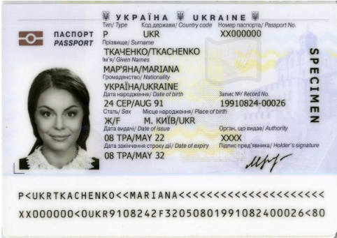
 
*Specimen source: PRADO (Council of the EU), document UKR-AO-03003. Public reference document.*

#### The scenario
 
A synthetic identity is a person who does not exist, built from a mixture of real-format and fabricated data. The passport may even pass document checks. 
The fraud appears when I test whether the whole profile is internally consistent and whether the person leaves any real-world footprint.

---

Submitted profile:
 
```
Name             : Marko Tkachenko
DOB              : 15 March 1992  (age 34)
Nationality      : Ukrainian
Occupation       : Import/Export Manager (claims 15 years' experience)
Stated income    : EUR 78,000 / year
Stated net worth : EUR 850,000
Source of wealth : "savings and trading"
```

---

#### Step 1 - Internal consistency
 
I test the profile against itself:
- **Age versus experience.** 15 years of experience at age 34 means starting at 19. This is possible, but worth questioning for a manager role.
- **Income versus net worth.** This is the strongest indicator. On EUR 78,000 per year, accumulating EUR 850,000 in savings is very difficult, because after tax and living costs the numbers do not support it.
   A large gap between income and claimed net worth, combined with a vague source ("savings and trading"), is a classic signal of a synthetic identity or an undisclosed source.

---

#### Step 2 - Footprint check
 
A real 34-year-old import and export manager with this income usually leaves traces on the Internet; however, the customer has:
- No LinkedIn, no professional presence, and no company association
- No digital footprint at all for the name
- An email address created recently, just before the application
A person who is supposedly established but has no history is suspicious.

---
 
#### Step 3 - Document format
 
I still verify the passport (MRZ, check digits, and the PRADO template). Ukrainian transliteration from Cyrillic to Latin can create legitimate spelling variants (Marko or Marco), so 
I am careful not to flag a normal transliteration as fraud. The red flag here is the profile, not the spelling.

---

#### Step 4 - Address and supporting data
 
- The address exists but is commercial
- Supporting documents, if any, are thin or recently created

---

#### Red flags
 
| Red flag | Type | Severity |
|---|---|---|
| Net worth far exceeds what the stated income could produce | Profile inconsistency | 🔴 HIGH |
| No digital or professional footprint for an "established" person | Synthetic-identity signal | 🟡 MEDIUM |
| Vague source of wealth ("savings and trading") | Undisclosed source | 🟡 MEDIUM |
| Recently created email and thin supporting data | Fabricated profile | 🟡 MEDIUM |

---

#### Decision & Action
 
⚠️ **EDD + SAR.**
The income-versus-net-worth gap and the absent footprint are enough to require Enhanced Due Diligence (full source-of-wealth evidence, independent verification, and senior sign-off).
Because the pattern is consistent with a fabricated identity used to move undisclosed funds, I also recommend filing a SAR. If EDD cannot resolve the inconsistencies, I decline and offboard.

---

#### Mock RFI - source of wealth (EDD)
 
> **Disclaimer:** Fictional RFI for educational purposes. Neutral, document-focused wording. It asks the customer to evidence the wealth they claimed, with no mention of suspicion or any report.
 
```
From:    Clear Exchange, Compliance Team
To:      (customer)
Subject: Verification of source of wealth
 
Hello,
 
As part of our enhanced verification, we need supporting evidence for the source of wealth declared on your application.
Please provide documents covering the wealth you described ("savings and trading"), for example:
 
  - Recent tax returns or official income statements (last 2 years)
  - Bank statements showing accumulation of the funds (last 6-12 months)
  - For trading income: account or broker statements, or realised-gains reports
  - If any part is from a one-off event (sale, inheritance, gift), the relevant contract, deed, or signed letter
 
Each document should be a full original (PDF or clear photo), with your name visible and consistent with your account details.
 
You can upload securely under Settings, then Enhanced Verification. If you have questions about which documents apply, reply to this message.
 
Thank you,
Clear Exchange, Compliance Team
```

---

#### Alert disposition note
 
> **Disclaimer:** Fictional internal note for educational purposes. This is the record an analyst writes so the decision is auditable.
 
```
Case ID:        KYC-2026-00xxx
Customer:       Marko Tkachenko (onboarding)
Review type:    Onboarding, profile / SOW review
Risk rating:    HIGH (pending EDD outcome)
 
Trigger:        Profile coherence check failed at onboarding.
                Stated income EUR 78,000/year versus claimed net worth
                EUR 850,000, with vague explanation of SOW ("savings and trading").
 
Review conducted:
  - Income vs net worth gap assessed, not supportable on stated income
  - Open-source footprint search, no professional/social presence found
  - Email created days before application
  - Passport verified (MRZ valid); transliteration variant noted, not a flag
  - Address exists, commercial
 
Decision:       ESCALATE. Apply EDD and recommend filing a SAR.
                EDD: SOW RFI issued (see above) requesting full documentary evidence, each component independently verified; senior sign-off required before any onboarding.
                SAR: profile is consistent with a synthetic identity used to move undisclosed funds, reasonable grounds to suspect.
 
Rationale:      Multiple inconsistencies that the customer's documents do not resolve. EDD addresses the onboarding question;
                the SAR addresses the suspicion, which exists independently of whether the customer is ultimately onboarded.
 
Analyst:        A. Kotsyk
Escalated to:   Senior AML Officer / MLRO
Next action:    SOW RFI issued; compile case file and escalate for the SAR assessment. If the RFI response does not resolve the inconsistencies, decline and offboard.
Tipping off:    Customer not informed of the SAR or any suspicion (31 U.S.C. § 5318(g)(2)). The RFI is worded neutrally.
```
 
#### Key learning
 
Synthetic identities pass document checks but fail the coherence test. The most reliable single signal is the gap between stated income and claimed wealth, supported by the absence of any real-world footprint.
I catch these by reasoning about the whole person, not by inspecting one document.
 
---
 
## Part 4 - Sanctions Screening
 
Every customer is screened against sanctions lists. Two outcomes matter most and are the two hardest to handle correctly: the false positive, a name collision that
I must clear and document, and the true positive, a real designated party that I must freeze and report. Getting these two right, and knowing the difference, is a core compliance skill.

Sanctions screening does not run alone. At onboarding it runs alongside PEP screening and adverse-media screening, which together form the standard screening set. This part covers sanctions. 
PEP screening and the OSINT workflow that supports it are covered in the final document (Document 10).
 
### Document 8 - Sanctions False Positive (Saudi Arabia)
 
**Document type:** Passport, Kingdom of Saudi Arabia

**Specimen reference:** PRADO SAU-AO-02001 - https://www.consilium.europa.eu/prado/en/SAU-AO-02001/image-354218.html
 
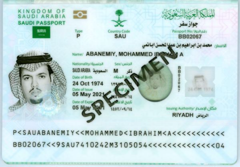
 
*Specimen source: PRADO (Council of the EU), document SAU-AO-02001. Public reference document.*
 
#### The scenario
 
A Saudi customer, **Mohammed Al-Rashid**, submits a clean passport and passes document checks. However, the name triggers a sanctions screening alert: an 87% fuzzy match against an OFAC SDN entry, "Muhammad Al-Rasheed". I now have to decide whether this is the same person (a true positive) or a name collision (a false positive).
 
Common Arabic names produce many false positives because of transliteration. Mohammed, Muhammad, Mohamad, and Mohammad are all the same name in Latin script, and screening systems flag them against each other.

---

#### Step 1 - Understand why the alert was raised (fuzzy matching)
 
Screening does not use exact matching. It uses fuzzy matching to catch transliterations and typos. There are three algorithms, usually combined with different weights (this depends on internal policies and procedures).
 
| Algorithm | Measures | Example |
|---|---|---|
| **Levenshtein** | Minimum single-character edits | RASHID → RASHEED = 2 edits |
| **Jaro-Winkler** | Similarity, weighted to the prefix | MOHAMMED vs MUHAMMAD = high |
| **Soundex** | Phonetic (sounds-like) code | RASHID / RASHEED → similar code |
 
```
Levenshtein similarity = 1 - (editDistance / maxLen)
RASHID vs RASHEED:
  RASHID  (6) -> RASHEED (7):  insert E, change D position -> ~2 edits
  similarity = 1 - (2/7) = 0.71
 
Combined score (illustrative weights):
  0.5 × JaroWinkler + 0.3 × Levenshtein + 0.2 × Soundex
  -> 0.87  (87%)  -> lands in the 80%-94% "alert" band -> analyst review
```
 
The three algorithms and the exact weights above are illustrative. In a real institution the screening engine's algorithms, weights, and thresholds are defined in internal procedures and tuned by the
compliance team to its risk appetite, so I am not free to invent them for each case. I use these values here only to show how a combined fuzzy score is built and why an 87% result lands in the review band.
 
87% is high enough to raise an alert, but it is not an automatic confirmed match. It must be reviewed by a human, which is my role.

---

#### Step 2 - Disambiguate using identifiers
 
A name match is not a person match. I compare the identifiers, which is where true and false positives separate.
 
| Identifier | My customer | OFAC SDN entry | Match? |
|---|---|---|---|
| Name | Mohammed Al-Rashid | Muhammad Al-Rasheed | ~ fuzzy |
| Date of birth | 12 Aug 1990 | 03 Feb 1972 | ❌ No |
| Nationality | Saudi Arabia | Iran | ❌ No |
| Passport number | (Saudi, valid) | (different) | ❌ No |
| Listed program | - | IRGC-related | - |
 
The dates of birth are 18 years apart. The nationality is different. The passport numbers do not match. These are different people who happen to have similar names.

---

#### Step 3 - Document the decision
 
This is the part that juniors get wrong. Clearing a sanctions alert is acceptable, but only if I document the disambiguation. I record exactly which identifiers differ and why I concluded that it is not a match.
The full note follows.
 
```
Alert ID:        SCR-2026-00xxx
Customer:        Mohammed Al-Rashid (onboarding)
Screening list:  OFAC SDN
Alert type:      Name fuzzy match, 87%
 
Matched against:    SDN entry "Muhammad Al-Rasheed" (Iranian national, IRGC-related program)
 
Review conducted, identifier comparison:
  Field           Customer               SDN entry           Match
  ----------------------------------------------------------------
  Name            Mohammed Al-Rashid    Muhammad Al-Rasheed  fuzzy (87%)
  Date of birth   12 Aug 1990           03 Feb 1972          NO (18 yrs)
  Nationality     Saudi Arabia          Iran                 NO
  Passport no.    (Saudi, valid)        (different)          NO
  Place of birth  Riyadh, SA            (Iran)               NO
 
Decision:       FALSE POSITIVE. Clear the alert.
 
Rationale:      Name similarity is driven by common Arabic-name transliteration (Mohammed/Muhammad, Rashid/Rasheed).
                All distinguishing identifiers differ: DOB by 18 years, nationality, passport number, and place of birth.
                These are different individuals. No freeze, no SAR, no OFAC blocking report.
 
Outcome:        Customer cleared on the sanctions check. Onboarding continues subject to the rest of CDD.
 
Analyst:        A. Kotsyk
Reviewed by:    (sanctions lead, per 4-eyes policy on alert closures)
Date:           2026-06-xx
```
 
A four-eyes check, where a second reviewer signs off on the closure, is common practice for sanctions alerts, because clearing one incorrectly is a serious error that entails significant legal consequences.

---

#### Red flags / resolution
 
| Check | Result |
|---|---|
| Name similarity | 87% (alert) |
| DOB match | ❌ 18 years apart |
| Nationality match | ❌ Saudi vs Iran |
| Passport match | ❌ different |
| Conclusion | **False positive** |

---

#### Decision
 
✅ **CLOSE AS FALSE POSITIVE AND DOCUMENT.**
 
No freeze, no SAR, and no OFAC blocking report. The customer can be onboarded, subject to the rest of CDD. However, I write a clear disposition note: the name matched at 87%, but the match is 
ruled out on DOB, nationality, and passport number. If a regulator ever asks why I cleared a sanctions alert, the answer is on file.

---

#### Key learning
 
A name is not a person. Between 85% and 95% of sanctions alerts are false positives, and they are cleared on identifiers: DOB, nationality, document number, and place of birth.
The skill is not only clearing them, but documenting the disambiguation so the decision is auditable. I never silently close a sanctions alert.
 
---
 
### Document 9 - Sanctions True Positive (Russian - SDN Match)
 
**Document type:** Passport, Russian Federation

**Specimen reference:** PRADO RUS-AO-03003 - https://www.consilium.europa.eu/prado/en/RUS-AO-03003/image-196854.html
 
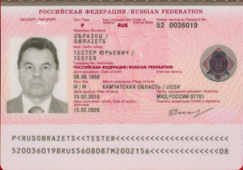
 
*Specimen source: PRADO (Council of the EU), document RUS-AO-03003. Public reference document.*
 
#### The scenario
 
A Russian customer submits a genuine passport. Sanctions screening returns a high-confidence match, and unlike Document 8, the identifiers confirm it. The applicant is an individual on the OFAC SDN List,
designated under Executive Order 14024, the authority used for harmful foreign activities of the Government of the Russian Federation.
This is a true positive, and it must be handled as a hard stop: freeze, escalate, and report.
 
I also use this case to show the difference between sectoral and comprehensive sanctions, because it explains why an SDN designation overrides the fact that Russia is not under a full embargo.

---

#### Step 1 - Confirm the match on identifiers
 
| Identifier | My customer | Sanctions list entry | Match? |
|---|---|---|---|
| Name | (as submitted) | (SDN-designated person) | ✅ |
| Date of birth | 08.08.1956 | 08.08.1956 | ✅ |
| Nationality | Russian | Russian | ✅ |
| Passport / ID | 520036019 | 520036019 | ✅ |
| List / authority | - | OFAC SDN, E.O. 14024 | - |
 
The name, the date of birth, the nationality, and the document number all align. This is not a collision. It is the same person, on the SDN List. This is a confirmed true positive.
 
*The date of birth and passport number shown here are fictional placeholders used only to demonstrate identifier matching. They do not correspond to a real individual.*

---

#### Step 2 - Sectoral vs comprehensive (why the SDN listing is decisive)
 
| | Comprehensive | Sectoral / targeted | SDN designation |
|---|---|---|---|
| Scope | Almost all dealings with the jurisdiction prohibited | Only specified sectors or activities restricted | The named person is fully blocked |
| Example (2026) | Cuba, Iran, North Korea, Crimea/Donetsk/Luhansk | Russia (energy, defence, finance sectors) | This individual, listed under E.O. 14024 |
 
Russia as a country is not comprehensively embargoed. Its program is sectoral, plus thousands of targeted designations. However, an individual on the SDN List is fully blocked regardless of the sectoral framing.
A junior must not reason that "Russia is only sectoral, so it is fine". The designation is on the person, and all of their property and dealings are blocked.

---

#### Step 3 - Act: freeze, do not return
 
On a confirmed match I do the following:
- **Block the funds or transaction immediately.** Do not process them and do not return them to the customer.
- Restrict the account.
- Escalate to the compliance officer or MLRO at once.
- Do not tell the customer that it is a sanctions match in a way that tips off an investigation.

---

#### Step 4 - Report (two separate obligations)
 
| Obligation | What | Deadline |
|---|---|---|
| **OFAC blocking report** | Report the blocked property to OFAC | Within 10 business days |
| **SAR** | Suspicious activity report to FinCEN | Within 30 calendar days of detection |
 
These are two different legal duties under two different laws. Filing one does not satisfy the other.

---

#### Red flags / resolution
 
| Check | Result |
|---|---|
| Name match | ✅ |
| DOB match | ✅ |
| Nationality + document match | ✅ |
| Conclusion | **True positive, confirmed designated party** |

---

#### Decision
 
🔴 **FREEZE + SAR + OFAC BLOCKING REPORT.**
 
Block the funds, restrict the account, escalate immediately, and recommend filing both the OFAC blocking report (within 10 business days) and a SAR (within 30 calendar days). See the mock SAR below.
 
---
 
#### Mock SAR #2 - Sanctions True Positive
 
> **Disclaimer:** Fictional SAR for educational purposes. Institution and subject details are fictional.
 
**Filing institution:** Clear Exchange Ltd (VASP / MSB), FinCEN Registration No. XXXXXXX, Wilmington, DE 19801

**Date of report:** June 20, 2026

**Subject:** name as submitted, confirmed match to an OFAC SDN designation; Account XXX-XXXXXX; nationality Russian Federation; SDN List, active designation under E.O. 14024; funds blocked and account restricted

**Prior SARs on subject:** none on file
 
**Narrative**
 
Clear Exchange Ltd files this report to document an attempt by a designated party to open and fund an account, and to record the resulting blocking of property.
The institution reports the conduct because the customer is an individual on the OFAC Specially Designated Nationals (SDN) List, and any dealing with that individual's property is prohibited.
 
On June 19, 2026, the customer attempted to onboard and to fund the account. During screening, the institution's sanctions system returned a high-confidence match against the SDN List.
The compliance system automatically held the inbound deposit, in the amount of [amount], at 11:02 UTC on the same day, and the account was restricted shortly afterwards.
An analyst then reviewed the alert and confirmed the match against multiple identifiers. The full name, the date of birth, the nationality, and the passport number all aligned with the designated
individual, which distinguished this case from a name-only false positive. The individual is designated under Executive Order 14024, the authority that addresses harmful foreign activities
of the Government of the Russian Federation.
 
Because the match was confirmed, the held deposit constitutes blocked property under the relevant OFAC program. The funds were not returned to the customer and were not processed further.
The institution understands that Russia is subject to sectoral and targeted measures rather than a comprehensive embargo, but this does not affect the outcome, because the individual is named on the SDN List
and is therefore fully blocked regardless of the broader program.
 
The institution blocked the funds, restricted the account, and escalated the case to the compliance officer on the same day. It will file the required blocking report with OFAC within ten business days
of the blocking, which is a separate obligation under sanctions law and is distinct from this report. The funds remain blocked pending instruction from OFAC.
The institution will cooperate fully with OFAC and with law enforcement, and any linked accounts or related parties will be screened and escalated. The institution did not inform the customer
that this report was filed, and any communication with the customer was limited to a neutral statement that the account is under review.
 
Point of contact: AML Compliance Officer, Clear Exchange Ltd.
 
**END OF MOCK SAR**
 
---
 
#### Mock letter to the customer
 
> **Disclaimer:** Fictional letter for educational purposes. Institution and customer details fictional.
> **Note:** This is the hardest message to word correctly. The account is restricted because of a confirmed sanctions match, but the letter must be strictly neutral. It cannot mention sanctions, a SAR, OFAC, an
> investigation, or law enforcement. Saying any of this risks unlawful tipping off and can prejudice enforcement. It only states, in general terms, that the account is under review.
 
```
From:    Clear Exchange, Compliance
To:      (customer)
Subject: Your account is currently under review
 
Hello,
 
We are writing to let you know that your account is currently under review as part of our standard compliance procedures.
While this review is ongoing, access to your account and related functions is temporarily restricted.
 
We are not able to share details about the review at this stage. We understand that this may be inconvenient, and we are handling the matter
as quickly as we can. We will contact you with any update, or with any further information we may require from you.
 
Thank you for your understanding.
 
Clear Exchange, Compliance Team
```
 
> Note what the letter does not say. It says nothing about a sanctions hit, a SAR, an OFAC blocking report, or any investigation. It commits only to a neutral "under review" status and a promise
> to follow up, which is the maximum that can be said without tipping off.
 
---
 
## Sanctions Screening Workflow
 
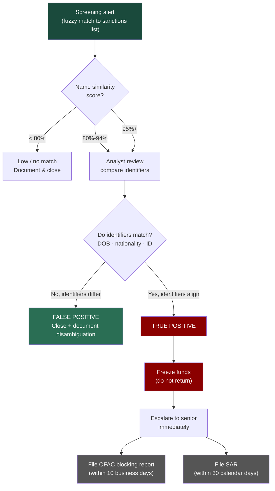

---

## Part 5 - PEP Screening and OSINT
 
PEP screening sits next to sanctions screening at onboarding. Documents 8 and 9 covered the sanctions gate. This part covers the PEP gate and the OSINT work behind it.
 
Two things make PEP screening different from sanctions screening.
 
First, a PEP is not a criminal. A sanctions true positive is a hard stop. A PEP match is not. The status only means the customer holds, or recently held, a senior public role. This raises the risk that funds derive 
from bribery or corruption. The correct response is Enhanced Due Diligence (EDD), not refusal. FATF does not support refusing all PEPs, because this pushes honest customers out of the regulated system.
 
Second, the status is often hidden. A customer can simply tick "not a PEP" on the form, and no database holds every official from every country. So the real skill is OSINT: confirm or uncover the status from public sources, then check where the wealth and the funds come from.

---

### Document 10 - Hidden Foreign PEP (Georgia)
 
**Document type:** Passport, Georgia
 
**Specimen reference:** PRADO GEO-AO-04001 - https://www.consilium.europa.eu/prado/en/GEO-AO-04001/image-385689.html
 
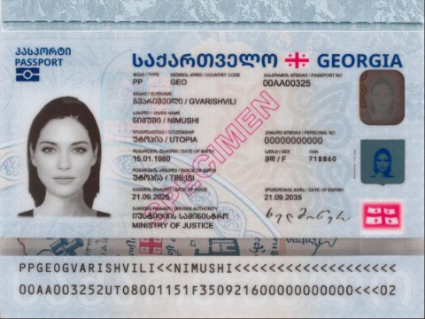
 
*Specimen source: PRADO (Council of the EU), document GEO-AO-04001, integrated biodata card. Public reference document.*
 
> **Disclaimer:** This scenario is fictional and created only for educational and portfolio purposes. The customer (Tornike B. Machaladze) and the company (Iberia Energy Logistics JSC) are invented, and the
> findings attributed to them are the scenario. The portals named here are real, and the screenshots illustrate those real sources and their format. Where a screenshot shows an actual record, it belongs to
> an unrelated public official or company and is labelled that way. PEP status is a neutral public fact, not an accusation. No real person is named or targeted.
 
---
 
#### Why Georgia
 
I set the scenario in Georgia on purpose. Georgia publishes asset declarations of public officials online at declaration.acb.gov.ge (Anti-Corruption Bureau of Georgia), open to anyone. 
Most of these government sources have English versions, but the declarations are in Georgian only. OpenSanctions loads this dataset and treats the declarants as PEPs.
So the whole chain of this case runs on sources that anyone can open in a browser. The customer and the company are fictional. The portals are real, and the screenshots show real sources, using 
unrelated officials and companies only to demonstrate each format.

---

#### Note on fictional identity safety
 
A portfolio case must not damage the reputation of a real person. I applied three safeguards. The customer's name is invented: the surname exists in Georgia, so the scenario stays realistic, but I checked the full name in search engines and OpenSanctions and found no official or PEP with this name as of June 2026. The state-owned company is fictional. The screenshots show real sources for format only, and where a real record appears it belongs to an unrelated official or company, labelled as such in the evidence log.

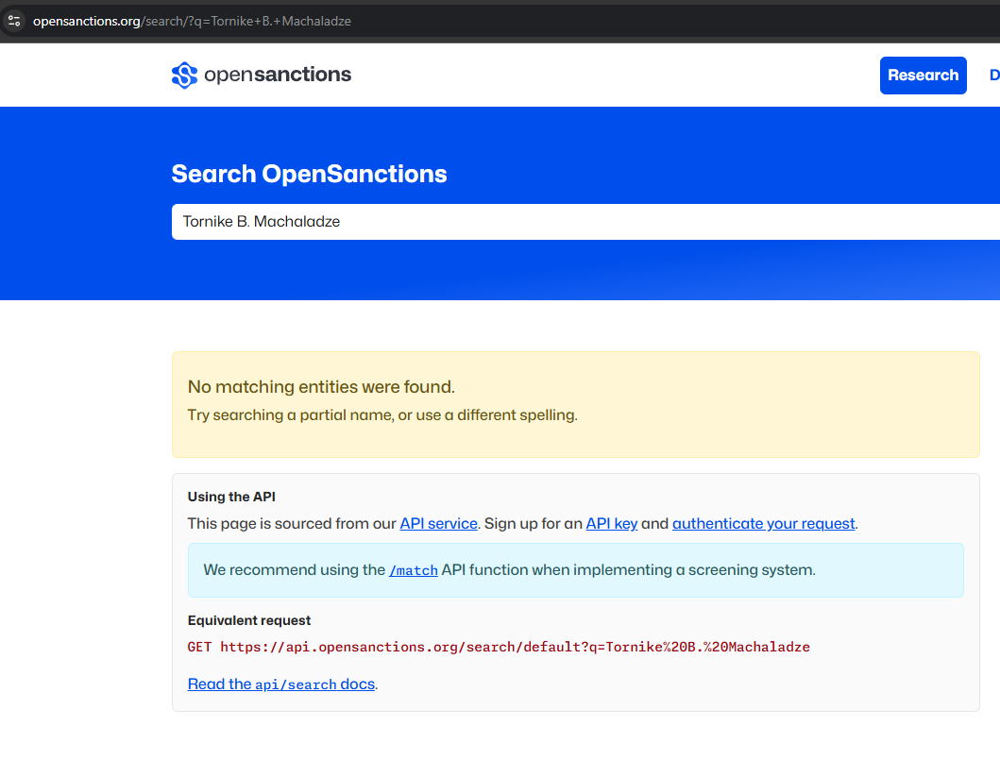
 
*Search of OpenSanctions for the invented name "Tornike B. Machaladze" returns no results, confirming the name does not collide with any real official or PEP.*
 
---
 
#### The PEP framework
 
FATF defines a PEP as "an individual who is or has been entrusted with a prominent public function" (FATF Glossary). In simple words: a person with a senior public role. The main categories are heads of state 
and government, senior politicians, senior government, judicial, or military officials, senior executives of state-owned enterprises, and important political party officials.
 
| Type | Who | Treatment under FATF Recommendation 12 |
|---|---|---|
| **Foreign PEP** | A PEP of another country | EDD is mandatory in every case |
| **Domestic PEP** | A PEP of the customer's own country | Risk-based: EDD when the relationship is higher risk |
| **International organisation PEP** | A senior official of an international body | Risk-based, as for domestic |
| **RCA** | Relatives and close associates of any PEP | The same measures as the PEP |
 
Recommendation 12 sets different requirements depending on the PEP type. For a foreign PEP, whether as customer or beneficial owner, a financial institution must apply normal CDD and four additional measures: 
(a) risk-management systems to identify whether a customer or beneficial owner is a PEP
(b) senior management approval to establish or continue the relationship
(c) reasonable measures to establish the source of wealth and the source of funds
(d) enhanced ongoing monitoring

For a domestic PEP or a person entrusted with a prominent function by an international organisation, the institution must take reasonable measures to determine whether someone holds that status. 
Where the relationship is higher risk, measures (b), (c), and (d) apply. For family members and close associates of any PEP, the same requirements apply as for the PEP themselves, because the money can sit 
one step away from the official.
 
---
 
#### The scenario
 
A customer, **Tornike B. Machaladze**, a national of Georgia, submits a Georgian passport during onboarding at Clear Exchange Ltd. The document checks pass (the template matches the PRADO specimen, and the MRZ is valid), sanctions screening returns no match, and the system opens the account automatically. On the application he writes his occupation as "private investor and consultant", estimates his net worth at about USD 2,000,000, and ticks "I am not a politically exposed person". The PEP alert from screening goes to the manual review queue, because a PEP match never blocks an account automatically. Before the review is complete, he attempts a first deposit of 350,000 USDT, and the transfer is placed on hold pending the review.
 
PEP screening returns an alert from the OpenSanctions Georgian declarations dataset. The OSINT review below confirms that the customer is the Deputy Director General of a state-owned enterprise, Iberia Energy 
Logistics JSC (fictional). He is a foreign PEP, and he did not disclose it. An undisclosed status, a salary that cannot explain the claimed wealth, and a large crypto deposit move this case into EDD.
 
*The customer and the company are fictional, and the findings about them are the scenario. The portals are real, and the screenshots show real sources for format only.*
 
---
 
#### Step 1 - PEP screening
 
The name is matched against PEP databases built from official gazettes, government websites, and public datasets. Matching is fuzzy, so transliteration from Georgian script produces name variants that the engine 
has to catch.
 
Two facts come out of this step:
- The engine returns a possible match to a declarant in the OpenSanctions dataset: a senior executive of a state-owned company.
- The customer ticked "not a PEP". If the match is confirmed, that answer is false, and the non-disclosure is itself a red flag.
  
As with a sanctions alert, a PEP match is reviewed by a human, not actioned automatically.
 
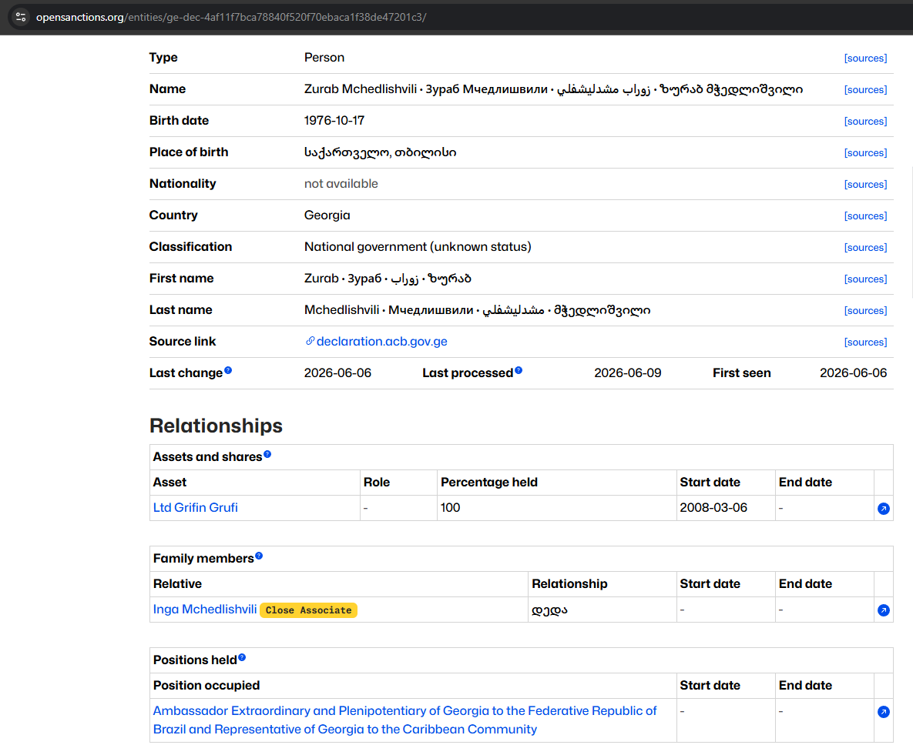
 
*Screenshot of a real OpenSanctions PEP entry, used to show the record format: name in multiple scripts, classification, positions held, family members (Close Associate tag), and assets. 
The official shown is unrelated to this fictional scenario.*
 
---
 
#### Step 2 - OSINT verification
 
This is the core of the case. I confirm the status from public sources and build the source-of-wealth picture at the same time. The rules: at least two independent sources for any material point, primary sources over aggregators, fact separated from allegation, and every finding saved as a file, because web pages change or disappear.
 
**The asset declaration.** The portal shows the customer's filing for 2025. The declaration is the strongest document in this case: a primary government source where the official himself states his role, income, and assets.
 
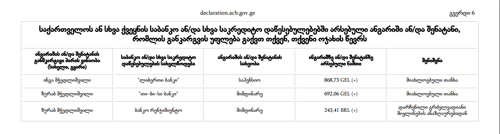
 
*Screenshot of declaration.acb.gov.ge, bank accounts section (page 6 of 13). The declaration is in Georgian only. The official shown is unrelated to this fictional scenario.*
 
In the scenario, the declaration states:
- Position: Deputy Director General, Iberia Energy Logistics JSC (state-owned), appointed 2019.
- Annual income: GEL 96,000 in salary (about USD 35,000). No other income.
- Assets: one apartment in Tbilisi, one vehicle, a bank deposit of GEL 40,000.
- No business interests, no securities, no consulting activity.

The screenshot above is a real declaration shown only to illustrate the format, so its content differs from the scenario. For example, the real declarant holds a business interest, while the fictional Machaladze 
declares none.

One gap matters here: Georgian declarations do not cover cryptocurrency. Even an honest declaration would not show crypto wealth. This is why the on-chain check in Step 4 cannot be replaced by the declaration.

---

**The evidence log.** Every check is recorded with the date, the source, the finding, its status as fact or allegation, and the saved file. This log is the audit trail.
 
Because the subject and the company are fictional, no genuine record exists for them, so the findings below are the scenario result. The saved files show that the sources and the method are real. 
Where a file shows an actual record, it belongs to an unrelated public official or company and is used only to demonstrate the source format, and it is labelled that way. One file is a mock artifact built 
for this case: the wallet risk report.
 
| # | Date | Source | Finding (scenario) | Status | Evidence file |
|---|---|---|---|---|---|
| 1 | 14 Jun 2026 | OpenSanctions (Georgian declarations dataset) | PEP alert raised by the internal screening engine, which draws on this dataset. The attached screenshot shows a real Georgian PEP entry on opensanctions.org, demonstrating the record format: name in multiple scripts, birth date, classification, positions held, family members (Close Associate tag), and assets | Fact (source and format verified) | `osint/01-opensanctions-entry.png` (real portal, unrelated official, format only) |
| 2 | 14 Jun 2026 | declaration.acb.gov.ge | Declaration for 2025 (scenario): Deputy Director General, salary GEL 96,000. Note: the real declaration used for format illustration shows a business interest (100% in a private company) and modest bank balances, demonstrating the source structure | Fact (primary source) | `osint/02-declaration.pdf` (real portal, unrelated official, format only) |
| 3 | 14 Jun 2026 | companyinfo.ge (Transparency International Georgia, data from enreg.reestri.gov.ge) | Company information, affiliations, and ownership history shown for an unrelated Georgian company, illustrating the source format | Fact (source format verified) | `osint/03-company-registry-extract.html` + `osint/03-company-registry-extract_files/` (real portal, unrelated official, format only) |
| 4 | 14 Jun 2026 | Ministry of Foreign Affairs of Georgia, Diplomatic Protocol Directorate (mfa.gov.ge) | Official Diplomatic List (May 2026) confirms that MFA publishes diplomatic appointments publicly. Format demonstrates how ambassador-level appointments are verified from a primary government source | Fact (primary source format) | `osint/04-mfa-diplomatic-list.pdf` (real document, unrelated officials, format only) |
| 5 | 14 Jun 2026 | mfa.gov.ge/en/news + civil.ge | Two independent sources covering a real Georgian senior official (Maka Botchorishvili, Vice PM and FM), demonstrating the media verification workflow: one official press release and one independent outlet | Fact (source format verified) | `osint/05-media-1.png` (mfa.gov.ge, full-page screenshot), `osint/05-media-2.html` + `osint/05-media-2_files/` (civil.ge, unrelated official, format only) |
| 6 | 14 Jun 2026 | TinEye reverse image search | Reverse image search on the applicant's submitted photo returned 385 results across multiple sources (CNN, kobieta.wp.pl, pictame.com), with the earliest appearance in March 2015. The photo is a widely distributed stock image unconnected to any individual. In a real case this would be a critical red flag: the applicant submitted a photo that does not belong to them | 🔴 RED FLAG (photo not genuine) | `osint/06-photo-match.png` (real TinEye result) |
| 7 | 14 Jun 2026 | State Procurement Agency of Georgia (tenders.procurement.gov.ge) | Real tender record (NAT260011912) from the Georgian state procurement portal, demonstrating the interface and data fields available for vendor and procuring entity searches: announcement number, procuring entity, procurement type, estimated value, CPV codes, supplier details | Fact (source format verified) | `osint/07-procurement-vendor.png` (real portal, unrelated state entity, format only) |
| 8 | 14 Jun 2026 | Automated wallet screening | Initial: 64% of inbound value received in direct transfers from a high-risk exchange cluster, full tracing pending | Initial (service-level attribution) | `osint/08-wallet-report.png` (mock report, ChainScope, fictional data) |
 
At the end of this step the status is confirmed on several independent primary sources: the customer is a foreign PEP, and he did not disclose it.
 
The reverse image search on the submitted photo returned 385 results across multiple sources, with the earliest appearance in March 2015. The photo is a widely distributed image with no connection to any individual. 
In a real case this is a critical red flag on its own: the applicant did not submit their own photo.
 
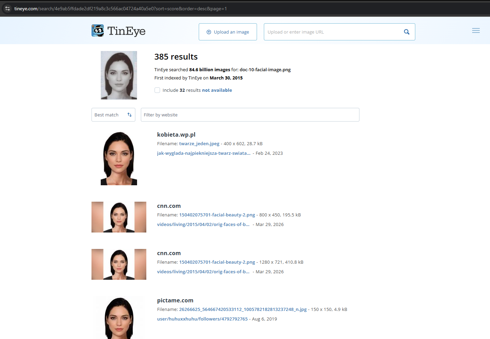
 
*TinEye reverse image search result. 385 results returned, first appeared in March 2015, sources include CNN and multiple stock image sites. The photo submitted by the applicant is not genuine.*

---

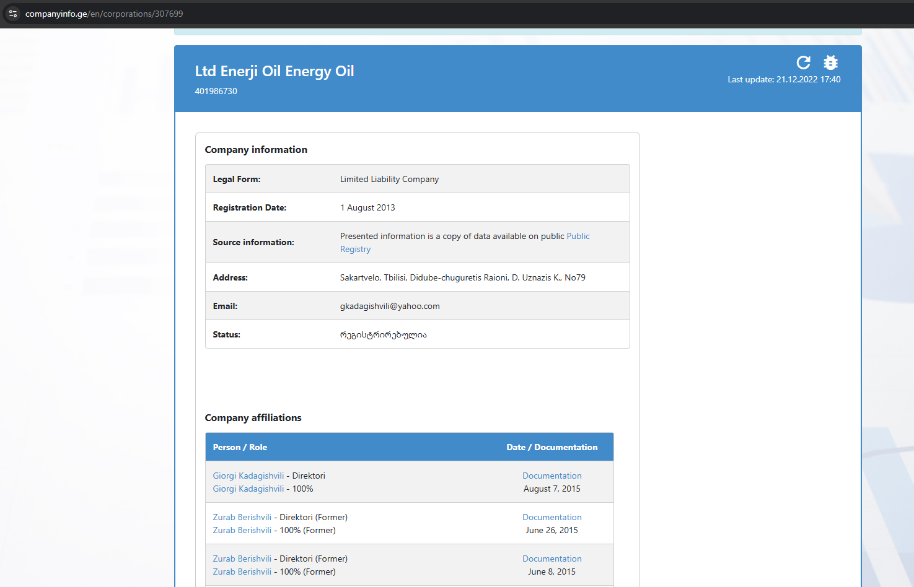
 
*Screenshot of companyinfo.ge (Transparency International Georgia), showing company information and ownership affiliations sourced from the official Georgian Public Registry (enreg.reestri.gov.ge). 
The company shown is unrelated to this fictional scenario.*

---

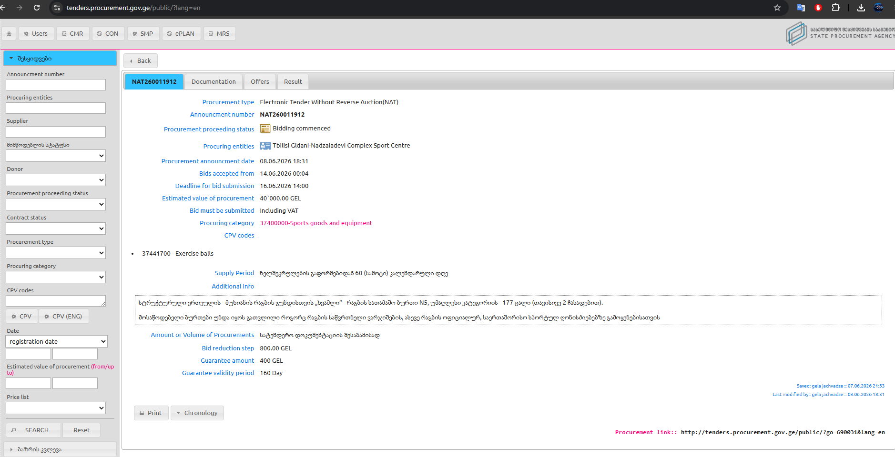
 
*Screenshot of the Georgian state procurement portal (tenders.procurement.gov.ge), showing a real tender record. An analyst uses this portal to check government contracts and suppliers linked to a PEP. 
The entity shown is unrelated to this fictional scenario.*
 
---
 
#### Step 3 - Classification
 
The customer is a senior executive of a state-owned enterprise. From the perspective of Clear Exchange Ltd., he is a foreign PEP, because Georgia is not the institution's home jurisdiction. EDD is mandatory. The classification does not depend on any suspicion. The status alone sets the requirement.
 
If the OSINT had shown that the customer was the spouse, child, or close business partner of the official instead, the outcome would be the same. An RCA is treated as the PEP.
 
---
 
#### Step 4 - Enhanced Due Diligence
 
EDD answers two questions, and both now have numbers in them.

- **Source of wealth.** The customer claims about USD 2,000,000 from "investments and consulting". His own declaration shows a salary of about USD 35,000 per year and lists no investments and no consulting.
The primary source does not support the wealth story. The gap must be evidenced by documents, or it remains unexplained wealth.
- **Source of funds.** The attempted deposit of 350,000 USDT equals roughly ten years of the entire declared gross salary. The declaration does not cover crypto at all, so the on-chain check is the only way to see this part. The transfer is on hold, so I can review the funding wallet before the funds are accepted. Automated wallet screening shows that 64% of the inbound value was received in direct transfers from a high-risk exchange cluster with weak KYC controls. This pattern is consistent with buying crypto for cash at services that do not identify their customers. This is an initial finding, and full tracing is pending. I attribute the cluster to a service, not to a named private individual, because on-chain attribution in this portfolio stops at the service level and does not target real private persons.
  
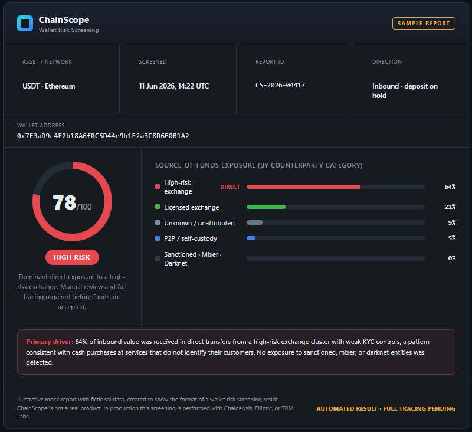
 
*Mock report (fictional tool "ChainScope", fictional data), modeled on the format of commercial wallet-screening tools such as Chainalysis, Elliptic, and TRM Labs. 
It shows the format of an automated wallet screening result: risk score, exposure by counterparty category, and the flagged driver.*
 
Two more measures are mandatory for a foreign PEP: senior management approval, and enhanced ongoing monitoring if the account is opened.
 
---
 
#### Step 5 - Adverse media
 
I search reputable media and the investigative databases (for example ICIJ Offshore Leaks and OCCRP Aleph) for negative information. I weigh credibility (who reported it and on what evidence), 
severity (a conviction is strong, an open investigation is only an allegation), and recency.
 
In this scenario the search returns no credible adverse media on the customer. A clean result does not lower the risk on its own, because the undisclosed PEP status, the unexplained wealth, and the source-of-funds exposure already require EDD. The absence of findings is recorded in the audit trail the same way as a hit. A name in a leak database is always a lead to confirm on identifiers, not proof, because those databases 
warn that inclusion does not imply wrongdoing and that names collide.

If adverse media is found, the response scales with its severity and credibility. The table below shows how I would handle each level.
 
| Level | Example | Action |
|---|---|---|
| None | No result, or only neutral mentions (official appointments, work meetings) | Continue EDD as normal. Record the clean result in the audit trail. |
| Weak | Unsourced claim on a low-quality site, or old political criticism with no specific allegation | Record as an allegation, lower the source weight, continue EDD. Usually no change to the decision. |
| Medium | Name in a leak database (ICIJ, OCCRP), or an open investigation reported by reputable media | Confirm on identifiers, record as an allegation, increase the EDD intensity. Consider a SAR if combined with other red flags. |
| Strong | A conviction for corruption, bribery, or fraud, or a major regulatory fine naming the customer | Likely decline. Recommend filing a SAR. If already a customer, consider offboarding. MLRO and legal review. |
| Critical | A direct link to a sanctioned person or entity, or to terrorist financing | Immediate escalation and freeze. This moves from the PEP process into a sanctions or terrorist-financing review. |
 
Three rules hold at every level: an allegation is not a fact, the weight is severity times credibility, and adverse media is never read on its own but together with the other red flags.

---
 
#### Red flags
 
| Red flag | Type | Severity |
|---|---|---|
| Undisclosed PEP status (customer declared "not a PEP") | Non-disclosure | 🔴 HIGH |
| Claimed net worth of USD 2,000,000 against a declared salary of USD 35,000 per year | Unexplained wealth | 🔴 HIGH |
| First deposit of 350,000 USDT, roughly ten years of declared gross salary | Profile mismatch | 🔴 HIGH |
| Funding wallet: 64% of inbound value received directly from a high-risk exchange cluster (initial) | Source-of-funds risk | 🔴 HIGH |
| Procurement vendor sharing an address with a relative of the customer (illustrative, if found) | Conflict-of-interest lead | 🟡 MEDIUM |
 
---
 
#### Decision & Action
 
⚠️ **EDD, SENIOR MANAGEMENT APPROVAL, AND ENHANCED MONITORING.** A PEP match is not a refusal. The action path:
- **Apply EDD.** Establish the source of wealth with documents, and the source of funds including the on-chain check.
- **Senior management approval.** A Recommendation 12 requirement for a foreign PEP.
- **Enhanced ongoing monitoring** if the account is opened.
- **Record the non-disclosure.** The false "not a PEP" answer is documented as a red flag, whatever the final decision.
- **Recommend declining and filing a SAR** if EDD cannot evidence the source of wealth, or if the full on-chain review confirms the high-risk exposure. The customer communication stays neutral, and the customer
    is not told that a report was filed (31 U.S.C. § 5318(g)(2)).
  
---
 
#### Alert disposition note
 
> **Disclaimer:** Fictional internal note for educational purposes.
 
```
Case ID:        PEP-2026-00xxx
Customer:       Tornike B. Machaladze (onboarding)
Review type:    Onboarding, PEP screening and EDD
Risk rating:    HIGH (foreign PEP)
 
Trigger:        PEP screening alert from the OpenSanctions Georgian declarations dataset.
                The customer declared "not a PEP" on the application. The screening match indicates
                a senior executive of a state-owned enterprise, which the OSINT review below treats
                as an undisclosed foreign PEP.
 
Findings:
  - Undisclosed PEP status: the "not a PEP" declaration conflicts with
    the screening match. Non-disclosure is itself a red flag.
  - Source of wealth not supported: the customer claims a net worth of about USD 2,000,000 from "investments and consulting", but
    the declared income profile for this role (about GEL 96,000 / USD 35,000 per year salary, no other declared income) does not explain it.
    The gap is unexplained.
  - Source of funds risk: the customer attempted a first deposit of 350,000 USDT (about ten years of declared gross salary), which
    was placed on hold. Automated wallet screening shows 64% of the inbound value received in direct transfers from a high-risk exchange cluster.
    This is an initial result; full tracing is pending.
  - Submitted photo not genuine: reverse image search returned 385 results from multiple sources (earliest March 2015).
    The photo is a widely distributed image and does not belong to the applicant.
  - Adverse media: no credible adverse media found at this stage.
  - Method: status and wealth picture built from lawfully public sources (OpenSanctions, the asset declaration portal, the company registry,
    official government records, and media), with every finding saved to the OSINT folder as the audit trail.
 
Classification: Foreign PEP. EDD mandatory (FATF Recommendation 12).
 
Decision:       Apply EDD. Require senior management approval and enhanced ongoing monitoring
                before the relationship can proceed. Issue a source-of-wealth request to the customer.
                Keep the deposit on hold pending the source-of-funds review.
                Record the false "not a PEP" answer and the non-genuine photo as red flags.
 
SAR trigger:    Recommend filing a SAR if EDD cannot evidence the source of wealth, or
                if the full on-chain review confirms the high-risk exposure.
 
Analyst:        A. Kotsyk
Escalated to:   Senior AML Officer / MLRO (senior sign-off required)
Tipping off:    Any communication stays neutral (31 U.S.C. § 5318(g)(2)).
```
 
---
 
#### The four common PEP situations
 
An analyst has to separate these four, because the correct action is different for each.
 
**False positive (name collision).** The name matches a PEP entry, but the identifiers do not: the date of birth, the nationality, the role, or the photo rule the match out. 
Resolved and documented like a sanctions false positive. A name is not a person.
 
**RCA (relative or close associate).** The customer is not a PEP, but is the spouse, child, parent, or close business partner of one. OSINT through shared directorships, shared 
addresses, and family links reveals the connection. An RCA is treated as the PEP, so EDD applies. The real question is who benefits.
 
**Adverse media.** The customer is a PEP, and there is credible negative information, for example an open corruption investigation. I separate allegation from fact and weigh the severity. 
The action ranges from EDD with closer monitoring to decline and a SAR. An allegation raises risk but does not prove guilt.
 
**Ex-PEP.** The customer left the public role some time ago. For a foreign PEP, many firms keep the status and the EDD, because the corruption risk does not vanish when the person leaves office. 
For a domestic PEP, the risk can be stepped down over time. There is no automatic time limit. The safe answer is risk-based, not a fixed expiry.
 
---
 
#### Key learning
 
A PEP is not a criminal, and a PEP match is not a refusal. For a foreign PEP, EDD is mandatory: senior management approval, source of wealth and source of funds, and enhanced monitoring. 
The alert came from an aggregator, but the confirmation and the numbers came from primary sources: the declaration portal, the company registry, and the gazette. 
A salary of USD 35,000 per year does not explain a net worth of USD 2,000,000 or a 350,000 USDT deposit, and the declaration does not see crypto at all, so the on-chain check is not optional. 
Every finding sits in the evidence log 
with a saved file, as fact or allegation, and that log is what makes the conclusion defensible.
 
---
 
## PEP Screening Workflow
 
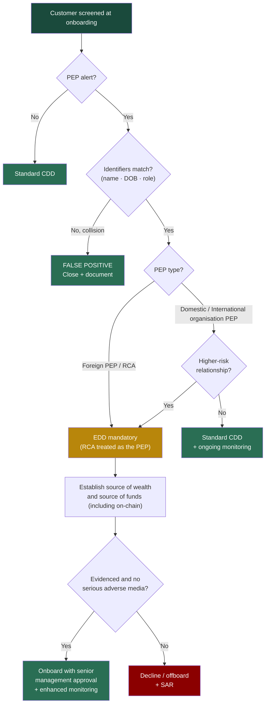

---

## Analyst Decision Tree (All Document Types)
 
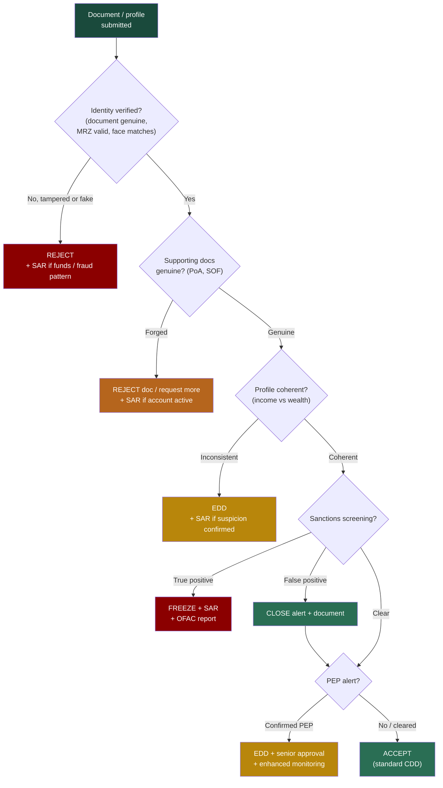
 
---
 
## Summary - Decision Log
 
| # | Document | Case type | Country | Primary red flag | Decision | SAR? |
|---|---|---|---|---|---|---|
| 1 | Passport | Tampered document | Italy | MRZ check-digit mismatch | ❌ Reject | If prior funds / fraud pattern |
| 2 | Driver's licence | Edited document | USA (NY) | Front DOB ≠ back barcode | ❌ Reject | If prior funds / fraud pattern |
| 3 | Selfie | Deepfake / AI-generated | (selfie) | AI artifacts, no camera metadata | ❌ Reject | ✅ Yes |
| 4 | Passport + selfie | Stolen identity | Nigeria | Biometric mismatch | ❌ Reject | ✅ Yes |
| 5 | Utility bill | Forged supporting document | UK | Font inconsistency | ⚠️ Request more | If the customer refuses / fraud pattern |
| 6 | Bank statement | Fabricated financial document | UAE | PDF = Word + math error | ❌ Reject | If account active |
| 7 | Passport + financials | Synthetic identity | Ukraine | Income vs net-worth gap | ⚠️ EDD | ✅ Yes |
| 8 | Passport | Sanctions false positive | Saudi Arabia | Name collision, IDs differ | ✅ Close | No |
| 9 | Passport | Sanctions true positive | Russia | Confirmed SDN match (E.O. 14024) | 🔴 Freeze | ✅ + OFAC |
| 10 | Passport | Hidden foreign PEP (OSINT) | Georgia | Undisclosed PEP, unexplained wealth | ⚠️ EDD + senior approval | If EDD fails |
 
---
 
## Key Takeaways
 
1. **No single red flag decides a case. Combinations do.** A high net worth on its own is not suspicious. An undisclosed PEP status on its own is a compliance step, not a crime.
   But in Document 10 these arrive together with a 350,000 USDT deposit and 64% high-risk on-chain exposure, and that combination is what moves the case into EDD and a possible SAR.
2. **MRZ check digits are the fastest way to catch a tampered passport.** They require only the ICAO 9303 algorithm and no equipment. A failed check digit is strong evidence of tampering, and
   the laser-perforated number adds a second check, because it cannot be altered on an existing passport.
3. **A driver's licence has no MRZ, so I check the back instead.** The PDF417 barcode must match the printed front. A front-to-back mismatch is the licence equivalent of a failed check digit.
   I never rely on the front alone.
4. **Metadata is more reliable than the eye on forged financial documents.** A "bank statement" whose PDF creator is Microsoft Word was written in Word, not generated by a bank. This is a 30-second check
   that catches most fakes. On genuine system-generated PDFs the Created and Modified timestamps are identical and the PDF creation date should match the generation date printed on the statement.
5. **A real document does not mean a real customer.** A stolen identity passes every document check, and only biometrics and velocity catch it. Two registrations in a day are normal, but the same document
   with two different faces is not.
6. **Synthetic identities fail the coherence test, not the document test.** The gap between stated income and claimed wealth, combined with an absent footprint, is the indicator.
    The correct response is EDD to evidence the wealth, plus a SAR for the suspicion.
7. **A name is not a person.** Between 85% and 95% of sanctions alerts are false positives, cleared on identifiers such as DOB, nationality, and document number, and the disambiguation must be documented.
    Fuzzy-match weights live in internal procedures and are not invented for each case.
8. **A true positive is a hard stop.** An SDN designation fully blocks the person even when the country program is only sectoral. I freeze the funds without returning them, escalate, and recommend filing both
    the OFAC blocking report and a SAR, which are two separate legal duties. Any customer communication stays strictly neutral, stating only that the account is under review, to avoid tipping off.
9. **A PEP is not a criminal, and a PEP match is not a refusal.** For a foreign PEP, EDD is mandatory: senior management approval, source of wealth and source of funds, and enhanced monitoring.
    The undisclosed status is the red flag, not the status itself.
10. **OSINT confirms what databases only suggest, and crypto adds a step.** The PEP alert came from an aggregator, but the verification ran on lawfully public sources: the asset declaration portal,
    the company registry, and official records. Every finding goes into an evidence log with a saved file, as fact or allegation, and that log is the audit trail.
    Two checks matter most in a crypto PEP case: a reverse image search can expose a submitted photo as a stock image that does not belong to the applicant, and because an asset declaration
    does not show cryptocurrency, the on-chain source-of-funds check is mandatory.
    
---
 
## Sources
 
**Document specimens (PRADO, the Council of the EU public register):**
- Italy, ITA-AO-02005: https://www.consilium.europa.eu/prado/en/ITA-AO-02005/index.html
- Nigeria, NGA-AO-03001: https://www.consilium.europa.eu/prado/en/NGA-AO-03001/index.html
- Ukraine, UKR-AO-03003: https://www.consilium.europa.eu/prado/en/UKR-AO-03003/index.html
- Saudi Arabia, SAU-AO-02001: https://www.consilium.europa.eu/prado/en/SAU-AO-02001/index.html
- Russia, RUS-AO-03003: https://www.consilium.europa.eu/prado/en/RUS-AO-03003/index.html
- Georgia, GEO-AO-04001: https://www.consilium.europa.eu/prado/en/GEO-AO-04001/index.html
  
**Driver's licence sample (official US state source):**
- New York State DMV, Sample Photo Documents: https://dmv.ny.gov/driver-license/sample-photo-documents
  
**Standards and references:**
- ICAO Doc 9303: Machine Readable Travel Documents (MRZ specification and check-digit algorithm) https://www.icao.int/sites/default/files/publications/DocSeries/9303_p4_cons_en.pdf
- FATF 40 Recommendations 2012, including Recommendation 10 (CDD), Recommendation 12 (Politically Exposed Persons), the FATF Glossary, and the FATF Guidance on PEPs.
  The PEP definition and EDD measures in Document 10 follow these texts. https://www.fatf-gafi.org/content/dam/fatf-gafi/recommendations/FATF%20Recommendations%202012.pdf
- OFAC SDN List and sanctions programs: https://sanctionslist.ofac.treas.gov/Home/SdnList
- OFAC Sanctions Programs and Country Information (current comprehensive and targeted programs): https://ofac.treasury.gov/sanctions-programs-and-country-information
- 31 U.S.C. § 5318(g)(2): tipping-off prohibition https://www.law.cornell.edu/uscode/text/31/5318
- FinCEN SAR filing and BSA E-Filing guidance April 2026 https://bsaefiling.fincen.gov/resources/FinCENSARFilingInstructions.pdf
  
**Tools:**
- PDF and EXIF metadata viewer metadata2go.com (used)
- Google Maps for address verification (used)
- Jumio, Onfido, and Sumsub automated KYC platforms (knowledge-level reference)
- Commercial sanctions screening engines (knowledge-level reference)
- BioCatch and NeuroID behavioural-biometrics platforms (knowledge-level reference, Document 4)
- OBS and ManyCam virtual-camera software, named as liveness-bypass tools (knowledge-level reference, Document 3)

  
**OSINT sources (Document 10)**

*Used in the case:*
- OpenSanctions, free for non-commercial use: PEP and sanctions data, including the Georgian asset declarations dataset: https://www.opensanctions.org
- declaration.acb.gov.ge: Anti-Corruption Bureau of Georgia, public asset declarations (the site has an English version, but the declarations are in Georgian only)
- companyinfo.ge: Transparency International Georgia, company registry that aggregates data from the official Georgian Public Registry (enreg.reestri.gov.ge): https://www.companyinfo.ge
- Ministry of Foreign Affairs of Georgia: diplomatic appointment lists and press releases: https://mfa.gov.ge
- civil.ge: independent Georgian news outlet https://civil.ge/
- tenders.procurement.gov.ge: Georgian State Procurement Agency https://tenders.procurement.gov.ge/public/?lang=en
- TinEye reverse image search: https://tineye.com
  
*Knowledge-level reference (not used in this case):*
- World-Check and Dow Jones Risk and Compliance: commercial sanctions, PEP, and adverse-media screening data: https://www.world-check.com, https://www.dowjones.com/company/resources/
- OpenCorporates: cross-country company aggregator: https://opencorporates.com
- ICIJ Offshore Leaks (https://offshoreleaks.icij.org) and OCCRP Aleph (https://aleph.occrp.org): investigative and leak databases
- Legislative Herald of Georgia (https://matsne.gov.ge): legislation and presidential decrees
- Google Lens and Yandex Images: image verification
- Etherscan (https://etherscan.io), Chainalysis, Elliptic, and TRM Labs: blockchain explorer and on-chain analytics. The ChainScope wallet report in Step 4 is a mock modeled on these commercial tools.
  
---
 
*Prepared by Andrey Kotsyk, AML / Blockchain Forensics Portfolio.*
 
*All scenarios are fictional and for educational purposes only. Passport images are public PRADO specimens, and the driver's licence is an official NY DMV sample, used for educational reference with source links. 
No real identities were used. Mock SARs and institution details are fictional. The fictional name in Document 10 was checked against public sources to rule out a collision with any real official.*
 
*linkedin.com/in/andrey-kotsyk
github.com/KotsykAndrey/aml-blockchain-portfolio*
