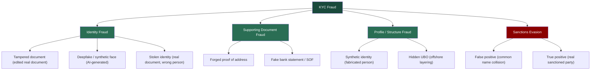

# Case 3 - KYC Document Forensics & Sanctions Screening

### Type: KYC Fraud Detection / Document Forensics / Sanctions Screening

### Date: June 2026

### Tools: PRADO (EU public document register), ICAO 9303 MRZ logic, PDF/EXIF metadata viewers (exiftool, metadata2go.com), Google Maps (address verification)

## Overview

This case is a practical demonsration of the following skills:
1. KYC AI fraud prevention (deepfake, AI-generated images/videos/documents, synthetic identity)
3. KYC verification - passport, driver's licence, proof of address, and establishing SoF / SoW. Detection of: tampered passports, MRZ mismatches, forged proof of address, fake bank statements, and stolen identities
4. Sanctions screening (concept level, in real case a tool such as world-check.com would be used
5. Identify red flags
6. Writing alert disposition notes (document false/true positives, escalation to senior management, and RFIs to clients) 
7. Mock SAR for suspicious activity, and a mock OFAC blocking report for a true-positive sanctions match

This case contains ten fictional fraud scenarious accross different document types and jurisdictions. I split it into four parts follow the real onboarding process.

| # | Document | Country | Fraud type | Decision |
|---|---|---|---|---|
| 1 | Passport | Italy | Tampered, MRZ mismatch | Reject (+ SAR if prior funds) |
| 2 | Driver's licence | USA (New York) | Edited ID / front-back mismatch | Reject (+ SAR if prior funds) |
| 3 | Selfie | - | Deepfake / AI-generated | Reject + SAR |
| 4 | Passport | Nigeria | Stolen identity | Reject + SAR |
| 5 | Utility bill | UK | Forged proof of address | Request more (+ SAR if refuses) |
| 6 | Bank statement | UAE bank | Fake, PDF metadata + math | Reject (+ SAR if account active) |
| 7 | Passport | Ukraine | Synthetic identity | EDD + SAR |
| 8 | Corporate docs | HK + BVI + Panama | Hidden UBO | EDD |
| 9 | Passport | Saudi Arabia | Sanctions false positive | Close + document |
| 10 | Passport | Russia | Sanctions true positive | Freeze + SAR + OFAC report |

---

> **Disclaimer:** All scenarios are fictional and created only for educational and portfolio purposes. All passport images are specimens from the EU public document register. No real identities were used.
> (the source for each document is linked in the end). Mock SARs are fictional. All institution details are fictional.
> For passports I use official PRADO specimens; the driver's licence is an official public sample from the New York State DMV. For utility bills, bank statements, and corporate documents, which have no
> safe specimens, I use schematic layouts and diagrams that show the structure.

---

## KYC Fraud Methods
 
The nine documents map onto the main families of KYC fraud an analyst sees in crypto onboarding:
 

 
---

